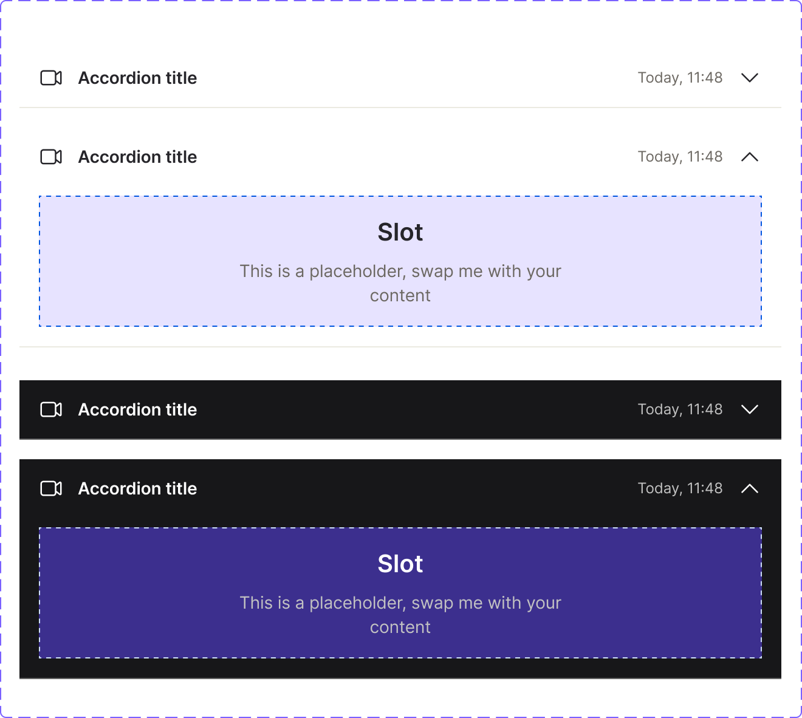

<!-- SOURCE: Figma MCP + figma-console MCP -->
<!-- FILE KEY: 5YihJ5WuDvnvrlrRMC4sBp -->
<!-- NODE ID: 8135:8877 (doc page) · 44417:100356 (Accordion component set) · 8298:8979 (_header atom) -->
<!-- EXTRACTED: 2026-04-28 -->
<!-- COMPONENT: Accordion -->
<!-- COLOR STRATEGY: B — states as columns, elements as rows (>3 state/variant combos) -->

# Accordion — Figma Design Spec

> **See also:** [props.md](./props.md) · [tokens.md](./tokens.md) · [examples.md](./examples.md) · [accessibility.md](./accessibility.md)

---

## Visual reference

> Screenshot captured from node `44417:100356` (Accordion component set) in file `5YihJ5WuDvnvrlrRMC4sBp`.
> Shows: collapsed (light), expanded (light), collapsed (dark), expanded (dark).

---

## Anatomy

Element structure extracted from the Figma layer tree of the `Accordion` component set (`44417:100356`) and the `_header` atom (`8298:8979`).

### Accordion (top-level container)

| # | Type | Name | Role | Notes |
|---|------|------|------|-------|
| 1 | frame | `_header` | Fixed sub-component | The clickable header row. Always present. Contains icon, title, secondary text, arrow |
| 2 | frame | `Scroll content` | Structural | Visible only when `isOpen?=true`. Contains the `Content` slot and optional scrollbar |
| 3 | instance | `Content` / `Slot` | Content element — instance swap | Placeholder. Swap with custom content. Labelled "This is a placeholder, swap me with your content" |
| 4 | instance | `Scrollbar_Mac OS` | Optional slot | Controlled by `scrollbar?` boolean toggle (default: `false`) |
| 5 | frame | `Dividers` | Structural/decorative | Bottom separator line. Controlled by `divider?` boolean toggle (default: `true`) |

### Sub-component: `_header` (Atom)

| # | Type | Name | Role | Notes |
|---|------|------|------|-------|
| 1 | instance | `Icon` | Optional slot — instance swap | Left icon. Controlled by `icon?` boolean (default: `true`). Accepts `Icon` component. Default: video icon |
| 2 | text | `Title` | Content element | Primary label. Maps to `title` prop. Uses `--typography/bodyBold01` |
| 3 | frame | `AI badge` | Optional slot | Controlled by `AIBadge?` boolean (default: `false`). Contains star icon + "AI" label |
| 4 | frame | `Secondary info` | Optional slot | Right-aligned text. Controlled by `rightText?` boolean (default: `true`). Maps to `text` prop |
| 5 | instance | `arrow-down` | Fixed sub-component | Chevron icon. Rotates 180° when expanded. Always present |
| 6 | frame | `Focus ring` | Structural | 2px border overlay. Visible only in `state=focus`. z-index above all content |

---

## API — Component properties

### Accordion variant axes

| Property | Values | Default |
|----------|--------|---------|
| `mode` | `light`, `dark` | `light` |
| `isOpen?` | `true`, `false` | `false` |

### Accordion boolean toggles

| Property | Default | Notes |
|----------|---------|-------|
| `scrollbar?` | `false` | Shows a Mac OS-style scrollbar in the content area when expanded |
| `divider?` | `true` | Shows a 1px separator below the accordion row |

### `_header` atom — variant axes

| Property | Values | Default |
|----------|--------|---------|
| `mode` | `light`, `dark` | `light` |
| `state` | `rest`, `hover`, `focus`, `disabled` | `rest` |
| `isOpen?` | `true`, `false` | `false` |

### `_header` atom — boolean toggles

| Property | Default | Notes |
|----------|---------|-------|
| `icon?` | `true` | Shows/hides the leading icon slot |
| `rightText?` | `true` | Shows/hides the secondary text on the right |
| `AIBadge?` | `false` | Shows/hides the AI badge after the title |

### `_header` atom — instance swap slots

| Slot | Accepted types | Default component |
|------|---------------|-------------------|
| `↳ icon` | `Icon` component | Video icon (`84161:245033`) |

### `_header` atom — text slots

| Slot | Default value |
|------|--------------|
| `title` | `"Accordion title"` |
| `↳ text` | `"Today, 11:48"` |

### Persistent states

| State | Property name | Notes |
|-------|--------------|-------|
| Disabled | `state=disabled` | Applied on `_header` atom; title and secondary text use `--interactive/disabled04` |

### Transient states (interaction only — not API props)

| State | Trigger |
|-------|---------|
| `hover` | Pointer enters header row |
| `focus` | Keyboard focus on header button |

### Token coverage

<!-- NO COVERAGE DATA RETURNED BY figma_get_component enrich -->
> The REST API returned enrichment metadata but no token coverage percentage.
> Token coverage was manually assessed from design context output (see below).
> **All color and typography values are tokenised.** No hardcoded raw hex values were
> found in the main component. Exception: the placeholder `Slot` component uses
> `--ui/ui23` and `--ui/ui22` tokens for its dashed border — these are design-system
> tokens, not hardcoded values, though they are specific to the placeholder and would
> not apply to real content.

---

## Color & token bindings

<!-- COLOR STRATEGY B: states as columns, elements as rows -->

| Element | Token | Rest (L) | Hover (L) | Focus (L) | Disabled (L) | Rest (D) | Hover (D) | Focus (D) | Disabled (D) |
|---------|-------|----------|-----------|-----------|--------------|----------|-----------|-----------|--------------|
| Header background | `--ui/ui06` / `--ui/ui05` | `#fff` (ui06) | `#f4f3ee` (ui05) | `#fff` (ui06) | `#fff` (ui06) | `#171719` (ui06) | `#2f2e32` (ui05) | `#171719` (ui06) | `#171719` (ui06) |
| Title text | `--text/textcolor01` | `#26252a` | `#26252a` | `#26252a` | `--interactive/disabled04` `#8d8b7e` | `#ffffff` | `#ffffff` | `#ffffff` | `--interactive/disabled04` `#858585` |
| Secondary text | `--text/textcolor02` | `#6c6862` | `#6c6862` | `#6c6862` | `--interactive/disabled04` `#8d8b7e` | `#c2c2c2` | `#c2c2c2` | `#c2c2c2` | `--interactive/disabled04` `#858585` |
| Focus ring | `--interactive/focus01` | — | — | `#0056e0` | — | — | — | `#d7e3f9` | — |
| Divider | `--ui/ui01` | `#ebeae1` | `#ebeae1` | `#ebeae1` | `#ebeae1` | `#666666` | `#666666` | `#666666` | `#666666` |
| AI badge background | `--ui/ui23` | `#e7e3ff` | `#e7e3ff` | `#e7e3ff` | `#e7e3ff` | `#3c2f8e` | `#3c2f8e` | `#3c2f8e` | `#3c2f8e` |
| AI badge text | `--text/textcolor10` | `#4a3da4` | `#4a3da4` | `#4a3da4` | `#4a3da4` | `#e7e3ff` | `#e7e3ff` | `#e7e3ff` | `#e7e3ff` |

### Text styles

| Element | Token | Size | Weight | Line height | Letter spacing |
|---------|-------|------|--------|-------------|----------------|
| Title | `--typography/bodyBold01` | `14px` | `600` | `20px` | `-0.06px` |
| Secondary text | `--typography/label01` | `12px` | `400` | `16px` | `0px` |
| AI badge text | `--typography/label01` | `12px` | `400` | `16px` | `0px` |

Font family tokens:

| Token | Resolved |
|-------|----------|
| `--typography/bodyBold01/font-family` | `Inter:Semi_Bold` |
| `--typography/font-family/sans` | `Inter:Regular` |

### Effect styles

<!-- NO EFFECT STYLES FOUND IN FIGMA RESPONSE -->

---

## Structure & spacing

### Container (Accordion — header row)

| Property | Token | Value | Notes |
|----------|-------|-------|-------|
| Height | — | `48px` | Fixed header height |
| Width | — | `627px` (Figma canvas) | Fills container in real usage |
| Padding horizontal | — | `16px` | `px-[16px]` |
| Padding vertical | — | `14px` | `py-[14px]` |

### Container (Accordion — content area, expanded)

| Property | Token | Value | Notes |
|----------|-------|-------|-------|
| Padding top | — | `8px` | `pt-[8px]` |
| Padding bottom | — | `16px` | `pb-[16px]` |
| Padding horizontal | — | `16px` | `px-[16px]` |

### Internal spacing (header row)

| Property | Token | Value | Notes |
|----------|-------|-------|-------|
| Gap (icon → content → arrow) | — | `12px` | Main horizontal gap |
| Gap (title → AI badge) | — | `4px` | Within the title+badge group |
| Icon size | — | `20px` | Leading icon slot |
| Arrow icon size | — | `20px` | Chevron |
| Scrollbar width | — | `12px` | `Scrollbar_Mac OS` — only when `scrollbar?=true` |
| Focus ring border | — | `2px solid` | `--interactive/focus01` |

### Auto-layout

- **Header row direction:** horizontal
- **Header alignment:** `items-center` (vertically centred)
- **Content area direction:** horizontal (content + optional scrollbar)
- **Title group direction:** horizontal (`gap-4px`, `items-center`)

### Density / size variants

No density variants exist in this component. There is a single header height of `48px`.

---

## Interaction states

States visible in the Figma `_header` atom variant structure.

| State | Trigger | Visual change |
|-------|---------|---------------|
| `rest` (default) | — | Background `--ui/ui06` |
| `hover` | Pointer over header | Background changes to `--ui/ui05` (slightly grey/darker) |
| `focus` | Keyboard tab to header button | Background `--ui/ui06` + `2px solid --interactive/focus01` ring overlay |
| `disabled` | `state=disabled` prop | Text uses `--interactive/disabled04` (muted); background stays `--ui/ui06` |
| `isOpen=true` | User clicks to expand | Chevron rotates 180°; content area slides in below header |

---

## Component variants in this file

The `Accordion` doc page (`8135:8877`) contains the following component sets:

| Component set | Node ID | Description |
|--------------|---------|-------------|
| `Accordion` | `44417:100356` | Standard accordion (header or arrow trigger) |
| `Accordion custom` | `82572:13805` | Custom variant with `expandTrigger="arrow"` and `contentAfterTitle` slot |
| `Accordion nested` | `48782:6191` | Parent accordion containing nested children |
| `Accordion nested custom` | `82572:13785` | Custom nested accordion |
| `Accordion nested child` | `48782:6353` | The inner accordion used inside nested variants |
| `_header` | `8298:8979` | Atom: accordion header with all states |
| `_headerCustom` | `82572:13829` | Atom: header for the custom variant |

### Accordion nested — variant axes

| Property | Values | Default |
|----------|--------|---------|
| `mode` | `light`, `dark` | `light` |
| `isOpen?` | `true`, `false` | `false` |
| `divider?` | `true`, `false` | `true` |

---

## Figma examples page annotations (`79430:614`)

Extracted from the `↳ Accordion examples` canvas page.

### Default accordion (`82572:12909`)

> "The accordion can be expanded / collapsed by clicking the entire header."

States demonstrated: **Collapsed - Rest**, **Collapsed - Hover**, **Expanded - Hover**, **Expanded - Rest**

Header anatomy labels (from Figma):
1. Leading icon (optional)
2. Title
3. Badge (optional)
4. Secondary text (optional)
5. Arrow icon

### Custom accordion (`82572:13619`)

> "The accordion can be expanded / collapsed only by clicking the arrow icon button."

States demonstrated: **Collapsed - Rest**, **Collapsed - Hover**, **Expanded - Hover**, **Expanded - Rest**

Header anatomy labels (from Figma):
1. Leading icon (optional)
2. Title
3. Icon button (optional) or Icon (optional)
4. Badge (optional)
5. Secondary text (optional)
6. Arrow icon button (expand/collapse trigger)

---

## Design decisions & annotations

> **Accordion documentation link (from Figma Code Connect description):**
> https://oxygen.8x8.com/components/accordion/usage

> **Slot component description:**
> "This is a placeholder component. Swap me with your custom content by using the component instance swapper."

> **Focus ring annotation (from Figma):**
> "A focus ring is used to indicate the currently focused item."

> **Dividers component annotation:**
> https://oxygen.8x8.com/docs/contact-us

<!-- NO FURTHER ANNOTATIONS FOUND IN FIGMA RESPONSE -->

---

## Accessibility (from Figma annotations only)

- **ARIA role:** <!-- NOT ANNOTATED IN FIGMA -->
- **Focus order:** <!-- NOT ANNOTATED IN FIGMA -->
- **Keyboard interactions:** <!-- NOT ANNOTATED IN FIGMA -->

> For full accessibility documentation see [accessibility.md](./accessibility.md).

---

## Gaps & conflicts

| Type | Description |
|------|-------------|
| Missing annotation | No ARIA role, keyboard interaction, or focus order annotations in Figma |
| Missing annotation | No design intent annotation explaining why `scrollbar?=false` by default |
| Missing annotation | No annotation on why the `divider?` toggle exists (when to omit the divider) |
| Incomplete data | `figma_get_variables` failed — REST API permission issue; token resolved values sourced manually from design context output |
| Incomplete data | Token coverage % not returned by `figma_get_component` enrich (REST API limitation without Desktop Bridge) |
| Incomplete data | Component descriptions unavailable via REST API (requires Figma Desktop Bridge plugin) |
| Note | `_headerCustom` (`82572:13829`) properties were not separately extracted — they mirror `_header` with an additional icon button slot |
| Note | Scrollbar colors in dark mode use hardcoded `#858585` for the scrollbar thumb — no token binding detected |

---

_Source: Figma MCP · figma-console MCP · Extracted 2026-04-28_
