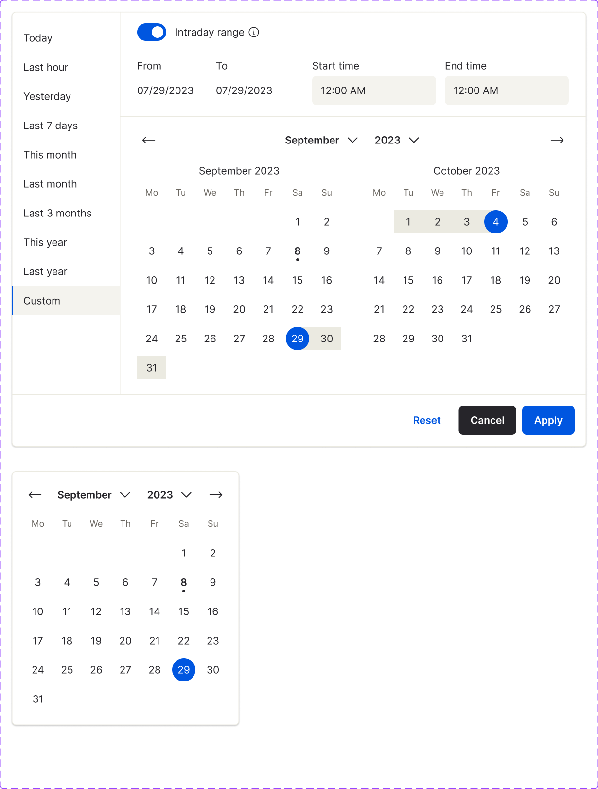

<!-- SOURCE: Figma MCP + figma-console MCP -->
<!-- FILE KEY: 5YihJ5WuDvnvrlrRMC4sBp -->
<!-- NODE ID: 80239:7420 -->
<!-- EXTRACTED: 2026-05-08 -->
<!-- COMPONENT: Calendar -->
<!-- COLOR STRATEGY: B (multiple state/element combos — states as columns, elements as rows) -->

# Calendar — Figma Design Spec

> **See also:** [props.md](./props.md) · [tokens.md](./tokens.md) ·
> [examples.md](./examples.md) · [accessibility.md](./accessibility.md)

---

## Visual reference

**Range calendar (light mode):** Two-month grid (September + October 2023) with predefined ranges panel on the left. Intraday toggle + From/To date inputs + Start/End time inputs shown at top. Reset / Cancel / Apply action buttons in footer. Week starts Monday. Today indicated by dot; selected date in filled blue circle; range endpoints and in-between days highlighted.

**Single calendar (light mode):** Single-month grid (September 2023) at 312×348px. Navigation arrows + month/year dropdowns. Selected date shown as filled blue circle.

---

## Anatomy

### Range calendar (`mode=light, type=range` — node 80239:8864, 788×596)

| # | Type | Name | Role | Notes |
|---|------|------|------|-------|
| 1 | frame | Info | structural | Top bar containing optional predefined ranges panel + optional date/time inputs |
| 2 | frame | _Predefined ranges panel | optional slot | Boolean `predefinedRanges`; 148 px wide; right-border divider |
| 3 | instance | _Predefined ranges item × N | content | Repeated list items (Today, Last hour, Yesterday, Last 7 days, This month, Last month, Last 3 months, This year, Last year, Custom) |
| 4 | frame | _Range type | optional slot | Boolean `time`; Intraday toggle + From/To date inputs + Start/End time inputs |
| 5 | frame | Calendars | structural | Horizontal flex, `gap-[32px]`, `px-[24px]`; contains Left calendar + Right calendar |
| 6 | frame | Left calendar | structural | `w-[280px]`, `gap-[12px]` (header to body) |
| 7 | frame | Header (left) | content | Month title text (e.g. "September 2023"), centered, `px-[40px]` |
| 8 | frame | Body (left) | structural | Day grid rows |
| 9 | frame | Right calendar | structural | Mirror of Left calendar |
| 10 | frame | Navigation | structural | `←` icon button + month dropdown + year dropdown + `→` icon button; centered above both months |
| 11 | frame | Action bar | structural | Reset + Cancel + Apply buttons; top border divider |

### Single calendar (`mode=light, type=single` — node 80303:251931, 312×348)

| # | Type | Name | Role | Notes |
|---|------|------|------|-------|
| 1 | frame | Navigation | structural | `←` arrow + Month dropdown + Year dropdown + `→` arrow |
| 2 | frame | Header | content | Month name text, centered |
| 3 | frame | Body | structural | Weekday row + day grid rows |
| 4 | instance | Day Number (×~35) | content | Each day cell, `size-[40px]` |

### Sub-component: _Day Number (atoms — node frame 80239:9317)

| # | Type | Name | Role | Notes |
|---|------|------|------|-------|
| 1 | frame | Background Range | optional slot | Shows in-range fill when `range=true`; uses `--ui/ui01` background |
| 2 | frame | Focus ring | optional slot | `border-2 rounded-[1000px]` with `--interactive/focus01`; inner white inset shadow |
| 3 | text | Day number | content | Day digit; `body01` typography |

**Day types exposed in variant set:** `Default`, `Disabled`, `Empty`, `Dimmed`, `Current day`
**Boolean axes:** `Selected` (Yes/No), `Hover` (Yes/No)
**Mode:** Light, Dark

### Sub-component: _Predefined ranges item (atoms — node frame 80239:9446)

States: `Rest`, `Hover`, `Selected`, `Focus`, `Hover and Select - Focus`
Input variant: `Yes` (with text input for custom range), `No` (label only)
Mode: Light, Dark

### Sub-component: _Range type (atoms — node frame 80398:28952)

| Variant | Description |
|---------|-------------|
| `size=large, state=IntradayOn` | Full-width row with Intraday toggle ON + date/time inputs |
| `size=large, state=IntradayOff` | Toggle OFF; time inputs hidden |
| `size=large, state=noIntraday` | No intraday toggle; only date range inputs |
| `size=small, state=IntradayOn/Off/noIntraday` | Stacked/compact layout for narrower breakpoints |

---

## API — Component properties

### Variant axes

Confirmed from `componentPropertyDefinitions` on COMPONENT_SET node `80239:8863`:

| Property | Figma key | Type | Values | Default |
|----------|-----------|------|--------|---------|
| `mode` | `mode` | VARIANT | `light` | `light` |
| `type` | `type` | VARIANT | `range`, `single` | `range` |

> Note: only `light` mode exists in this component set — no dark variant published here.

### Boolean toggles

Confirmed from `componentPropertyDefinitions`:

| Property | Figma key | Default | Notes |
|----------|-----------|---------|-------|
| `time` | `time#29876:2` | `true` | Shows/hides the intraday range toggle and time inputs |
| `predefinedRanges` | `predefinedRanges#80303:0` | `true` | Shows/hides the left predefined ranges panel |
| `90 days` | `90 days#85539:0` | `false` | Enables 90-day range limit mode (disabled dates outside window + tooltip) |

### Instance swap slots

<!-- NO INSTANCE SWAP SLOTS FOUND in returned data -->

### Persistent states

| State | Applied to | Notes |
|-------|-----------|-------|
| Selected | Day cell | `aria-selected`; filled blue circle (`--actions/action01`) |
| Disabled | Day cell | Greyed out; `aria-disabled`; tooltip available via `disabledDateTooltip` |
| Current day | Day cell | Dot indicator below day number |
| Dimmed | Day cell | Passive day from adjacent month |

### Token coverage

<!-- Token names extracted from generated CSS (get_design_context). Variables returned empty —
     tokens are defined in the UI-Foundations library (iVY5nI8JAxM05Apnnvozzs), not in UI-components. -->

- **Coverage:** Partial — most colour and typography values are tokenised; some spacing values are raw px
- **Hardcoded values flagged:**
  - `Container.width`: `788px` (range) / `312px` (single) — no token binding
  - `Predefined ranges panel.width`: `148px` — no token binding
  - `Month column.width`: `280px` — no token binding
  - `Day cell.size`: `40px` — no token binding
  - `Container.border-radius`: `6px` — no token binding; `rounded-[6px]`
  - `Navigation button.padding`: `6px` — no token binding
  - `Calendar gap`: `32px` — no token binding
  - `Month header padding`: `40px` horizontal — no token binding

---

## Color & token bindings

<!-- COLOR STRATEGY B: states as columns, elements as rows -->

| Element | Default | Hover | Selected | Disabled | Focus |
|---------|---------|-------|----------|----------|-------|
| Calendar background | `--ui/ui06` (white) | — | — | — | — |
| Calendar border | `--ui/ui01` (#ebeae1) | — | — | — | — |
| Calendar shadow | `--ui/shadow01` (rgba(41,41,41,0.25)) | — | — | — | — |
| Day number text | `--text/textcolor01` (#26252a) | `--text/textcolor01` | `--ui/ui06` (white) | `--text/textcolor06` | `--text/textcolor01` |
| Day cell background | transparent | `--ui/ui02` | `--actions/action01` (#0056e0) | transparent | transparent |
| Day cell focus ring | — | — | — | — | `--interactive/focus01` (#0056e0) |
| In-range day background | `--ui/ui01` (#ebeae1) | — | — | — | — |
| Current day dot | `--actions/action01` (#0056e0) | — | — | — | — |
| Dimmed day text | `--text/textcolor06` | — | — | — | — |
| Predefined range item text | `--text/textcolor01` | `--text/textcolor01` | `--text/textcolor01` | — | `--text/textcolor01` |
| Predefined range item background | transparent | `--ui/ui02` | `--ui/ui05` | — | `--ui/ui05` |
| Intraday toggle (ON) | `--actions/action01` (#0056e0) | — | — | — | — |
| Apply button background | `--actions/action09` (#0056e0) | — | — | — | — |
| Dividers | `--ui/ui01` (#ebeae1) | — | — | — | — |
| Month/Year dropdown text | `--text/textcolor01` | — | — | — | — |
| Navigation icon | `--text/textcolor01` | — | — | — | — |

### Text styles

| Element | Token | Size | Weight | Line height | Letter spacing |
|---------|-------|------|--------|-------------|---------------|
| Day number | `body01` | 14px | 400 (normal) | 20px | −0.06px |
| Month/Year in header | `body01` | 14px | 400 | 20px | −0.06px |
| Month/Year in dropdown | `bodybold01` | 14px | 600 (semi-bold) | 20px | −0.06px |
| Predefined ranges item | `body01` | 14px | 400 | 20px | −0.06px |
| Weekday header | `label01` | — | — | — | — |
| Action button labels | `bodybold01` | 14px | 600 | 20px | −0.06px |

### Effect styles

| Element | Type | Value |
|---------|------|-------|
| Calendar panel | drop-shadow | `0px 1px 1px var(--ui/shadow01)` |

---

## Structure & spacing

### Container

| Property | Token | Value | Variant |
|----------|-------|-------|---------|
| Width | — | 788px | range mode |
| Width | — | 312px | single mode |
| Height | — | 596px | range mode |
| Height | — | 348px | single mode |
| Border radius | — | 6px | all |
| Border | `--ui/ui01` | 1px solid | all |

### Internal spacing

| Property | Token | Value | Notes |
|----------|-------|-------|-------|
| Predefined ranges panel width | — | 148px | optional; right-border divider |
| Predefined ranges panel padding-y | — | 16px | top/bottom |
| Predefined ranges item padding | — | 10px top/bottom, 16px left/right | |
| Calendars section padding-x | — | 24px | horizontal outer padding |
| Gap between calendar months | — | 32px | horizontal |
| Month column width | — | 280px | each calendar pane |
| Month header–to–body gap | — | 12px | |
| Month header padding-x | — | 40px | left/right (leaves room for nav arrows) |
| Day cell size | — | 40px × 40px | square |
| Navigation button padding | — | 6px | all sides |
| Action bar button padding | — | 10px top/bottom, 16px left/right | |

### Auto-layout

- Direction: vertical (outer panel), horizontal (calendars row), vertical (individual month)
- Alignment: items-start (outer), items-start (months row), center (header text)

### Density / size variants (breakpoints)

| Breakpoint | Width | Predefined ranges | Layout |
|------------|-------|------------------|--------|
| 992–769px | ~495px | optional | dual month |
| 768–541px | ~495px | optional | dual month, compact |
| 768–541px (no ranges) | ~328px | no | dual month |
| 540–320px | ~312px | optional | single month, stacked |
| 540–320px (no ranges) | ~312px | no | single month |

---

## Interaction states

| State | Trigger | Visual change |
|-------|---------|---------------|
| hover (day) | pointer over valid day | background changes to `--ui/ui02` |
| focus (day) | keyboard Tab / arrow keys | `border-2` ring in `--interactive/focus01` with white inset shadow |
| selected (day) | click or Enter | filled circle in `--actions/action01`; text becomes white (`--ui/ui06`) |
| range preview | pointer hover in range mode | in-range days show `--ui/ui01` background |
| hover (predefined item) | pointer over | item background → `--ui/ui02` |
| selected (predefined item) | click | item background → `--ui/ui05` |
| focus (predefined item) | keyboard | item background → `--ui/ui05` |

---

## Design decisions & annotations

<!-- NO ANNOTATIONS FOUND IN FIGMA RESPONSE — layer names and generated code only, no verbatim design intent captured -->

---

## Accessibility (from Figma annotations only)

- **ARIA role:** <!-- NOT ANNOTATED IN FIGMA -->
- **Focus order:** <!-- NOT ANNOTATED IN FIGMA -->
- **Keyboard interactions:** Focus ring visually defined — `border-2 border-[--interactive/focus01] rounded-[1000px]` with inner white inset shadow. Keyboard activation of day cells confirmed by `Day.onClick` prop description (fires on Enter/Space).

See [accessibility.md](./accessibility.md) for full accessibility documentation.

---

## Gaps & conflicts

| Type | Description |
|------|-------------|
| Missing token | `Container.width` (788px, 312px) — hardcoded, no token |
| Missing token | `Predefined ranges panel.width` (148px) — hardcoded |
| Missing token | `Month column.width` (280px) — hardcoded |
| Missing token | `Day cell.size` (40px) — hardcoded |
| Missing token | `Container.border-radius` (6px) — hardcoded |
| Missing token | `Calendar gap` (32px between months) — hardcoded |
| Missing token | `Month header padding-x` (40px) — hardcoded |
| Missing annotation | No design intent annotations found in Figma layer descriptions |
| Incomplete data | Variables empty in UI-components file — tokens live in UI-Foundations library (`iVY5nI8JAxM05Apnnvozzs`); token names sourced from generated CSS only |
| Incomplete data | Styles empty in UI-components file — same reason as variables |
| Potential conflict | Figma boolean `90 days` (default false) enables a 90-day limit mode not exposed as a prop in `@8x8/oxygen-calendar` — implemented via `disabledDates` + `disabledDateTooltip` in code, not a dedicated prop |
| Potential conflict | Figma `mode` only has `light` variant — no dark component set published; dark mode likely handled via CSS tokens at runtime |

---

_Source: Figma MCP · figma-console MCP · Extracted 2026-05-08_
