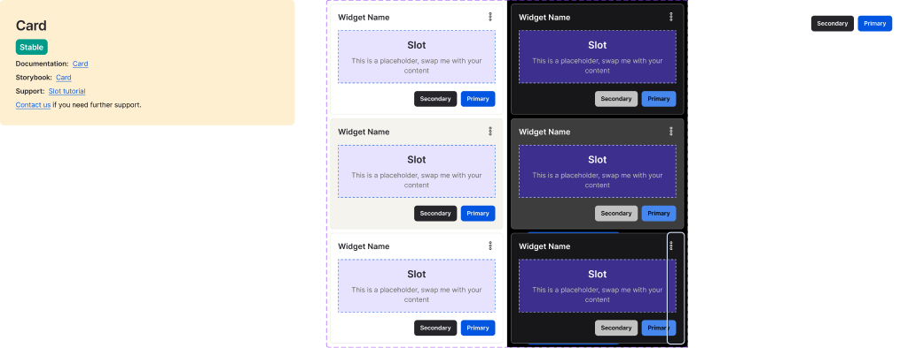
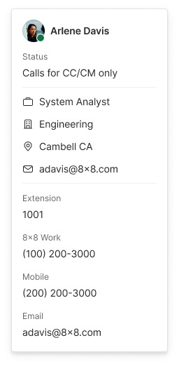

<!-- SOURCE: Figma MCP + figma-console MCP -->
<!-- FILE KEY: 5YihJ5WuDvnvrlrRMC4sBp -->
<!-- NODE ID: 11263:11501 (component set canvas) · 49372:112 (examples canvas) -->
<!-- EXTRACTED: 2026-05-05 -->
<!-- COMPONENT: Card -->
<!-- COLOR STRATEGY: B (2 modes × 3 states = 6 combos; states as rows, modes as Light/Dark columns) -->

# Card — Figma Design Spec

> **See also:** [props.md](./props.md) · [tokens.md](./tokens.md) ·
> [examples.md](./examples.md) · [accessibility.md](./accessibility.md)

> ⚠️ **DEPRECATED** — This component is deprecated in `@8x8/oxygen-card`. Design spec preserved for audit/reference.

---

## Visual reference

### Component variants (node 11263:11501)

### Usage examples (node 49372:112 — "↳ Card examples")

---

## Anatomy

Element structure extracted from the Figma layer tree. All 6 variants share the same internal child structure; exceptions noted per variant.

### Component set: `Card` (`18077:30676`)

Outer canvas (`11263:11501`) also contains:
- `Dark Bg` (`18077:31100`, RECTANGLE) — decorative background for previewing dark variants; not part of the component
- `Atoms` section (`30125:42878`) — contains `_Cta` atom (`18077:30599`, 320×32)
- `_Information & support` instance (`49011:63399`) — annotation/support documentation frame; not part of the component

### Variant: Mode=Light/Dark, State=Rest & Hover

| # | Type | Name | Role | Notes |
|---|------|------|------|-------|
| 1 | frame | `Header` | structural | 320×22px; contains title text + icon button |
| 1a | text | `Widget Name` | content element | Controlled by `Add title` text property |
| 1b | instance | `dots-vertical` | optional slot | Controlled by `Show icon` boolean toggle |
| 2 | instance | `Slot` | optional slot | Content area; accepts any content; shown/hidden pattern not confirmed from API |
| 3 | instance | `_Cta` | optional slot | Call-to-action area; controlled by `Show actions` boolean toggle |

### Variant: Mode=Light/Dark, State=Focus

Identical to Rest/Hover plus one additional child:

| # | Type | Name | Role | Notes |
|---|------|------|------|-------|
| 4 | instance | `Focus ring` (`81045:233208`) | structural | Focus indicator overlay; present only in Focus state variants |

---

## API — Component properties

### Variant axes

| Property | Values | Default |
|----------|--------|---------|
| `Mode` | `Light`, `Dark` | `Light` |
| `State` | `Rest`, `Hover`, `Focus` | `Rest` |

### Boolean toggles

| Property | Default | Notes |
|----------|---------|-------|
| `Show actions` | `true` | Shows/hides the `_Cta` instance (call-to-action area) |
| `Show icon` | `true` | Shows/hides the `dots-vertical` icon in the Header frame |

### Text properties

| Property | Default | Notes |
|----------|---------|-------|
| `Add title` | `"Widget Name"` | Sets the text content of the `Widget Name` text node in Header |

### Instance swap slots

| Slot | Accepted types | Default node ID |
|------|---------------|-----------------|
| `Select Light icon` | COMPONENT_SET key `7e4d2d45750792f034ea1b8154c10fe106ce9573` | `84716:247786` |
| `Select Dark Icon` | COMPONENT_SET key `7e4d2d45750792f034ea1b8154c10fe106ce9573` | `84716:247790` |

> Both slots reference the same icon component set. Separate slots allow different icon choices per mode.

### Persistent states

<!-- NO PERSISTENT STATES FOUND — all three State variants (Rest, Hover, Focus) are transient interaction states. No disabled, selected, loading, or error states present in the component set. -->

### Token coverage

<!-- NO COVERAGE DATA RETURNED BY figma_get_component enrich — REST API returned enriched:true but no explicit token coverage % was calculated. Variable IDs were returned in fill/stroke boundVariables. See Color & token bindings below. -->

---

## Color & token bindings

<!-- COLOR STRATEGY B: rows = element/property, columns = state. Two sub-tables for Light and Dark mode. -->

### Card container — Light mode

| State | Property | Variable ID | Resolved value | Probable MCP token |
|-------|----------|-------------|---------------|-------------------|
| Rest | Fill (background) | `20136:267` | `#FFFFFF` | Unknown — not matched in `ui01/02/03` |
| Hover | Fill (background) | `20136:263` | `#F4F3EE` | `ui02` (value match) |
| Focus | Fill (background) | `20136:267` | `#FFFFFF` | Unknown — same as Rest |
| Rest | Stroke (border) | `20136:253` | `#EBEAE1` | `ui01` (value match) |
| Hover | Stroke (border) | `20136:253` | `#EBEAE1` | `ui01` (value match) |
| Focus | Stroke (border) | `20136:253` | `#EBEAE1` | `ui01` (value match) |

### Card container — Dark mode

| State | Property | Variable ID | Resolved value | Probable MCP token |
|-------|----------|-------------|---------------|-------------------|
| Rest | Fill (background) | `20136:267` | `#171719` | Unknown — not matched in `ui01/02/03` |
| Rest | Stroke (border) | `20136:253` | `#666666` | `ui01` dark (value match) |

> **SOURCE\_GAP** — Token variable names are opaque IDs (e.g. `20136:253`) because the Variables REST API returned 403 (Enterprise plan required). Semantic names cannot be confirmed without the Figma Desktop Bridge plugin or Variables API access. Probable MCP token mappings are inferred by matching hex values only — do not use as authoritative token names.

### Text styles

<!-- NO TOKEN BINDINGS FOUND IN FIGMA RESPONSE — text node `Widget Name` inside Header returned no `boundVariables` for typography. Text style names are unavailable. -->

### Effect styles

<!-- NO TOKEN BINDINGS FOUND IN FIGMA RESPONSE — no `effects` were returned on any variant layer. -->

---

## Structure & spacing

### Container

| Property | Token | Value | Variant |
|----------|-------|-------|---------|
| Width | — | `352px` | All variants |
| Height | — | `226px` | All variants |
| Border | `20136:253` (`ui01`) | `1px solid #EBEAE1` (Light) / `#666666` (Dark) | All states |

### Header frame

| Property | Token | Value | Notes |
|----------|-------|-------|-------|
| Width | — | `320px` | 16px inset from card left edge |
| Height | — | `22px` | — |

### Internal spacing

<!-- NO STRUCTURE DATA FOUND — padding, gap, and auto-layout direction were not returned by the REST API component calls. figma_get_design_context call failed (no node selected in Figma Desktop). -->

### Density / size variants

<!-- NO DENSITY VARIANTS — component set only varies Mode and State; no size/density axis. -->

---

## Interaction states

States present in the Figma variant structure.

| State | Trigger | Visual change |
|-------|---------|---------------|
| `Rest` | Default / pointer not over | Background: `#FFFFFF` (Light) / `#171719` (Dark); border: `ui01` |
| `Hover` | Pointer over card | Background changes to `#F4F3EE` (Light / `ui02`); border unchanged |
| `Focus` | Keyboard focus | Background same as Rest; `Focus ring` instance added as overlay |

---

## Design decisions & annotations

<!-- NO ANNOTATIONS FOUND IN FIGMA RESPONSE — component description was unavailable due to a known Figma REST API bug. To retrieve descriptions, run the Desktop Bridge plugin in Figma Desktop: Right-click → Plugins → Development → Figma Desktop Bridge. -->

---

## Accessibility (from Figma annotations only)

<!-- NOT ANNOTATED IN FIGMA — no accessibility annotations were found in the retrieved Figma data. -->

For full accessibility documentation see [accessibility.md](./accessibility.md).

---

## Gaps & conflicts

| Type | Description |
|------|-------------|
| Source gap | Variable IDs (`20136:253`, `20136:263`, `20136:267`) are opaque — semantic token names not resolvable without Variables REST API (Enterprise) or Desktop Bridge plugin |
| Source gap | Rest/Dark fill (`20136:267` = `#171719`) and Light Rest fill (`#FFFFFF`) do not match any of the three `ui0x` tokens returned by the MCP — true token name unknown |
| Source gap | Hover state for Dark mode was not fetched in this session — Dark/Hover fill token unknown |
| Incomplete data | Text typography tokens unavailable — no `boundVariables` returned on text nodes |
| Incomplete data | Auto-layout direction and padding not returned by REST API; `get_design_context` call failed (no node selected in Figma Desktop) |
| Missing annotation | No design intent annotations captured — component description unavailable (Figma REST API bug) |
| Missing annotation | No accessibility annotations in Figma |
| Note | Node 49372:112 is the "Card examples" canvas containing a "Contact card" usage example; it is not a component set |

---

_Source: Figma MCP · figma-console MCP · Extracted 2026-05-05_
