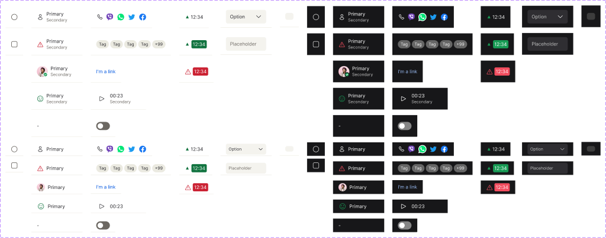
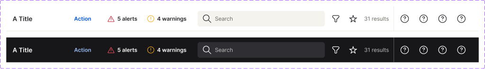

<!-- SOURCE: Figma MCP + figma-console MCP -->
<!-- FILE KEY: 5YihJ5WuDvnvrlrRMC4sBp -->
<!-- NODE ID: 2433:0 (Table canvas) · 53919:26449 (Table examples canvas) -->
<!-- EXTRACTED: 2026-05-06 -->
<!-- COMPONENT: DataTable -->
<!-- COLOR STRATEGY: B — states as columns, elements as rows (>3 variant combinations) -->

# DataTable — Figma Design Spec

> **See also:** [props.md](./props.md) · [tokens.md](./tokens.md) ·
> [examples.md](./examples.md) · [accessibility.md](./accessibility.md)

---

## Visual reference

### table cell component set (light + dark, all types)

### table action header (TableHeader toolbar)

---

## Anatomy

The DataTable is composed of **10 distinct Figma component sets** on the "Table" canvas page. Each maps to a sub-component or region of the rendered table.

| # | Component Set | Node ID | Role |
|---|---------------|---------|------|
| 1 | `table cell` | 50268:24462 | Data cell — the main `<Cell>` area with all content type variants |
| 2 | `table header` | 50690:112119 | Column header cell — `<HeaderCell>` |
| 3 | `table start controls cell` | 53841:35814 | Left-side selection/drag cell — checkbox or radio row selector + status bar |
| 4 | `table end controls cell` | 54027:37388 | Right-side row action cell — overflow menu, inline buttons, collapse toggle |
| 5 | `table row hover` | 51615:26100 | Hover-state overlay with action buttons or icon buttons |
| 6 | `table start controls header` | 53841:36967 | Column header for the selection column (select-all checkbox, sort/drag indicators) |
| 7 | `table end controls header` | 54027:37204 | Column header for the end actions column |
| 8 | `table action header` | 54456:153760 | Toolbar above the table — `<TableHeader>` (title, action, search, filter, alerts, results) |
| 9 | `table footer` | 54587:154269 | Pagination row below the table — `<Pagination>` |
| 10 | `table collapsible row slot` | 55222:11958 | Slot area for expandable/collapsible row content |

### Sub-component: table cell (50268:24462)

| # | Type | Name | Role | Notes |
|---|------|------|------|-------|
| 1 | frame | state | Structural — background overlay | absolute fill; carries hover/active state background |
| 2 | frame | statusBar | Optional slot (boolean `statusBar?`) | 4px wide left-edge indicator; default hidden |
| 3 | frame | info | Content — primary + secondary text block | flex row, gap 8px |
| 4 | instance | icon | Optional slot (boolean `icon?`) | Icon sub-component; default visible |
| 5 | text | Primary | Content element | body01 style; truncates with ellipsis |
| 6 | text | Secondary | Optional slot (boolean `secondaryInfo?`) | label01 style; secondary text line |
| 7 | frame | _fixedDivider (left) | Optional slot (boolean `fixedLeft?`) | 2px right-edge divider when column is pinned left |
| 8 | frame | _fixedDivider (right) | Optional slot (boolean `fixedRight?`) | 2px left-edge divider when column is pinned right |

### Sub-component: table header (50690:112119)

| # | Type | Name | Role | Notes |
|---|------|------|------|-------|
| 1 | text | title | Content element | Text property; default "Table header" |
| 2 | instance | sortIcon | Optional slot (boolean `sortIcon?`) | Sort direction indicator; hidden by default |
| 3 | instance | infoIcon | Optional slot (boolean `infoIcon?`) | Info tooltip trigger; hidden by default |
| 4 | frame | _fixedDivider (left) | Optional slot (boolean `fixedLeft?`) | 2px divider for pinned-left column |
| 5 | frame | _fixedDivider (right) | Optional slot (boolean `fixedRight?`) | 2px divider for pinned-right column |

### Sub-component: table action header (54456:153760)

| # | Type | Name | Role | Notes |
|---|------|------|------|-------|
| 1 | text/frame | title | Optional slot (boolean `title?`) | Table title |
| 2 | instance | action | Optional slot (boolean `action?`) | Primary action link/button |
| 3 | instance | alerts | Optional slot (boolean `alerts?`) | Alert count badge |
| 4 | instance | iconButtons | Optional slot (boolean `iconButtons?`) | Toolbar icon buttons (filter, favourite) |
| 5 | frame | search | Optional slot (boolean `search?`) | Search input |
| 6 | text | resultsText | Content (text prop `↳ resultsText`) | Result count; default "31 results" |
| 7 | instance | results | Optional slot (boolean `results?`) | Results count display |
| 8 | instance | favourites | Optional slot (boolean `favourites?`) | Favourites toggle |
| 9 | instance | filter | Optional slot (boolean `filter?`) | Filter control |

### Sub-component: table footer / Pagination (54587:154269)

| # | Type | Name | Role | Notes |
|---|------|------|------|-------|
| 1 | frame | rows-per-page | Content element | Select dropdown for page size |
| 2 | frame | navigation | Content element | Previous/next arrows + page selector dropdown |
| 3 | text | page indicator | Content element | "Page X of Y" |

---

## API — Component properties

### table cell — Variant axes

| Property | Values | Default |
|----------|--------|---------|
| `mode` | `light`, `dark` | `light` |
| `type` | `default`, `checkbox`, `radio`, `avatar`, `switch`, `text input`, `select input`, `icons`, `tag`, `link`, `action`, `trend`, `trend filled`, `status`, `sentiment`, `error filled`, `empty state`, `skeleton` | `radio` |
| `isCompact?` | `no`, `yes` | `no` |

### table cell — Boolean toggles

| Property | Default | Notes |
|----------|---------|-------|
| `statusBar?` | `false` | Left-edge status/warning indicator |
| `primaryInfo?` | `true` | Primary text line |
| `secondaryInfo?` | `true` | Secondary text line below primary |
| `icon?` | `true` | Leading icon slot |
| `info?` | `true` | Overall info column (wraps primary + secondary + icon) |
| `indicator?` | `true` | Visual indicator element |
| `fixedLeft?` | `false` | Right-edge divider when column is pinned left |
| `fixedRight?` | `false` | Left-edge divider when column is pinned right |

---

### table header — Variant axes

| Property | Values | Default |
|----------|--------|---------|
| `mode` | `light`, `dark` | `light` |
| `type` | `title`, `empty`, `skeleton` | `title` |
| `state` | `rest`, `hover` | `rest` |

### table header — Boolean toggles

| Property | Default | Notes |
|----------|---------|-------|
| `sortIcon?` | `false` | Sort direction chevron |
| `infoIcon?` | `false` | Info tooltip icon |
| `fixedLeft?` | `false` | Pinned-left column divider |
| `fixedRight?` | `false` | Pinned-right column divider |

### table header — Text property

| Property | Default |
|----------|---------|
| `title` | `"Table header"` |

---

### table start controls cell — Variant axes

| Property | Values | Default |
|----------|--------|---------|
| `mode` | `light`, `dark` | `light` |
| `type` | `checkbox`, `radio`, `skeleton` | `checkbox` |
| `isCompact?` | `no`, `yes` | `no` |
| `dragg?` | `yes`, `no` | `yes` |

### table start controls cell — Boolean toggles

| Property | Default | Notes |
|----------|---------|-------|
| `statusBar?` | `false` | Status bar indicator |
| `favourite?` | `true` | Favourite icon |
| `errorIcon?` | `true` | Error icon |
| `checkbox?` | `true` | Checkbox control |
| `radio?` | `true` | Radio control |
| `controls?` | `true` | Controls group |
| `fixed?` | `false` | Fixed column divider |

---

### table end controls cell — Variant axes

| Property | Values | Default |
|----------|--------|---------|
| `mode` | `light`, `dark` | `light` |
| `type` | `remove`, `overflow`, `collapse`, `buttons`, `skeleton` | `overflow` |
| `isCompact?` | `no`, `yes` | `no` |

### table end controls cell — Boolean toggles

| Property | Default | Notes |
|----------|---------|-------|
| `overflowMenu?` | `true` | Overflow (…) button |
| `actionOne?` | `true` | First inline action |
| `actionTwo?` | `true` | Second inline action |
| `actionThree?` | `true` | Third inline action |
| `fixed?` | `false` | Fixed column divider |

---

### table row hover — Variant axes

| Property | Values | Default |
|----------|--------|---------|
| `mode` | `light`, `dark` | `light` |
| `isCompact?` | `no`, `yes` | `no` |
| `type` | `iconButtons`, `buttons` | `iconButtons` |

### table row hover — Boolean toggles

| Property | Default | Notes |
|----------|---------|-------|
| `isDraggable?` | `false` | Drag handle indicator |

---

### table action header — Variant axes

| Property | Values | Default |
|----------|--------|---------|
| `mode` | `light`, `dark` | `light` |

### table action header — Boolean toggles

| Property | Default | Notes |
|----------|---------|-------|
| `title?` | `true` | Table title |
| `action?` | `true` | Primary action link |
| `alerts?` | `true` | Alert count |
| `iconButtons?` | `true` | Icon button toolbar |
| `search?` | `true` | Search input |
| `filter?` | `true` | Filter control |
| `favourites?` | `true` | Favourites toggle |
| `results?` | `true` | Results count |

### table action header — Text property

| Property | Default |
|----------|---------|
| `↳ resultsText` | `"31 results"` |

---

### table footer / Pagination — Variant axes

| Property | Values | Default |
|----------|--------|---------|
| `mode` | `light`, `dark` | `light` |

---

### table start controls header — Variant axes

| Property | Values | Default |
|----------|--------|---------|
| `mode` | `light`, `dark` | `light` |
| `state` | `rest` | `rest` |
| `type` | `checkbox`, `radio`, `skeleton` | `checkbox` |
| `empty?` | `no`, `yes` | `no` |
| `draggable?` | `no`, `yes` | `no` |

### table start controls header — Boolean toggles

| Property | Default | Notes |
|----------|---------|-------|
| `favourite?` | `true` | Favourite icon |
| `errorIcon?` | `true` | Error icon |
| `fixed?` | `false` | Fixed column divider |

---

### Token coverage

<!-- NO COVERAGE DATA RETURNED BY figma_get_component enrich -->
> The `figma-console` MCP returned `enriched: true` but no explicit token coverage % was computed. Token names were extracted from the `get_design_context` response (see below).

---

## Color & token bindings

<!-- COLOR STRATEGY B: states as columns, elements as rows -->

### table cell — color tokens (from `get_design_context`, mode=light, type=default)

| Element | Token | Light value | Dark value |
|---------|-------|-------------|------------|
| Cell background | `--ui/ui06` | `white` | <!-- NOT FOUND --> |
| Cell border bottom | `--ui/ui01` | `#ebeae1` | <!-- NOT FOUND --> |
| Primary text | `--text/textcolor01` | `#26252a` | <!-- NOT FOUND --> |
| Secondary text | `--text/textcolor02` | `#6c6862` | <!-- NOT FOUND --> |
| Status bar (error) | `--error/error01` | `#cb2233` | <!-- NOT FOUND --> |
| Fixed divider | `--ui/ui01` | `#ebeae1` | <!-- NOT FOUND --> |

> Dark mode token values were not extractable via `get_design_context` (only light defaults were returned). The variables API returned no results for this file — the tokens live in the UI-Foundations library (file key `iVY5nI8JAxM05Apnnvozzs`).

### Text styles

| Element | Style token | Size | Weight | Line height | Letter spacing |
|---------|-------------|------|--------|-------------|----------------|
| Primary text | `typography/body01` | `var(--typography/body01/font-size, 14px)` | 400 | `var(--typography/body01/line-height, 20px)` | `var(--typography/body01/letter-spacing, -0.06px)` |
| Secondary text | `typography/label01` | `var(--typography/label01/font-size, 12px)` | 400 | `var(--typography/label01/line-height, 16px)` | `var(--typography/label01/letter-spacing, 0px)` |

### Effect styles

<!-- NO TOKEN BINDINGS FOUND IN FIGMA RESPONSE -->

---

## Structure & spacing

### table cell container

| Property | Token | Value | Variant |
|----------|-------|-------|---------|
| Min height | — | `64px` | `isCompact?=no` |
| Min height | — | (not extracted) | `isCompact?=yes` |
| Width | — | `150px` (component default) | all |
| Padding horizontal | — | `16px` | all |
| Gap (icon → info) | — | `8px` | all |

### Status bar

| Property | Token | Value |
|----------|-------|-------|
| Width | — | `4px` |
| Height | — | `63px` |
| Border radius | — | `8px` |
| Background | `--error/error01` | `#cb2233` |

### Fixed column divider

| Property | Token | Value |
|----------|-------|-------|
| Width | — | `2px` |
| Height | — | `64px` |
| Background | `--ui/ui01` | `#ebeae1` |

### table footer (Pagination)

| Property | Value |
|----------|-------|
| Height | `88px` (visual from screenshot) |
| Layout | space-between: rows-per-page selector left, page navigation right |

### Auto-layout

- **table cell:** horizontal direction, `gap: 8px`, `padding: 16px` horizontal, items centered vertically
- **table action header:** horizontal direction, items aligned left with spacing between groups
- **table footer:** horizontal direction, space-between

---

## Interaction states

| State | Component | Trigger | Visual change |
|-------|-----------|---------|---------------|
| `hover` | `table header` | pointer over | `state=hover` variant — background tint applied |
| `hover` | `table row hover` | pointer over row | Overlay with `iconButtons` or `buttons` type rendered on top |
| `rest` | `table header` | default | No background tint |
| `skeleton` | `table cell` | loading | `type=skeleton` variant — placeholder shimmer fill |
| `skeleton` | `table header` | loading | `type=skeleton` variant |
| `skeleton` | `table start controls cell` | loading | `type=skeleton` variant |
| `skeleton` | `table end controls cell` | loading | `type=skeleton` variant |
| `isCompact?=yes` | `table cell`, rows | density | Reduced row height |

---

## Design decisions & annotations

<!-- NO ANNOTATIONS FOUND IN FIGMA RESPONSE -->

> No description fields or layer annotations were returned by either MCP server. The Desktop Bridge plugin was active (source: `desktop_bridge_plugin`) but `description` and `descriptionMarkdown` fields returned `null` for all component sets.

---

## Accessibility (from Figma annotations only)

- **ARIA role:** <!-- NOT ANNOTATED IN FIGMA -->
- **Focus order:** <!-- NOT ANNOTATED IN FIGMA -->
- **Keyboard interactions:** <!-- NOT ANNOTATED IN FIGMA -->

See [accessibility.md](./accessibility.md) for full accessibility documentation.

---

## Gaps & conflicts

| Type | Description |
|------|-------------|
| Missing token | Dark mode token values not extracted — `get_design_context` only returned light defaults; dark values require Variables API access (Enterprise plan) or manual Figma inspection |
| Missing token | No token resolved for compact row height — `isCompact?=yes` dimension not captured in `get_design_context` |
| Missing token | Cell width (150px) appears hardcoded in the component default — should confirm if a token or auto-layout `fill` is the intended production value |
| Source gap | All component set `description` fields are `null` in Figma — no design intent annotations available |
| Source gap | Variables API returned empty for both the UI-components file and the UI-Foundations library via `figma_get_variables`; token bindings for dark mode, hover states, and active states could not be resolved |
| Missing annotation | No accessibility annotations on any component set (ARIA roles, focus order, keyboard behaviour) |
| Incomplete data | `table collapsible row slot` structure not explored — only variant axis (`mode`) retrieved |
| Incomplete data | `table row hover` internal anatomy not retrieved — only top-level properties |
| Conflict | Figma `type` variants on `table cell` include `radio`, `checkbox`, `avatar`, `switch`, `text input`, `select input`, `icons`, `tag`, `link`, `action`, `trend`, `trend filled`, `status`, `sentiment`, `error filled`, `empty state` — not all of these map to documented Oxygen `<Cell>` prop types; reconciliation needed |

---

_Source: Figma MCP · figma-console MCP · Extracted 2026-05-06_
