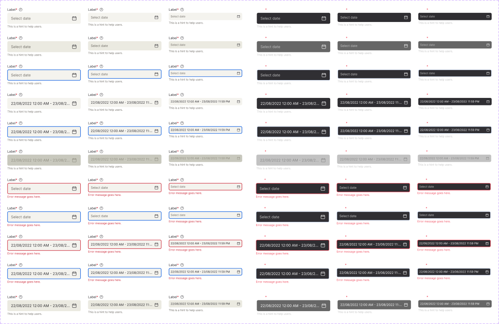

<!-- SOURCE: Figma MCP + figma-console MCP -->
<!-- FILE KEY: 5YihJ5WuDvnvrlrRMC4sBp -->
<!-- NODE ID: 80239:8235 -->
<!-- EXTRACTED: 2026-05-08 -->
<!-- COMPONENT: DateTimeSelector -->
<!-- COLOR STRATEGY: B (5 states × 2 modes × filled/unfilled — states as columns, elements as rows) -->

# DateTimeSelector — Figma Design Spec

> **See also:** [props.md](./props.md) · [tokens.md](./tokens.md) ·
> [examples.md](./examples.md) · [accessibility.md](./accessibility.md)

---

## Visual reference

**Component set overview:** 68 variants arranged in a 2176×1416px grid. Left half shows Light mode; right half shows Dark mode. Rows progress through: Rest (unfilled/filled) → Hover → Focus → Disabled → Error (Rest + Focus) × (Unfilled + Filled). Columns are Large / Medium / Small sizes at 320px wide each.

---

## Anatomy

Base variant: `Mode=Light, Size=Large, State=Rest, Error=False, Filled=False` (node 80239:8236, 320×92px)

| # | Type | Name | Role | Notes |
|---|------|------|------|-------|
| 1 | instance | `_base_form_label` | optional slot | Visible when `Show Label=true` (default). 320×20px. Contains label text + required asterisk + faq icon button |
| 2 | frame | `Dropdown` | fixed sub-component | Always present. 320×48px (Large). The date picker trigger / input field |
| 3 | instance | `_base_form_hint` | optional slot | Visible when `Show Hint=true` (default). 320×16px. Shows hint or error text below the field |

**Container layout:** `flex-col`, `gap-[4px]` between all three zones, `w-[320px]`

### Sub-component: _base_form_label

| # | Type | Name | Role | Notes |
|---|------|------|------|-------|
| 1 | frame | `H Stack` | structural | Horizontal flex; label text + required asterisk `*` |
| 2 | text | `Label` | content | Text token `body01`; color `--text/textcolor01` |
| 3 | text | `Required` | content | `*` character; color `--error/error01`; token `bodybold01` |
| 4 | instance | `Icon Button` | content | 20×20px; faq/help icon (16×16); padding 2px; `rounded-[6px]` |

### Sub-component: Dropdown (trigger frame)

| # | Type | Name | Role | Notes |
|---|------|------|------|-------|
| 1 | frame | `Text` | structural | Horizontal flex, `gap-[8px]`, fills remaining width |
| 2 | text/div | `Text` (inner) | content | Placeholder or filled date-range value; `body02` token |
| 3 | instance | `calendar` | content | 24×24px calendar icon; hidden in Error=True state |
| 4 | frame | `Focus ring` | optional slot | Absolute, `border-2 border-[--interactive/focus01]`; visible in Focus state only |
| 5 | frame | `Error Area` | optional slot | Appears below dropdown in Error=True state; error message text |

---

## API — Component properties

### Variant axes

Confirmed from `componentPropertyDefinitions` on COMPONENT_SET node `80239:8235`:

| Property | Figma key | Type | Values | Default |
|----------|-----------|------|--------|---------|
| `Mode` | `Mode` | VARIANT | `Light`, `Dark` | `Light` |
| `Size` | `Size` | VARIANT | `Large`, `Medium`, `Small` | `Large` |
| `State` | `State` | VARIANT | `Rest`, `Hover`, `Focus`, `Disabled` | `Rest` |
| `Error` | `Error` | VARIANT | `False`, `True` | `False` |
| `Filled` | `Filled` | VARIANT | `False`, `True` | `False` |

### Boolean toggles

| Property | Figma key | Default | Notes |
|----------|-----------|---------|-------|
| `Show Label` | `Show Label#19887:0` | `true` | Shows/hides the `_base_form_label` zone |
| `Show Hint` | `Show Hint#19869:10` | `true` | Shows/hides the `_base_form_hint` zone |

### Text content properties

| Property | Figma key | Default | Notes |
|----------|-----------|---------|-------|
| `Placeholder` | `Placeholder#19734:4` | `"Select date"` | Displayed in unfilled state |
| `Text` | `Text#19735:0` | `"22/08/2022 12:00 AM - 23/08/2022 11:59 PM"` | Displayed in Filled=True state |
| `Error text` | `Error text#19714:27` | `"Error message goes here."` | Displayed in Error=True state |

### Instance swap slots

<!-- NO INSTANCE SWAP SLOTS FOUND in returned data -->

### Persistent states

| State | Axis | Notes |
|-------|------|-------|
| Error | `Error=True` | Red border + error message; calendar icon hidden |
| Disabled | `State=Disabled` | Greyed out; not interactive |
| Filled | `Filled=True` | Shows selected date-time value instead of placeholder |

> Transient states (Hover, Focus) → interaction states section only.

### Token coverage

- **Coverage:** Partial — most colour and typography values are tokenised; spacing values are hardcoded
- **Hardcoded values flagged:**
  - `Dropdown.width`: `320px` — no token binding
  - `Dropdown.border-radius`: `6px` — no token binding; `rounded-[6px]`
  - `Container.gap`: `4px` — no token binding; `gap-[4px]`
  - `Text.gap` (icon spacing): `8px` — no token binding; `gap-[8px]`
  - `Error border.width`: `2px` — no token binding; `border-2`
  - `Icon Button.border-radius`: `6px` — no token binding
  - `Icon Button.padding`: `2px` — no token binding

---

## Color & token bindings

<!-- COLOR STRATEGY B: states as columns, elements as rows -->

| Element | Rest | Hover | Focus | Disabled | Error |
|---------|------|-------|-------|----------|-------|
| Dropdown background | `--ui/ui05` (#f4f3ee) | — (verify) | `--ui/ui05` (#f4f3ee) | — (verify) | `--ui/ui05` (#f4f3ee) |
| Dropdown border | none | none | none | none | `--error/error01` 2px solid |
| Focus ring | — | — | `--interactive/focus01` (#0056e0) 2px | — | — |
| Placeholder text | `--text/textcolor02` (#6c6862) | `--text/textcolor02` | `--text/textcolor02` | — | `--text/textcolor02` |
| Filled value text | `--text/textcolor01` (verify) | — | — | — | — |
| Label text | `--text/textcolor01` (#26252a) | — | — | — | `--text/textcolor01` |
| Required `*` | `--error/error01` (#cb2233) | — | — | — | `--error/error01` |
| Hint text | `--text/textcolor02` (#6c6862) | — | — | — | — |
| Error message text | — | — | — | — | `--error/error01` (#cb2233) |

> Hover and Disabled token values not directly confirmed from CSS — verify in implementation.

### Text styles

| Element | Token | Size | Weight | Line height | Letter spacing |
|---------|-------|------|--------|-------------|---------------|
| Label | `body01` | 14px | 400 | 20px | −0.06px |
| Required asterisk | `bodybold01` | 14px | 600 | 20px | −0.06px |
| Placeholder / value | `body02` | 16px | 400 | 24px | +0.0121px |
| Hint text | `label01` | 12px | 400 | 16px | 0px |
| Error text | `label01` | 12px | 400 | 16px | 0px |

### Effect styles

<!-- NO EFFECT STYLES FOUND IN FIGMA RESPONSE — no drop shadow on the Date picker trigger -->

---

## Structure & spacing

### Container

| Property | Token | Value | Variant |
|----------|-------|-------|---------|
| Width | — | 320px | all sizes |
| Height | — | 92px | Large |
| Height | — | 84px | Medium |
| Height | — | 76px | Small |
| Gap (zones) | — | 4px | all |
| Flex direction | — | column | all |

### Dropdown (trigger) dimensions

| Property | Token | Value | Size |
|----------|-------|-------|------|
| Height | — | 48px | Large |
| Height | — | 40px | Medium (inferred: 84−20−4−16−4) |
| Height | — | 32px | Small (inferred: 76−20−4−16−4) |
| Padding horizontal | — | 16px | all |
| Padding vertical | — | 12px | Large |
| Border radius | — | 6px | all |

### Internal spacing

| Property | Token | Value | Notes |
|----------|-------|-------|-------|
| Text / icon gap | — | 8px | Inside Dropdown between text and calendar icon |
| Label zone height | — | 20px | Fixed across all sizes |
| Hint zone height | — | 16px | Fixed across all sizes |
| Icon Button size | — | 20×20px | faq help icon in label |
| Calendar icon size | — | 24×24px | Right side of dropdown |
| faq icon size | — | 16×16px | Inside Icon Button |

### Auto-layout

- Direction: vertical (outer container), horizontal (Dropdown, label H Stack)
- Alignment: items-start (outer), items-center (Dropdown)

### Dark mode

Dark mode variants exist (`Mode=Dark`) in the component set. Token values for dark mode not confirmed from CSS — token aliases resolve via UI-Foundations library (`iVY5nI8JAxM05Apnnvozzs`).

---

## Interaction states

| State | Trigger | Visual change |
|-------|---------|---------------|
| hover | pointer over Dropdown | Background change (verify token) |
| focus | keyboard Tab | `border-2` ring in `--interactive/focus01` (#0056e0); absolute positioned ring extends slightly beyond dropdown bounds (`inset-[-12px_-48px_-12px_-16px]`) |
| error | `Error=True` | Red 2px border on Dropdown; calendar icon hidden; Error Area appears below with `--error/error01` text |
| disabled | `State=Disabled` | Greyed appearance; not interactive |
| filled | `Filled=True` | Placeholder replaced with selected date-time value |

---

## Design decisions & annotations

<!-- NO ANNOTATIONS FOUND IN FIGMA RESPONSE — component description is null; no verbatim design intent captured -->

> **Naming note:** The Figma COMPONENT_SET is named `"Date picker"` while the OX package is `@8x8/oxygen-date-time-selector`. The default `Text` property value (`"22/08/2022 12:00 AM - 23/08/2022 11:59 PM"`) shows a date-time range format, which may indicate this trigger component is shared with `@8x8/oxygen-date-time-range-selector`. Needs confirmation.

---

## Accessibility (from Figma annotations only)

- **ARIA role:** <!-- NOT ANNOTATED IN FIGMA -->
- **Focus order:** <!-- NOT ANNOTATED IN FIGMA -->
- **Keyboard interactions:** Focus ring visually defined — `border-2 border-[--interactive/focus01] rounded-[6px]` absolute overlay. "A focus ring is used to indicate the currently focused item." (from Focus ring sub-component description)

See [accessibility.md](./accessibility.md) for full accessibility documentation.

---

## Gaps & conflicts

| Type | Description |
|------|-------------|
| Missing token | `Dropdown.width` (320px) — hardcoded, no token |
| Missing token | `Dropdown.border-radius` (6px) — hardcoded |
| Missing token | `Container.gap` (4px between label/dropdown/hint) — hardcoded |
| Missing token | `Text.gap` (8px between text and icon) — hardcoded |
| Missing token | `Error.border-width` (2px) — hardcoded |
| Missing annotation | No design intent annotations found in Figma layer descriptions |
| Incomplete data | Variables empty in UI-components file — tokens in UI-Foundations library (`iVY5nI8JAxM05Apnnvozzs`) |
| Incomplete data | Hover and Disabled state token values not confirmed from design context |
| Incomplete data | Filled state value text color not confirmed (likely `--text/textcolor01`) |
| Missing usage page | No `↳ Date picker examples` or `↳ DateTimeSelector examples` page found in Figma file |
| Potential conflict | Figma COMPONENT_SET is named "Date picker"; OX package is `@8x8/oxygen-date-time-selector`. Default `Text` value shows date-time range format — may be the same trigger component used by both `DateTimeSelector` and `DateTimeRangeSelector` |

---

_Source: Figma MCP · figma-console MCP · Extracted 2026-05-08_
