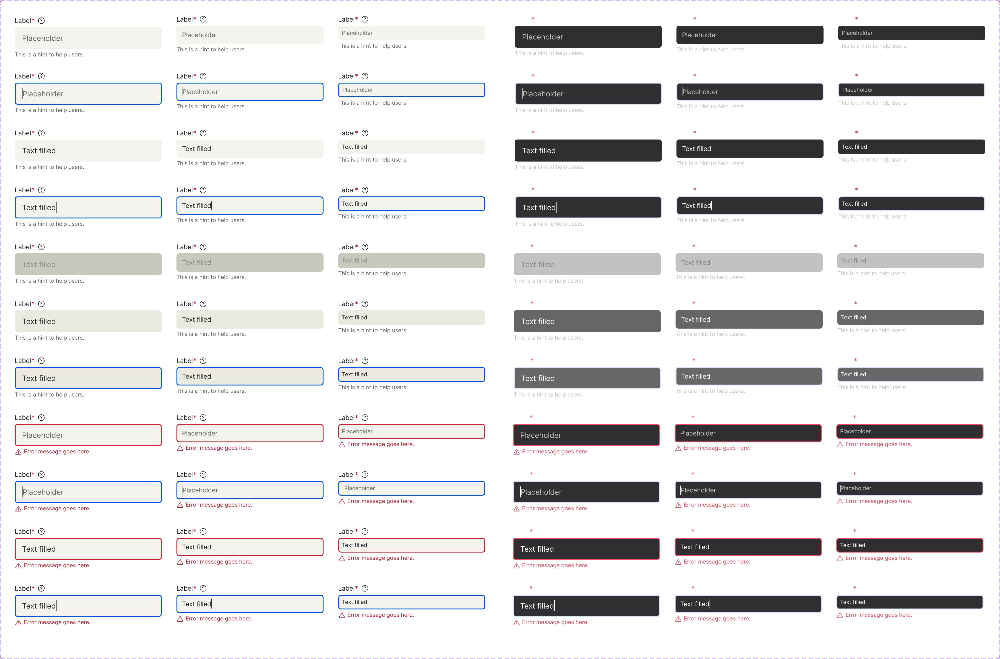
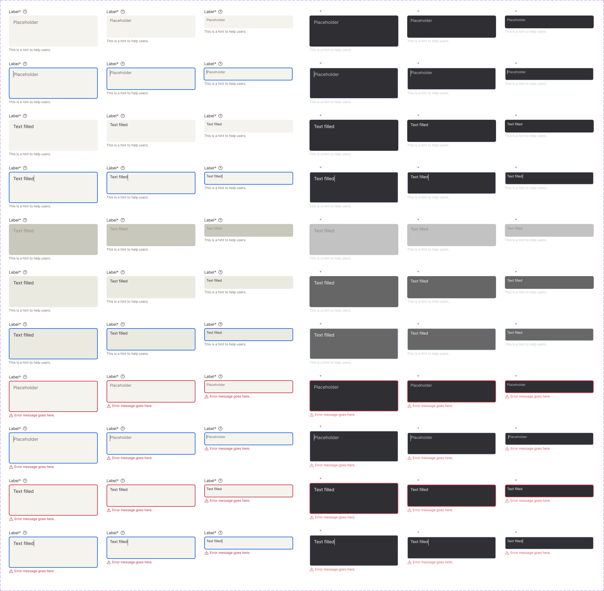
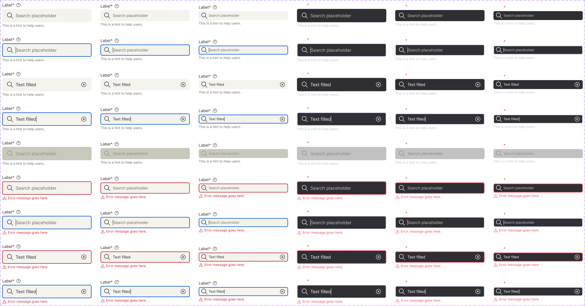

<!-- SOURCE: Figma MCP + figma-console MCP -->
<!-- FILE KEY: 5YihJ5WuDvnvrlrRMC4sBp -->
<!-- NODE ID (main): 2072:14 — canvas "Input" -->
<!-- NODE ID (examples): 65777:2179 — canvas "↳ Input examples" -->
<!-- EXTRACTED: 2026-04-29 -->
<!-- COMPONENT: Input (Text input · Text area · Search input) -->
<!-- COLOR STRATEGY: B (>3 state/variant combos — states as columns, elements as rows) -->

# Input — Figma Design Spec

> **See also:** [props.md](./props.md) · [tokens.md](./tokens.md) ·
> [examples.md](./examples.md) · [accessibility.md](./accessibility.md)

---

## Visual reference

### Text input (all variants — Light + Dark)



*(Figma node 22155:36793 — full variant grid: 3 sizes × Light/Dark × all states)*

### Text area (all variants — Light + Dark)



*(Figma node 21562:34985 — full variant grid)*

### Search input (all variants — Light + Dark)



*(Figma node 25655:40530 — full variant grid)*

---

## Anatomy

The Input canvas (`2072:14`) contains **three component sets** plus shared atom sub-components.

### Component sets on canvas

| # | Component set | Node ID | Type |
|---|---------------|---------|------|
| 1 | Text input | 22155:36793 | Single-line input |
| 2 | Text area | 21562:34985 | Multi-line textarea |
| 3 | Search input | 25655:40530 | Search-specific input with leading icon |

### Sub-component atoms (shared by all three)

| # | Type | Name | Node ID | Role | Notes |
|---|------|------|---------|------|-------|
| 1 | frame | `_base_form_label` | 22230:37448 | Optional slot | Controlled by `Show Label` boolean. Contains label text + required asterisk + help icon button |
| 2 | text | Label | I…;21562:35645 | Content element | Uses `typography/body01`, color `text/textColor01` |
| 3 | text | Required `*` | I…;21562:35646 | Content element | Uses `typography/bodyBold01`, color `error/error01`. Always visible in label row |
| 4 | instance | Icon Button (faq) | I…;71013:28942 | Fixed sub-component | Help icon, `iconSizeM`. Linked to Icon Button component |
| 5 | frame | `Input Text` / `Text Field` | varies | Structural | Input field container. bg=`ui05`, padding px=16px py=12px, rounded=6px |
| 6 | text | Placeholder | varies | Content element | Conditional on `hasPlaceholder` boolean. Uses `typography/body02`, color `text/textColor02` |
| 7 | frame | `_base_form_hint` | 22230:38105 | Optional slot | Controlled by `Show Hint` boolean. Helper/hint text below field |
| 8 | text | Hint text | I…;21562:35642 | Content element | Uses `typography/label01`, color `text/textColor02` |

### Text input — layer tree (default variant `22155:36794`)

```
Root (flex-col, gap=4px, w=320px)
├── _base_form_label  [Show Label=true]
│   ├── H Stack
│   │   ├── "Label" text  (body01, textColor01)
│   │   └── "*" text      (bodyBold01, error01)
│   └── Icon Button       (iconSizeM, faq/help icon)
├── Input Text  (bg=ui05, px=16, py=12, rounded=6)
│   └── Text  (flex, min-w)
│       └── Placeholder   [hasPlaceholder=true] (body02, textColor02)
└── _base_form_hint  [Show Hint=true]
    └── Hint text (label01, textColor02)
```

### Text area — additional layer (vs Text input)

```
Input Text  (bg=ui05, px=16, py=12, rounded=6)
├── Text  (h=88px — taller inner area for multi-line)
│   └── Placeholder   [hasPlaceholder=true]
└── grip  [Resize grip=true]  ← optional bottom-right resize handle (5×5px image)
```

### Search input — layer tree (default variant `25649:40529`)

```
Root (flex-col, gap=4px, w=320px)
├── _base_form_label  [Show Label=true]
│   └── (same as Text input)
├── Text Field  (bg=ui05, gap=8px, px=16, rounded=6)  ← gap=8px for search icon
│   ├── Search icon  (KeywordSearch component — magnifying glass)
│   └── Input  (flex-1, py=12)
│       └── Placeholder  [hasPlaceholder=true] (body02, textColor02)
└── _base_form_hint  [Show Hint area=true]
    └── Hint text (label01, textColor02)
```

---

## API — Component properties

### Variant axes (all three component sets)

| Property | Values | Default | Notes |
|----------|--------|---------|-------|
| Mode | Light, Dark | Light | Theme mode |
| Size | Large, Medium, Small | Large | Controls height |
| State | Rest, Focus, Disabled | Rest | Interaction state |
| Error | False, True | False | Error state |
| Read Only | False, True | False | Not present on Search input |
| Filled | False, True | False | Whether field contains a value |

### Boolean toggles

#### Text input & Text area

| Property | Default | Notes |
|----------|---------|-------|
| Show Label | true | Shows/hides `_base_form_label` slot (includes required asterisk + help icon) |
| Show Hint | true | Shows/hides `_base_form_hint` slot |
| hasPlaceholder | true | Shows/hides placeholder text inside field. **See accessibility note.** |
| Resize grip | false | **Text area only.** Shows resize handle at bottom-right |

#### Search input

| Property | Default | Notes |
|----------|---------|-------|
| Show Label | true | Shows/hides label slot |
| Show Hint area | true | Shows/hides hint slot |
| hasPlaceholder | true | Shows/hides placeholder |

### Text content properties

| Property | Default | Applies to |
|----------|---------|-----------|
| Placeholder | "Placeholder" / "Search placeholder" | All three |
| Text | "Text filled" | All three (value when Filled=True) |
| Error text | "Error message goes here." | All three |

### Persistent states (Figma variant axes → API props)

| Figma State/Axis | OX API prop | Notes |
|------------------|-------------|-------|
| State=Disabled | `isDisabled` | Greyed-out field, no interaction |
| Read Only=True | `isReadOnly` | Field shows content but not editable |
| Error=True | `hasError` | Red border + error message row shown |
| Filled=True | *(value prop)* | Controlled by value/onChange in code |

### Token coverage

- **Token coverage:** Partial — background, text colors, and typography are tokenised. Spacing (padding, gap, border-radius) uses hardcoded values.
- **Hardcoded values flagged:**
  - `Input Text.padding-x`: `16px` — should map to a spacing token
  - `Input Text.padding-y`: `12px` — should map to a spacing token
  - `Input Text.border-radius`: `6px` — should map to `border-radius/medium` or similar token
  - `Root.gap`: `4px` — gap between label/field/hint, should map to a spacing token
  - `Text Field.gap` (Search): `8px` — icon-to-input gap, should be a spacing token
  - `Text.inner-height` (Text area): `88px` — fixed inner textarea height, not tokenised

---

## Color & token bindings

<!-- COLOR STRATEGY B: states as columns, elements as rows -->

### Text input / Text area

| Element | Token | Light value | Dark value |
|---------|-------|-------------|------------|
| Field background (Rest/Focus/ReadOnly) | `--ui/ui05` | #F4F3EE | #2F2E32 |
| Field background (Filled/Rest) | `--ui/ui05` | #F4F3EE | #2F2E32 |
| Field background (Hover) | `--hover/hover06` | #EBEAE1 | #666666 |
| Field background (Disabled) | `--interactive/disabled01` | #C8C8BD | #C2C2C2 |
| Label text | `--text/textColor01` | #26252A | #FFFFFF |
| Placeholder & hint text | `--text/textColor02` | #6C6862 | #C2C2C2 |
| Required asterisk | `--error/error01` | #CB2233 | #F24D5F |
| Error border | `--error/error01` | #CB2233 | #F24D5F |
| Focus ring/border | `--interactive/focus01` | #0056E0 | #D7E3F9 |
| Error message text | `--error/error01` | #CB2233 | #F24D5F |

> **Note:** Dark mode values resolved from UI-Foundations token map via `figma_execute` alias chain traversal. `hover/hover06` Dark (#666666) and `interactive/disabled01` Dark (#C2C2C2) confirmed from shared token resolution. `error/error01` and `interactive/focus01` Dark values confirmed from Label, ToggleButton, and TextArea component extractions.

### Text styles

| Element | Token | Size | Weight | Line-height | Letter-spacing |
|---------|-------|------|--------|-------------|---------------|
| Label | `typography/body01` | 14px | 400 | 20px | -0.06px |
| Required `*` | `typography/bodyBold01` | 14px | 600 | 20px | -0.06px |
| Input text / Placeholder | `typography/body02` | 16px | 400 | 24px | 0.0121px |
| Hint / Helper text | `typography/label01` | 12px | 400 | 16px | 0px |

### Effect styles

<!-- NO EFFECT STYLES FOUND IN FIGMA RESPONSE — figma_get_styles returned 0 styles -->

---

## Structure & spacing

### Text input

| Property | Token | Value | Variant |
|----------|-------|-------|---------|
| Total height | — | 92px | Large |
| Total height | — | 84px | Medium |
| Total height | — | 76px | Small |
| Field padding-x | **HARDCODED** | 16px | All sizes |
| Field padding-y | **HARDCODED** | 12px | All sizes |
| Border radius | **HARDCODED** | 6px | All sizes |
| Label-to-field gap | **HARDCODED** | 4px | All sizes |
| Width | — | 320px (in Figma) | Responsive in code (`fullWidth` prop) |

### Text area

| Property | Token | Value | Variant |
|----------|-------|-------|---------|
| Total height | — | 156px | Large |
| Total height | — | 124px | Medium |
| Total height | — | 90px | Small |
| Inner text area height | **HARDCODED** | 88px | Large (grows with content) |
| Field padding-x | **HARDCODED** | 16px | All sizes |
| Field padding-y | **HARDCODED** | 12px | All sizes |
| Border radius | **HARDCODED** | 6px | All sizes |
| Resize grip | — | 5×5px | Visible only when Resize grip=True |

### Search input

| Property | Token | Value | Variant |
|----------|-------|-------|---------|
| Total height | — | 92px | Large |
| Total height | — | 84px | Medium |
| Total height | — | 76px | Small |
| Field padding-x | **HARDCODED** | 16px | All sizes |
| Icon-to-input gap | **HARDCODED** | 8px | All sizes |
| Border radius | **HARDCODED** | 6px | All sizes |

### Auto-layout

- **Direction:** vertical (column) — label → field → hint
- **Alignment:** start (items-start)
- **Inner field:** horizontal row (items-center)
- **Search field inner:** horizontal row with gap=8px between icon and input

---

## Interaction states

| State | Trigger | Visual change |
|-------|---------|---------------|
| Rest | Default | Field bg=`ui05`, no border |
| Focus | Keyboard tab / click into field | Blue focus ring/border appears on field |
| Hover | Pointer over field | Background shifts to `hover06` |
| Filled | User has typed text | Shows `Text` content instead of placeholder |
| Disabled | `isDisabled=true` | Field visually greyed, muted background, no interaction |
| Read Only | `isReadOnly=true` / `Read Only=True` | Field shows value, no cursor/edit capability |
| Error+Rest | `hasError=true`, field not focused | Red border on field + error message row below |
| Error+Focus | `hasError=true`, field focused | Blue focus ring overrides red border; error message **stays visible** |

> **Key behavior from Figma annotations:** When an error occurs and the user tries to edit the text, the border becomes **highlighted in-focus state (blue)** while the error message **stays visible at the bottom**. The error only clears when the value becomes valid.

---

## Design decisions & annotations

> **Error state + Focus:** "When an error occurs in the input text field and a user tries to change the text, the border becomes highlighted in-focus state (blue) while the error message stays visible at the bottom."

> **Error persistence:** "When the user enters invalid data (such as a number), an error message appears with explanatory text and an icon indicating the specific problem. When typing in the input field to correct data, the field shows a focus border. The error message remains visible until the user clicks outside the field. If the user enters incorrect data and clicks outside, both the error message and red border remain visible (as in step 4). Once the user removes the invalid number from the input field, making the data correct, the error message disappears and the help message returns."

> **hasPlaceholder accessibility rationale:** "Using placeholder text alone as a method to guide user input is not considered accessible, as it can disappear once the user starts typing, reducing clarity and usability — especially for users relying on assistive technologies."

> **hasPlaceholder usage guidance:** "`hasPlaceholder = true`, by default to preserve behaviour in current and legacy prototypes. `hasPlaceholder = false`, for all new designs and prototypes, we highly recommend setting `hasPlaceholder` to false and using a proper label and helper text combination."

> **Form validation strategy:** "Our form validation strategy combines two approaches: real-time feedback that checks individual fields as users complete them, and a comprehensive validation when submitting the entire form. This dual method helps users catch errors early while ensuring all requirements are met before submission."

> **Real-time validation:** "Real-time validation occurs on blur events (when an input field loses focus through clicking away or tabbing). This pattern provides immediate feedback by displaying error states directly on individual form controls that contain invalid data."

> **Submit-time validation:** "Form validation triggers when users submit a form containing invalid data. The system displays error states in two locations: Inline validation indicators appear directly on the affected input fields. A summary component at the bottom of the form lists all validation errors."

> **Placement:** "Make sure the input width is proportional to the content that the user has to insert and align to grid columns. The component should also be vertically aligned to other contents of the page."

---

## Accessibility (from Figma annotations only)

- **ARIA role:** <!-- NOT ANNOTATED IN FIGMA — infer in accessibility.md -->
- **Focus order:** Sequential tab order. Focus ring visible on field when focused.
- **Error announcement:** Error message remains visible during editing; should be announced via `aria-describedby` or `aria-errormessage` — <!-- NOT EXPLICITLY ANNOTATED IN FIGMA, see accessibility.md -->
- **Placeholder accessibility:** `hasPlaceholder=false` recommended for all new designs. Placeholder text alone is not accessible (disappears on input, not consistently announced by screen readers).
- **Required fields:** Required symbol `*` is a visual indicator. Semantic `required`/`aria-required` not explicitly annotated in Figma.

---

## Gaps & conflicts

| Type | Description |
|------|-------------|
| Missing token | `Input Text.padding-x`: hardcoded 16px — no spacing token binding |
| Missing token | `Input Text.padding-y`: hardcoded 12px — no spacing token binding |
| Missing token | `Input Text.border-radius`: hardcoded 6px — no border-radius token |
| Missing token | `Root.gap` (label/field/hint): hardcoded 4px |
| Missing token | `Text Field.gap` (search icon): hardcoded 8px |
| Missing token | `Text.inner-height` (text area): hardcoded 88px |
| ~~Missing token~~ | ~~Focus ring color not captured~~ — **Resolved 2026-05-05**: `interactive/focus01` Light #0056E0 / Dark #D7E3F9 |
| ~~Missing token~~ | ~~Error border color not captured~~ — **Resolved 2026-05-05**: `error/error01` Light #CB2233 / Dark #F24D5F |
| ~~Missing token~~ | ~~Disabled background color not captured~~ — **Resolved 2026-05-05**: `interactive/disabled01` Light #C8C8BD / Dark #C2C2C2 |
| ~~Missing token~~ | ~~`textColor02` dark mode value not captured~~ — **Resolved 2026-05-05**: `text/textColor02` Dark #C2C2C2 |
| Missing annotation | No explicit ARIA role annotation in Figma |
| Missing annotation | No keyboard interaction map in Figma |
| ~~Incomplete data~~ | ~~`figma_get_variables` failed~~ — **Resolved 2026-05-05**: all Dark mode values filled via `figma_execute` alias chain traversal from UI-Foundations library |
| Incomplete data | `figma_get_styles` returned 0 styles |
| Conflict | Figma `Read Only` variant is absent from Search input (Text input/Text area only) |
| Conflict | OX API has `isReadOnly` prop but Figma Search input has no Read Only variant |
| Note | `hasPlaceholder` default in Figma is `true` (legacy compatibility) but new designs should use `false` |

---

_Source: Figma MCP · figma-console MCP · Extracted 2026-04-29_
