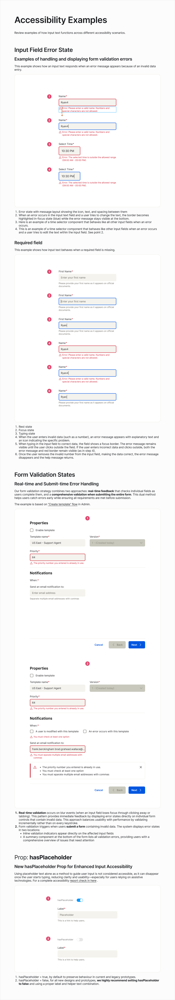

# Input — Accessibility

> **See also:** [Input-figma.md](./Input-figma.md) · [props.md](./props.md) ·
> [tokens.md](./tokens.md) · [examples.md](./examples.md)

---

## ARIA role

| Element | Role | Notes |
|---------|------|-------|
| Input field | `textbox` (implicit from `<input type="text">`) | Native semantics — no explicit ARIA role needed |
| Input with `type="search"` | `searchbox` | For Search input variant |
| Error message | `alert` or `aria-live="polite"` region | Announced when error appears |
| Required indicator `*` | Decorative | `aria-hidden="true"` on visual `*`; use `aria-required="true"` on the `<input>` |

---

## Keyboard interactions

| Key | Action |
|-----|--------|
| `Tab` | Move focus to input field |
| `Shift+Tab` | Move focus backward from input |
| Any printable key | Enters text into the field |
| `Backspace` / `Delete` | Removes text |
| `Escape` | *(No default behavior — application-defined)* |
| `Enter` | *(No default behavior for text inputs — submits form if inside `<form>`)* |

For **Search input**, additionally:
| Key | Action |
|-----|--------|
| `Enter` | Typically triggers search |

---

## Screen reader guidance

### Label association

Always associate a visible label with the input using `for`/`id` pairing or `aria-labelledby`. Never rely solely on placeholder text:

```tsx
// ✅ Correct
<label htmlFor="username">Username</label>
<Input inputProps={{ id: 'username', name: 'username' }} />

// ✅ Also correct (programmatic association)
<span id="username-label">Username</span>
<Input inputProps={{ 'aria-labelledby': 'username-label' }} />

// ❌ Avoid — screen readers may not announce placeholder as label
<Input inputProps={{ placeholder: 'Username' }} />
```

### Placeholder text (critical)

**From Figma annotations:** "Using placeholder text alone as a method to guide user input is not considered accessible, as it can disappear once the user starts typing, reducing clarity and usability — especially for users relying on assistive technologies."

- `hasPlaceholder=true` (Figma default) — use only for legacy designs
- `hasPlaceholder=false` — **recommended for all new designs**. Replace placeholder with a proper `<label>` and helper text

### Helper text / hint

Associate helper text using `aria-describedby`:

```tsx
<Input
  inputProps={{
    id: 'email',
    'aria-describedby': 'email-hint',
  }}
/>
<p id="email-hint">We'll use this to send your receipt.</p>
```

### Error messages

When `hasError=true`, associate the error message so screen readers announce it:

```tsx
<Input
  hasError
  inputProps={{
    'aria-invalid': 'true',
    'aria-describedby': 'email-error',
    'aria-errormessage': 'email-error',
  }}
/>
<p id="email-error" role="alert">Please enter a valid email address.</p>
```

**Figma behavior:** Error message stays visible when user is re-editing the field (focus state doesn't clear it). This is intentional — the screen reader should continue to associate the error text until the value is valid.

### Required fields

```tsx
<Input
  isRequired
  inputProps={{
    'aria-required': 'true',
    id: 'name',
  }}
/>
```

The visual `*` asterisk is decorative and should be `aria-hidden="true"` (handled by the component internally — verify in implementation).

### Read-only fields

```tsx
<Input
  isReadOnly
  inputProps={{
    readOnly: true,
    'aria-readonly': 'true',
    value: 'Non-editable value',
  }}
/>
```

### Disabled fields

```tsx
<Input
  isDisabled
  inputProps={{ disabled: true }}
/>
```

Disabled fields are not focusable. If the value must be communicated to screen reader users, consider `isReadOnly` instead.

---

## Focus management

- Focus ring is a **blue border** on the input field (Figma State=Focus)
- Focus ring is visible in both Rest→Focus and Error→Focus transitions
- Error state: focus ring is blue even when error is active (error message remains)
- Ensure focus ring meets WCAG 2.1 AA focus visibility requirements (minimum 3:1 contrast against adjacent colors)

---

## Color contrast

| Element | Foreground | Background | Ratio check needed |
|---------|------------|------------|-------------------|
| Label text | `textColor01` (#26252A Light) | Page bg | ✅ Very dark — likely passes |
| Placeholder text | `textColor02` (#6C6862 Light) | `ui05` (#F4F3EE) | ⚠ Verify — light grey on light beige |
| Helper text | `textColor02` (#6C6862 Light) | Page bg | ⚠ Verify |
| Error text | `error01` (#CB2233) | Page bg | ⚠ Verify against WCAG AA 4.5:1 |
| Required `*` | `error01` (#CB2233) | Page bg | ⚠ Verify |

> Placeholder text contrast is a common failure point. WCAG 2.1 AA requires 4.5:1 for normal text. `#6C6862` on `#F4F3EE` should be verified with a contrast checker.

---

## WCAG 2.1 AA checklist

| Criterion | Requirement | Status |
|-----------|-------------|--------|
| 1.1.1 Non-text content | Input has accessible label | ✅ `aria-label` / `<label>` required by implementation |
| 1.3.1 Info and relationships | Label programmatically associated | ✅ via `htmlFor` / `aria-labelledby` |
| 1.3.5 Identify input purpose | `autocomplete` attribute where appropriate | ⚠ Use `inputProps.autoComplete` |
| 1.4.3 Contrast (minimum) | Text contrast ≥ 4.5:1 | ⚠ Verify placeholder (#6C6862 on `#F4F3EE`) |
| 1.4.4 Resize text | Input resizes to 200% zoom | ⚠ Verify no overflow |
| 1.4.11 Non-text contrast | Focus ring ≥ 3:1 | ⚠ Verify blue ring contrast |
| 2.1.1 Keyboard | All functions via keyboard | ✅ Native input keyboard support |
| 2.4.3 Focus order | Logical focus sequence | ✅ DOM order |
| 2.4.7 Focus visible | Focus ring visible | ✅ Blue focus ring in Figma |
| 3.3.1 Error identification | Error described in text | ✅ Error message text required |
| 3.3.2 Labels or instructions | Label + optional hint text | ✅ Required in implementation |
| 3.3.3 Error suggestion | Error message suggests correction | ⚠ Application-level responsibility |
| 4.1.2 Name, role, value | `textbox` / `searchbox` role, state exposed | ✅ Native HTML semantics |
| 4.1.3 Status messages | Error role=alert | ✅ `role="alert"` on error message |

---

## Figma accessibility examples summary (node 65777:2179)



The Figma examples page documents three scenarios:

### 1. Input Field Error State
- Error message layout: icon + text + spacing
- During editing: **blue focus ring + error message both visible simultaneously**
- Time selector component follows same error behavior

### 2. Required Field
Flow: Rest → Focus → Typing → Error (invalid entry) → Re-focus → Correction
- Error appears on invalid blur
- Error persists on subsequent focus
- Error clears when value becomes valid

### 3. Form Validation States
- **Real-time:** Validates on blur. Shows inline error on field.
- **Submit-time:** Validates all fields on submit. Shows inline errors + summary component at bottom of form.
- Based on "Create template" flow in Admin.

### 4. hasPlaceholder prop
- Introduced for accessibility compliance
- `false` = use label + helper text (recommended for all new work)
- `true` = legacy behavior retained for existing prototypes

---

_Source: Oxygen MCP · Figma annotations (node 65777:2179) · Extracted 2026-04-29_
