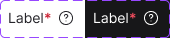

<!-- SOURCE: Figma MCP + figma-console MCP (Desktop Bridge confirmed 2026-05-01) -->
<!-- FILE KEY: 5YihJ5WuDvnvrlrRMC4sBp -->
<!-- NODE ID: 33680:62952 (showcase frame) / 22230:37448 (component set) -->
<!-- EXTRACTED: 2026-05-01 -->
<!-- COMPONENT: Label (_base_form_label) -->
<!-- COLOR STRATEGY: A -->
<!-- DESKTOP BRIDGE: confirmed connected; component properties verified via desktop_bridge_plugin source -->

# Label — Figma Design Spec

> **See also:** [props.md](./props.md) · [tokens.md](./tokens.md) ·
> [examples.md](./examples.md) · [accessibility.md](./accessibility.md) · [label-usage.md](./label-usage.md)

---

## Visual reference

*Showcase frame: light mode (left) and dark mode (right), both showing label text + required asterisk + info icon.*

---

## Anatomy

The Figma node `33680:62952` ("Group 3") is a documentation/showcase frame containing a `_base_form_label` component in two modes side by side. The inner component (`22230:37448`) represents the actual label.

| # | Type | Name | Role | Notes |
|---|------|------|------|-------|
| 1 | frame | H Stack | Structural | Horizontal flex container; holds text and optional asterisk |
| 2 | text | Label text | Content element | Label string; driven by `text` prop |
| 3 | text | `*` (required asterisk) | Optional slot | Shown when `isRequired = true` (hidden) |
| 4 | instance | Icon Button | Optional slot | Info/help button; shown when `information = true` |

### Sub-component: Icon Button

| # | Type | Name | Role | Notes |
|---|------|------|------|-------|
| 1 | frame | Icon Button wrapper | Structural | 2px padding, rounded-[6px] |
| 2 | instance | TypeIcon | Fixed sub-component | Size = `iconSizeM`; Mode follows parent mode |

---

## API — Component properties

### Variant axes

| Property | Values | Default |
|----------|--------|---------|
| `mode` | `light`, `dark` | `light` |

### Boolean toggles

| Property | Figma property ID | Default | Notes |
|----------|------------------|---------|-------|
| `information` | `information?#22230:1` | `true` | Shows / hides the Icon Button (info slot) |
| `isRequired` | `isRequired?#22230:2` | `true` | Shows / hides the required asterisk (`*`) |

### Instance swap slots

| Slot | Accepted types | Default |
|------|---------------|---------|
| Icon Button > icon | TypeIcon (iconSizeM) | `TypeIcon` from `packages/toast/src/components/typeMarkings.tsx` (Code Connect) |

### Persistent states

<!-- NO PERSISTENT STATES FOUND — component expresses state through `mode`, `isRequired`, and `information` boolean toggles only. Disabled state is not represented as a Figma variant on this node. -->

### Token coverage

- **Coverage:** High — all color and typography values reference design tokens.
- **Hardcoded values flagged:**
  - `Icon Button wrapper.padding`: `2px` — no token binding found
  - `Icon Button wrapper.border-radius`: `6px` (rounded-[6px]) — no token binding found
  - `H Stack.gap`: `4px` — no token binding found; may map to `spacing` token

---

## Color & token bindings

<!-- COLOR STRATEGY A: one table per element, states as rows -->

### Label text

| State | Token | Collection | Light | Dark |
|-------|-------|------------|-------|------|
| Default | `text/textColor01` | text | `#26252a` | `#ffffff` |

### Required asterisk (`*`)

| State | Token | Collection | Light | Dark |
|-------|-------|------------|-------|------|
| Default | `error/error01` | error | `#cb2233` | `#f24d5f` |

### Dark mode background overlay (showcase frame only)

| Element | Token | Collection | Value |
|---------|-------|------------|-------|
| Dark Bg | `ui/ui06` | ui | `#171719` |

> This token is used only in the documentation showcase frame to represent the dark surface. It is not part of the Label component itself.

### Text styles

| Element | Style token | Family | Size | Weight | Line height | Letter spacing |
|---------|-------------|--------|------|--------|-------------|----------------|
| Label text | `typography/body01` | Inter | 14px | 400 (Regular) | 20px | −0.06px |
| Required asterisk | `typography/bodyBold01` | Inter | 14px | 600 (SemiBold) | 20px | −0.06px |

### Effect styles

<!-- NO EFFECT STYLES FOUND IN FIGMA RESPONSE -->

---

## Structure & spacing

### Container (_base_form_label)

| Property | Token | Value | Variant |
|----------|-------|-------|---------|
| Height | — | 38px (showcase frame) / ~20px (component content) | — |
| Width | — | 68px (light mode symbol) / 68px (dark mode symbol) | — |
| Auto-layout direction | — | Horizontal | — |
| Alignment | — | items-center, content-stretch | — |

### Internal spacing

| Property | Token | Value | Notes |
|----------|-------|-------|-------|
| Gap (H Stack → Icon Button) | — | `4px` | Hardcoded — no token binding found |
| Icon Button padding | — | `2px` (all sides) | Hardcoded |
| Icon Button border-radius | — | `6px` | Hardcoded |
| Icon size | — | `iconSizeM` | Passed via instance swap |

### Auto-layout

- Direction: horizontal
- Alignment: items-center, content-stretch
- Text wrapping: not visible in Figma variants (no `shouldWrapText` variant present)

### Density / size variants

<!-- NO SIZE/DENSITY VARIANTS FOUND — component has a single size using body01 typography (14px/20px). -->

---

## Interaction states

| State | Trigger | Visual change |
|-------|---------|---------------|
| hover (Icon Button) | pointer over icon button | Follows Icon Button component styles |

<!-- NO OTHER INTERACTION STATES FOUND IN FIGMA RESPONSE — hover/focus/pressed states for the label text itself are not represented as variants in this node. -->

---

## Design decisions & annotations

> **Icon Button documentation:** The info/help icon uses the Icon Button component. Design docs at [https://zeroheight.com/714056d2f/p/75909b-icons/b/1725fe](https://zeroheight.com/714056d2f/p/75909b-icons/b/1725fe)

<!-- NO OTHER ANNOTATIONS FOUND IN FIGMA RESPONSE -->

---

## Accessibility (from Figma annotations only)

- **ARIA role:** <!-- NOT ANNOTATED IN FIGMA -->
- **Focus order:** <!-- NOT ANNOTATED IN FIGMA -->
- **Keyboard interactions:** <!-- NOT ANNOTATED IN FIGMA -->

> For full accessibility documentation see [accessibility.md](./accessibility.md).

---

## Gaps & conflicts

| Type | Description |
|------|-------------|
| ~~Incomplete data~~ | ~~`figma-console` tools unavailable~~ — **resolved**: Desktop Bridge confirmed connected; component properties verified via `desktop_bridge_plugin` source |
| ~~Incomplete data~~ | ~~`figma-console` variables API unavailable~~ — **clarified**: variables and styles return empty because they are defined in a linked library file, not this file. CSS variable names from design context are valid token references. |
| Missing token | `H Stack.gap`: `4px` hardcoded — no token binding found |
| Missing token | `Icon Button wrapper.padding`: `2px` hardcoded — no token binding found |
| Missing token | `Icon Button wrapper.border-radius`: `6px` hardcoded — no token binding found |
| Missing annotation | No ARIA role, focus order, or keyboard interaction annotations in Figma — confirmed via `annotations: []` (Desktop Bridge) |
| Missing annotation | No design intent annotations for required indicator or information icon behaviour — confirmed `description: null` |
| Conflict | Figma component `mode` axis (light/dark) has no direct counterpart in Oxygen React `Label` props — theming is handled by the design system theme provider, not a prop |
| Conflict | Figma `information` boolean (shows/hides info icon) maps to Oxygen's `infoBoxText` / `infoBoxButtonLabel` props — alignment needs verification |
| Source gap | `isDisabled` state not present as a Figma variant — disabled visual treatment unknown from Figma alone |
| Source gap | `shouldWrapText` and `showTooltipOnOverflow` behaviours have no Figma variant representation |

---

_Source: Figma MCP · figma-console MCP (Desktop Bridge connected) · Extracted 2026-05-01 · Updated 2026-05-01_
