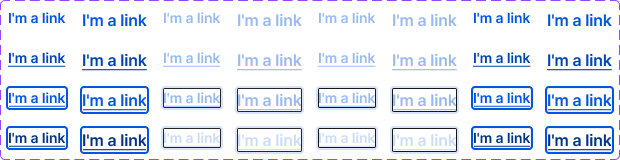

<!-- SOURCE: Figma MCP + figma-console MCP -->
<!-- FILE KEY: 5YihJ5WuDvnvrlrRMC4sBp -->
<!-- NODE ID: 58315:113 (Standalone Link component set) · canvas: 58314:19 -->
<!-- EXTRACTED: 2026-05-01 -->
<!-- COMPONENT: Link (Standalone variant) -->
<!-- COLOR STRATEGY: B (states as columns, elements as rows — >3 state×mode×inverted combos) -->

# Link — Figma Design Spec

> **See also:** [props.md](./props.md) · [tokens.md](./tokens.md) ·
> [examples.md](./examples.md) · [accessibility.md](./accessibility.md)

---

## Visual reference

_Screenshot: Standalone Link component set — all Mode/isInverted/State/Size combinations. Top row: Rest; second row: Hover (with underline); third row: Focus (with focus ring); bottom row: Active._

---

## Anatomy

Element structure from the Standalone Link component set layer tree.

| # | Type | Name | Role | Notes |
|---|------|------|------|-------|
| 1 | text | label (`
`) | Content element | Link text; always present |
| 2 | instance | `pop-out` (icon) | Optional slot | Controlled by `hasIcon` boolean; hidden by default |
| 3 | frame | Focus ring | Structural / decorative | Visible in Focus and Active states only; absolute-positioned overlay |

**Container:** horizontal auto-layout flex row, gap 4px, `items-start`.

---

## API — Component properties

### Variant axes

| Property | Values | Default |
|----------|--------|---------|
| `mode` | `Light`, `Dark` | `Light` |
| `isInverted` | `true`, `false` | `false` |
| `state` | `Rest`, `Hover`, `Focus`, `Active` | `Rest` |
| `size` | `Small`, `Large` | `Small` |

### Boolean toggles

| Property | Default | Notes |
|----------|---------|-------|
| `hasIcon` | `false` | Shows/hides the `pop-out` icon instance alongside the label |

### Instance swap slots

| Slot | Accepted types | Default |
|------|----------------|---------|
| `icon` | Any ReactNode / icon component | `null` (renders built-in `pop-out` vector when `hasIcon=true` and no icon passed) |

### Persistent states

<!-- NO PERSISTENT STATES FOUND — all states (Rest/Hover/Focus/Active) are transient interaction states in this component set. There is no `isDisabled` variant in Figma. -->

### Token coverage

<!-- NO COVERAGE DATA RETURNED BY figma_get_component enrich — Desktop Bridge plugin not running. -->

**Hardcoded values flagged:**

| Layer | Property | Raw value | Note |
|-------|----------|-----------|------|
| Container | gap | `4px` | Hardcoded flex gap; verify if spacing token exists |
| Focus ring | border-radius | `2px` | Hardcoded `rounded-[2px]`; verify token |
| Icon inner vector | inset | `12.5%` | Hardcoded positioning of SVG path within icon frame |

---

## Color & token bindings

<!-- COLOR STRATEGY B: states as columns, elements as rows. Grouped by surface (Default / Inverted). -->

### Text label — Light mode

| Element | Rest | Hover | Focus | Active |
|---------|------|-------|-------|--------|
| Default | `--actions/action08` `#0056e0` | `--interactive/hover15` `#0045b3` | `--actions/action08` `#0056e0` | `--interactive/active14` `#003486` |
| Inverted | `--actions/action10` `#99bbf3` | `--interactive/hover20` `#99bbf3` | `--actions/action10` `#99bbf3` | `--interactive/active17` `#ccddf9` |

### Text label — Dark mode

| Element | Rest | Hover | Focus | Active |
|---------|------|-------|-------|--------|
| Default | `--actions/action08` `#99bbf3` | `--interactive/hover15` `#99bbf3` | `--actions/action08` `#99bbf3` | `--interactive/active14` `#ccddf9` |
| Inverted | `--actions/action10` `#0056e0` | `--interactive/hover20` `#0045b3` | `--actions/action10` `#0056e0` | `--interactive/active17` `#003486` |

### Text decoration

| State | Decoration |
|-------|-----------|
| Rest | none |
| Hover | underline solid (`text-decoration-skip-ink: none`) |
| Focus | underline solid |
| Active | underline solid |

### Focus ring — Default surface

| Property | Light | Dark |
|----------|-------|------|
| Border | `--ui/ui06` `white` | `--ui/ui06` `#171719` |
| Box-shadow | `0 0 0 2px var(--interactive/focus01)` `#0056e0` | `0 0 0 2px var(--interactive/focus01)` `#d7e3f9` |

### Focus ring — Inverted surface

| Property | Light | Dark |
|----------|-------|------|
| Border | `--ui/ui07` `#26252a` | `--ui/ui07` `#f1f1f1` |
| Box-shadow | `0 0 0 2px var(--interactive/focus02)` `#d7e3f9` | `0 0 0 2px var(--interactive/focus02)` `#0056e0` |

### Text styles

| Element | Font family | Weight | Size | Line height | Tracking |
|---------|-------------|--------|------|-------------|---------|
| Label — Small | Inter | Semi Bold (600) | 14px | 20px | −0.084px |
| Label — Large | Inter | Semi Bold (600) | 16px | 24px | −0.176px |

### Effect styles

<!-- NO EFFECT STYLES FOUND IN FIGMA RESPONSE -->

---

## Structure & spacing

### Container

| Property | Token | Value | Variant |
|----------|-------|-------|---------|
| Height | — | 20px | Small |
| Height | — | 24px | Large |
| Auto-layout direction | — | Horizontal | All |
| Alignment | — | `items-start` | All |

### Internal spacing

| Property | Token | Value | Notes |
|----------|-------|-------|-------|
| Gap (text ↔ icon) | — | 4px (hardcoded) | Between label and icon |
| Icon size | — | 20×20px | Small variant |
| Icon size | — | 24×24px | Large variant |
| Focus ring inset | — | `inset-0` (full overlay) | Absolute positioned |
| Focus ring border-radius | — | 2px (hardcoded) | `rounded-[2px]` |

### Auto-layout

- Direction: horizontal
- Alignment: `items-start`
- Gap: 4px

### Density / size variants

| Variant | Font size | Line height | Icon size |
|---------|-----------|-------------|-----------|
| Small | 14px | 20px | 20×20px |
| Large | 16px | 24px | 24×24px |

---

## Interaction states

| State | Trigger | Visual change |
|-------|---------|---------------|
| Rest | Default | No decoration; `action08` / `action10` color |
| Hover | Pointer over | Underline added; color shifts to `hover15` / `hover20` |
| Focus | Keyboard Tab | Underline added; color same as Rest; focus ring appears (border + 2px outline shadow) |
| Active | Pointer down / Enter | Underline added; color shifts to `active14` / `active17`; focus ring visible |

---

## Design decisions & annotations

> **Component docs URL:** All 32 variants link to [https://oxygen.8x8.com/docs/components/textlink/usage](https://oxygen.8x8.com/docs/components/textlink/usage). Status: Stable.

> **isInverted purpose:** The `isInverted` flag swaps `action08↔action10` and uses a different focus ring token pair (`focus02` vs `focus01`, `ui07` vs `ui06`). This is designed for use on dark/filled surfaces where the default link colour would have insufficient contrast.

> **Focus ring design:** Two concentric rings — an inner border matching the surface colour (white on light, dark on dark) and an outer 2px box-shadow in the focus colour. This ensures the ring is visible regardless of background.

> **Size matches text context:** Small (14px/20px lh) and Large (16px/24px lh) correspond to common body text sizes so the standalone link integrates visually with surrounding typographic content.

<!-- NO ADDITIONAL ANNOTATIONS FOUND IN FIGMA RESPONSE -->

---

## Accessibility (from Figma annotations only)

> **Focus ring annotation (from component description):** "A focus ring is used to indicate the currently focused item." (Node 84709:245198, 81133:36227)

- **ARIA role:** <!-- NOT ANNOTATED IN FIGMA -->
- **Focus order:** <!-- NOT ANNOTATED IN FIGMA -->
- **Keyboard interactions:** <!-- NOT ANNOTATED IN FIGMA -->

See [accessibility.md](./accessibility.md) for full a11y documentation.

---

## Gaps & conflicts

| Type | Description |
|------|-------------|
| Incomplete data | `figma_get_component_details` failed — Desktop Bridge plugin not running; token coverage % unavailable |
| Incomplete data | `figma_get_variables` failed — no variables data returned; token bindings verified via design context code only |
| Incomplete data | `figma_get_styles` returned 0 styles — text/effect style names not available |
| Missing token | Container `gap: 4px` is hardcoded — no token binding found |
| Missing token | Focus ring `border-radius: 2px` is hardcoded — no token binding found |
| Missing variant | No `isDisabled` state in Figma component set — Oxygen MCP also has no `disabled` prop. Confirm if disabled Link is intentionally unsupported or handled via CSS pointer-events |
| Conflict | Figma component is named "Standalone Link" but the Oxygen MCP `standalone` prop has type `false` — relationship between Figma standalone variant and the React prop needs clarification |
| Missing annotation | No ARIA role, focus order, or keyboard interaction annotations in Figma |
| Source gap | Inline Link variant not represented in this component set (node 58314:19 canvas) — inline behaviour inherits typography from context and may live in a separate frame or only in usage examples |

---

_Source: Figma MCP · figma-console MCP (REST fallback) · Extracted 2026-05-01_
