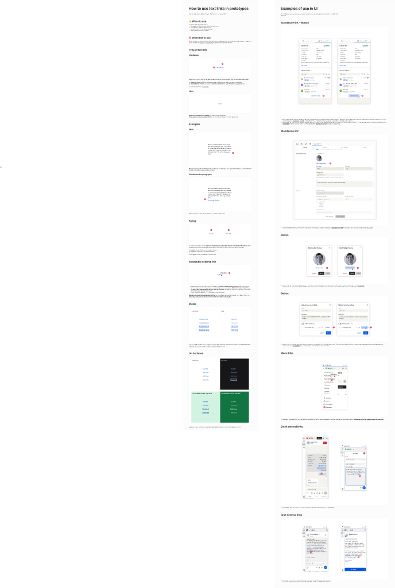

<!-- SOURCE: Figma — node 58394:123 (UI-components file) -->
<!-- PAGE: "How to use text links in prototypes" + "Examples of use in UI" -->
<!-- SECTION: Narrative documentation page — NOT the ✅ Do / ❌ Don't card format -->
<!-- EXTRACTED: 2026-05-01 -->
<!-- COMPONENT: Link -->
<!-- PAIRS: 0 — page does not use the standard Do/Don't card template -->

# Link — Usage Guidelines

> **See also:** [props.md](./props.md) · [tokens.md](./tokens.md) ·
> [examples.md](./examples.md) · [Link-figma.md](./Link-figma.md)

> **Extraction note:** Two hard stops were encountered running `figma-extract-usage`:
> 1. Desktop Bridge plugin not running — `figma_get_selection` returned a connection error.
> 2. Node 58394:123 contains a narrative documentation page, not ✅ Do / ❌ Don't cards.
>
> The content below was extracted from a screenshot of node 58394:123 and supplemented
> with usage documentation from the Oxygen MCP. It is **not** in Do/Don't card format.
> A designer should create the standard Do/Don't card format for this component.

---

## Visual reference

_Screenshot: node 58394:123 — "How to use text links in prototypes" (left) and "Examples of use in UI" (right)._

---

## When to use

- When you need the user to navigate to a different page within the application.
- When you need the user to navigate to a different application.
- When you need the user to navigate to an entirely different site.

## When not to use

- When you have an action that changes the state of the page or application. Use a Button instead.

---

## Types of text links

| Type | Description |
|------|-------------|
| **Standalone** | Separated from body content; uses `$body02` typography; has explicit size (Small / Large) |
| **Inline** | Embedded within a sentence or paragraph; inherits the surrounding typography size |

---

## Sizing

The size of the link depends on its placement context:

- **Inline** — matches the surrounding text size; no explicit size control.
- **Standalone** — uses the `$body02` token; available in Small (14px / 20px lh) and Large (16px / 24px lh) sizes.

---

## Accessible external links

The page includes guidance for links that open external destinations. A ✅ / ❌ pattern was visible in the screenshot for this section, but the text was too small to extract verbatim. Key principle (from Oxygen MCP usage content):

> Use descriptive labels — avoid "click here". Provide context for links opening in new tabs (e.g. add "(opens in new tab)" for screen readers).

---

## States

| State | Visual behaviour |
|-------|-----------------|
| Rest | `$action08` color, no decoration |
| Hover | `$hover15` color + underline |
| Focus | `$action08` color + underline + focus ring |
| Active | `$active14` color + underline + focus ring |
| Visited | `$textColor08` color (violet / white in dark) |

See [tokens.md](./tokens.md) for full token values per mode/inverted surface.

---

## On surfaces

Links adapt their color tokens based on the surface they sit on:

| Surface | Link token |
|---------|-----------|
| Default (`$ui01`) | `$action08` |
| Inverted surface | `$action10` |
| Sent chat bubble (`$ui13` / `$ui14`) | `$action07` |
| Received chat bubble (`$ui02`) | `$action05` |

---

## Examples of use in UI (from Figma page)

The right panel of node 58394:123 shows real product UI examples. Contexts visible in screenshot:

| Context | Description |
|---------|-------------|
| Standalone link + Button | Link alongside a primary action button |
| Standalone link | Link in isolation within a card or panel |
| Button (user profiles) | Links in user-list or profile contexts |
| Button (layout) | Links in spacing/layout-sensitive contexts |
| Menu links | Links within navigation menus |
| Email external links | Links in email-type chat surfaces |
| Chat external links | Links in chat bubble surfaces (both sent and received) |

---

## Content guidelines (from Oxygen MCP usage docs)

- Avoid vague labels like "click here" — use accurate, descriptive words that describe the destination.
- Keep labels concise. Avoid labels that wrap over multiple lines.

---

## Related components

- **Button** — use when the action changes application state rather than navigating.
- **Forms** pattern — links are often used within form layouts.
- **Typography** foundation — inline links inherit from surrounding type styles.

---

## Gaps

| Gap | Type | Action needed |
|-----|------|---------------|
| No ✅ Do / ❌ Don't cards | SOURCE_GAP | Designer should create standard Do/Don't card frames in the examples page |
| "Accessible external link" section text | SOURCE_GAP | Text too small in screenshot; extract via Desktop Bridge or request text from designer |
| Inline link visual example | SOURCE_GAP | No captured screenshot of inline link in running text |
| `$action05` token value | DOC_GAP | Token value not returned in oxygen-mcp token search; need separate lookup |

---

_Source: Figma screenshot (node 58394:123) · Oxygen MCP usage content · Extracted 2026-05-01_
