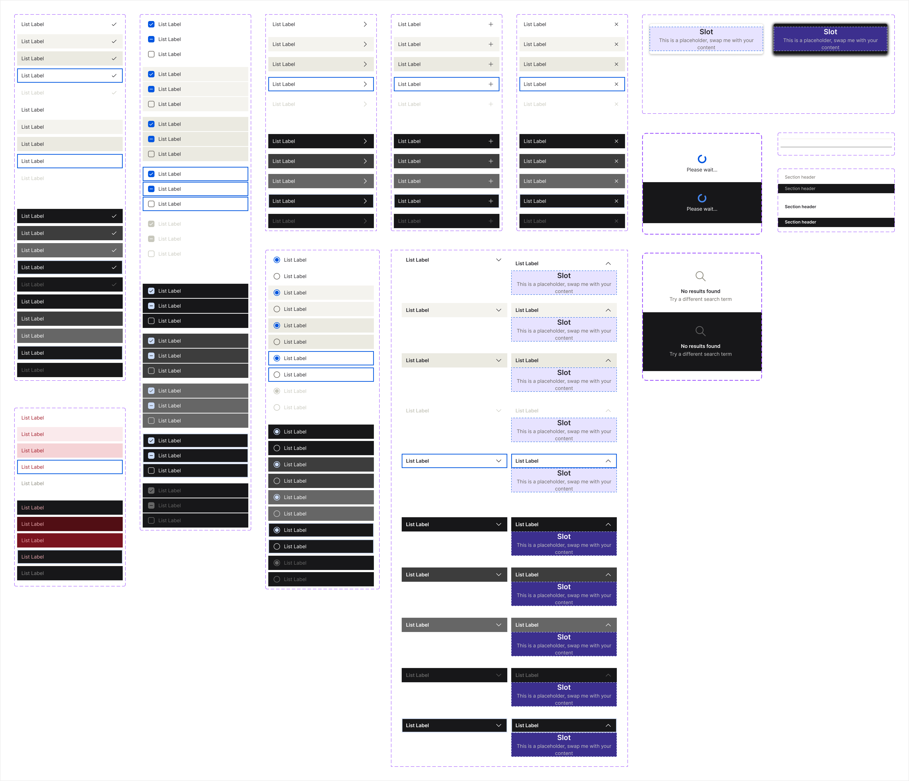

<!-- SOURCE: Figma MCP + figma-console MCP (Desktop Bridge) -->
<!-- FILE KEY: 5YihJ5WuDvnvrlrRMC4sBp -->
<!-- NODE ID: 47175:1414 (Popover page) · Components section: 47335:10918 -->
<!-- EXTRACTED: 2026-05-08 -->
<!-- COMPONENT: List / ListItem -->
<!-- COLOR STRATEGY: B (>3 state/variant combos — states as columns, elements as rows) -->

# List — Figma Design Spec

> **See also:** [props.md](./props.md) · [tokens.md](./tokens.md) ·
> [examples.md](./examples.md) · [accessibility.md](./accessibility.md)

---

## Visual reference

_Full component set: all ListItem variants (Single Action or Select, Destructive, Checkbox, Radio, Add Item, Sub Menu, Collapsible, Remove Item) in light and dark modes._

---

## Anatomy

The List item lives on the **Popover** page of the UI-components Figma file. It is structured as eight `COMPONENT_SET` groups, each representing a distinct ListItem variant type. A supporting **Atoms** section holds swappable leading/trailing visual sub-components.

### ListItem variant groups

| # | Component set name | Node ID | Variant axes | Item size |
|---|-------------------|---------|--------------|-----------|
| 1 | List item/Single Action or Select | `47231:15228` | mode, state, selected? | 296×40 px |
| 2 | List item/Destructive | `48537:67298` | mode, state | 296×40 px |
| 3 | List item/Checkbox | `47252:16600` | mode, state, selected? (+ indeterminate) | 296×40 px |
| 4 | List item/Radio | `48432:76449` | mode, state, selected? | 296×40 px |
| 5 | List item/Add Item | `47253:17175` | mode, state | 296×40 px |
| 6 | List item/Sub Menu | `47381:6549` | mode, state | 296×40 px |
| 7 | List item/Collapsible | `48608:161910` | mode, state, open? | 296×40 px (closed) · 296×108 px (open) |
| 8 | List item/Remove Item | `47253:17497` | mode, state | 296×40 px |

### Internal layer tree (Single Action or Select — light/rest/selected=true)

| # | Layer name | Type | Size | Role | Notes |
|---|-----------|------|------|------|-------|
| 1 | Leading Visuals/Icon | INSTANCE | 24×24 px | Optional slot (hidden) | Controlled by `leadingVisuals?`; 2 px padding → 20 px inner icon; `INSTANCE_SWAP` slot |
| 2 | Text Info | FRAME | 240×24 px | Content | Vertical auto-layout; 2 px top/bottom padding |
| 2a | Text Wrap | FRAME | 240×20 px | Content | Horizontal auto-layout; gap 8 px |
| 2b | List Label (primary text) | TEXT | — | Content | 14 px Inter Regular; `text/textColor01` |
| 2c | view-badge | FRAME | 16×20 px | Optional slot (hidden) | Controlled by `hasBadge`; badge container |
| 2d | Sub List Label (secondary text) | TEXT | — | Content | 12 px Inter Regular; `text/textColor02`; controlled by `secondaryText?` |
| 3 | selectionVariant/single:true | INSTANCE | 24×24 px | Optional slot | Trailing checkmark; 2 px padding → 20 px icon; `icon/icon01` |

### Sub-component: Atoms / Options (leading visual slot)

| # | Name | Type | Size | Notes |
|---|------|------|------|-------|
| 1 | Leading Visuals/Icon | INSTANCE | 24×24 px | Default `leadingType` value |
| 2 | Leading Visuals/Avatar | INSTANCE | 24×24 px | INSTANCE_SWAP alternative |
| 3 | Leading Visuals/Status | INSTANCE | 24×24 px | INSTANCE_SWAP alternative |
| 4 | Trailing Visuals/Sub Menu | INSTANCE | 24×24 px | Sub Menu variant trailing |
| 5 | Action List/Remove | INSTANCE | 24×24 px | Remove Item variant trailing |
| 6 | Action List/Add | INSTANCE | 24×24 px | Add Item variant trailing |
| 7 | selectionVariant/single:true | INSTANCE | 24×24 px | Single-select checkmark |
| 8 | selectionVariant/multiple:false | INSTANCE | 24×24 px | Unchecked checkbox |
| 9 | selectionVariant/multiple:true | INSTANCE | 24×24 px | Checked checkbox |
| 10 | selectionVariant/indeterminate:true | INSTANCE | 24×24 px | Indeterminate checkbox |

---

## API — Component properties

### Variant axes

| Property | Values | Default | Applies to |
|----------|--------|---------|------------|
| `mode` | `light`, `dark` | `light` | All variants |
| `state` | `rest`, `hover`, `active`, `focus`, `disabled` | `rest` | All variants |
| `selected?` | `true`, `false` | `true` | Single Action or Select, Radio |
| `selected?` | `true`, `false`, `indeterminate` | `true` | Checkbox |
| `open?` | `yes`, `no` | `no` | Collapsible |

### Boolean toggles

| Property | Default | Controls |
|----------|---------|---------|
| `leadingVisuals?` | `false` | Shows/hides the leading visual (icon/avatar/status) slot |
| `secondaryText?` | `false` | Shows/hides the Sub List Label (secondary text) |
| `hasBadge` | `false` | Shows/hides the badge container in the text row |

### Instance swap slots

| Slot | Property name | Default | Accepted types |
|------|--------------|---------|----------------|
| Leading visual | `leadingType` | Icon (`47222:15169`) | Icon, Avatar, Status indicator, and others per preferred values list |

### Persistent states

| State | Applies to | Notes |
|-------|-----------|-------|
| Selected | `selected?=true` | Shown by trailing checkmark/radio/checkbox — not by background change |
| Indeterminate | `selected?=indeterminate` | Checkbox variant only |
| Disabled | `state=disabled` | All variant types; reduces opacity |
| Open | `open?=yes` | Collapsible variant; expands height to 108 px |

### Token coverage

- **Coverage:** 100% — all fill, text, and typography values are bound to variables (confirmed via Desktop Bridge)
- **Hardcoded values flagged:** None detected in Single Action or Select variant

---

## Color & token bindings

<!-- COLOR STRATEGY B: states as columns, elements as rows -->
<!-- Confirmed via Desktop Bridge + figma.variables.getVariableByIdAsync resolution -->

### Item background

Background token is the same for `selected?=true` and `selected?=false` at each state — selection is communicated by trailing icon visibility, not background color.

| Element | rest | hover | active | focus | disabled |
|---------|------|-------|--------|-------|----------|
| Item bg token | `ui/ui06` | `ui/ui02` | `ui/ui01` | `ui/ui06` | `ui/ui06` |
| Light value | `#FFFFFF` | `#F4F3EE` | `#EBEAE1` | `#FFFFFF` | `#FFFFFF` |
| Light palette ref | `color/pure/white` | `color/offWhite/offWhite10` | `color/offWhite/offWhite09` | `color/pure/white` | `color/pure/white` |
| Dark value | `#171719` | `#3D3D3D` | `#666666` | `#171719` | `#171719` |
| Dark palette ref | `color/purple/purple01` | `color/gray/gray03` | `color/gray/gray05` | `color/purple/purple01` | `color/purple/purple01` |

### Text and icon

| Element | Token | Light palette ref | Light hex | Dark (same token, mode alias) |
|---------|-------|-------------------|-----------|-------------------------------|
| Primary text (List Label) | `text/textColor01` | `color/offWhite/offWhite02` | `#26252A` | Dark mode alias not resolved |
| Secondary text (Sub List Label) | `text/textColor02` | `color/offWhite/offWhite05` | `#6C6862` | Dark mode alias not resolved |
| Leading icon fill | `icon/icon01` | `color/offWhite/offWhite02` | `#26252A` | Same aliases as textColor01 |
| Trailing selection icon | `icon/icon01` | `color/offWhite/offWhite02` | `#26252A` | Same |

### Text styles

| Layer | Style ID | Size | Weight | Family |
|-------|----------|------|--------|--------|
| List Label (primary) | `S:ede99402157f11d7177797cb2a3156266aaa4519,20058:961` | 14 px | Regular | Inter |
| Sub List Label (secondary) | `S:cbff23a4e3258ff7ba423c6ffee7172d11f10829,20058:959` | 12 px | Regular | Inter |

> All typography properties (fontFamily, fontSize, fontStyle, lineHeight, letterSpacing) are bound to variables — no hardcoded typography values.

### Effect styles

<!-- NO EFFECT STYLES — none bound to any layer in this component -->

---

## Structure & spacing

### Container (all standard ListItem variants)

| Property | Token | Value | Notes |
|----------|-------|-------|-------|
| Width | — | 296 px | Fixed |
| Height | — | 40 px | Fixed for all except Collapsible open |
| Height (Collapsible open) | — | 108 px | Expanded; child content slot fills the difference |
| Padding left | — | 12 px | Hardcoded px — no token binding detected |
| Padding right | — | 12 px | Hardcoded px |
| Padding top | — | 8 px | Hardcoded px |
| Padding bottom | — | 8 px | Hardcoded px |

### Internal spacing

| Property | Token | Value | Notes |
|----------|-------|-------|-------|
| Gap between children | — | 8 px | Horizontal gap between leading visual, text block, trailing visual |
| Leading visual size | — | 24×24 px | Includes 2 px internal padding → 20 px rendered icon |
| Trailing visual size | — | 24×24 px | Same |
| Text Info internal gap | — | 0 px | Vertical; no gap between primary and secondary text frames |
| Text Wrap gap | — | 8 px | Horizontal gap between label text and badge |

### Auto-layout

- Direction: **HORIZONTAL**
- Primary axis alignment: **MIN** (leading/start)
- Counter axis alignment: **MIN** (top)

### Density / size variants

| Variant | Height | Notes |
|---------|--------|-------|
| All standard variants | 40 px | Uniform across Single Action, Destructive, Checkbox, Radio, Add, Sub Menu, Remove |
| Collapsible (closed) | 40 px | Same as standard |
| Collapsible (open) | 108 px | Expands downward |

---

## Interaction states

| State | Trigger | Background change | Visual notes |
|-------|---------|-------------------|--------------|
| `hover` | Pointer over item | `ui/ui06` → `ui/ui02` | #F4F3EE light / #3D3D3D dark |
| `active` | Pointer down | `ui/ui06` → `ui/ui01` | #EBEAE1 light / #666666 dark |
| `focus` | Keyboard Tab | `ui/ui06` (no bg change) | Focus ring expected — not confirmed from node data |
| `disabled` | `state=disabled` | `ui/ui06` (no bg change) | Opacity reduction applied |
| `selected?=true` | Programmatic | No bg change vs unselected | Trailing icon becomes visible (checkmark/radio/checkbox) |
| `open?=yes` | Collapsible trigger | No bg change | Height expands from 40 px to 108 px |

---

## Design decisions & annotations

<!-- NO FIGMA ANNOTATIONS — Desktop Bridge confirmed no annotation objects on any variant node -->

> **Observed design decisions from confirmed component property data:**
> - **Selection is icon-only, not color-coded:** `selected?=true` and `selected?=false` share the same background token (`ui/ui06`) at rest. Selection state is communicated exclusively through the trailing icon slot visibility.
> - **Destructive variant has no `selected?` axis and no `leadingType` instance swap** — it is a structurally simpler variant, suggesting destructive actions should never carry a selection state.
> - **Collapsible is the only variant with `open?`** replacing `selected?` — confirms it is behaviorally distinct (toggle) vs. selection-based variants.
> - **`hasBadge` is a separate boolean from `leadingVisuals?`** — badges appear in the text row, not the leading edge; they do not displace the leading visual.
> - **`secondaryText?` is off by default** — secondary text is an optional density increase, not the base presentation.
> - **Padding is not tokenized** (12/8 px hardcoded) — flag for tokenization if a density variant is ever added.

---

## Accessibility (from Figma annotations only)

- **ARIA role:** <!-- NOT ANNOTATED IN FIGMA -->
- **Focus order:** <!-- NOT ANNOTATED IN FIGMA -->
- **Keyboard interactions:** <!-- NOT ANNOTATED IN FIGMA -->

> For full accessibility guidance see [accessibility.md](./accessibility.md).

---

## Gaps & conflicts

| Type | Description |
|------|-------------|
| Missing token | Container padding (12 px left/right, 8 px top/bottom) and internal gap (8 px) are hardcoded — no variable binding detected |
| Missing annotation | No design intent annotations found on any variant node (Desktop Bridge confirmed) |
| Source gap | `Destructive` variant (separate component set, no `selected?`, no `leadingType`) has no direct mapping to any Oxygen `ListItem` prop — confirm whether it maps to a style/className or a separate component export |
| Source gap | `Collapsible` `open?` variant and Sub Menu / Add Item / Remove Item variants are not reflected in Oxygen `ListItem` props — likely composed via icon children at the code level |
| Source gap | Dark mode hex values for `text/textColor01`, `text/textColor02` and `icon/icon01` not resolved — dark mode aliases were returned but not recursively resolved |
| Incomplete data | `figma_get_styles` returned 0 entries for this file — text style names not confirmed (style IDs captured instead) |

---

_Source: Figma MCP · figma-console MCP (Desktop Bridge) · Extracted 2026-05-08_
