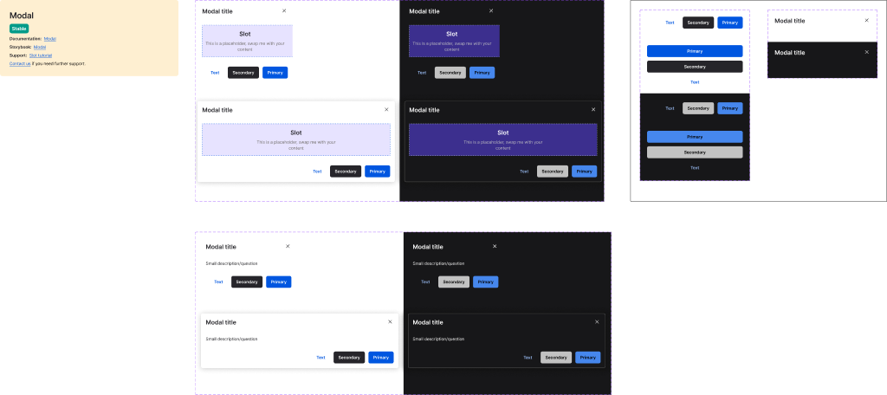

<!-- SOURCE: Figma MCP (claude.ai) + figma-console MCP -->
<!-- FILE KEY: 5YihJ5WuDvnvrlrRMC4sBp -->
<!-- NODE ID: 2625:167 (Modal canvas) · 29083:47583 (Custom Modal) · 30172:50869 (Dialog Modal) -->
<!-- EXTRACTED: 2026-05-01 -->
<!-- COMPONENT: Modal -->
<!-- COLOR STRATEGY: A — one table per element; light/dark as rows (2 mode states) -->

# Modal — Figma Design Spec

> **See also:** [props.md](./props.md) · [tokens.md](./tokens.md) · [examples.md](./examples.md) · [accessibility.md](./accessibility.md)

---

## Visual reference

> Screenshot captured from node `2625:167` (Modal canvas) in file `5YihJ5WuDvnvrlrRMC4sBp`.
> Shows: Custom Modal (top row) and Dialog Modal (bottom row), each in light/dark × mobile/desktop.

---

## Component set overview

The Modal Figma page (`2625:167`) contains two component sets and an Atoms section:

| Set | Node ID | Description |
|-----|---------|-------------|
| Custom Modal | `29083:47583` | Full-featured modal with swappable content Slot, optional scrollbar |
| Dialog Modal | `30172:50869` | Compact confirmation dialog with description text |
| Atoms | `30347:46293` | `_footer` and `_header` sub-components shown in isolation |

---

## Anatomy

### Custom Modal (`29083:47583`)

| # | Layer name | Type | Role | Notes |
|---|-----------|------|------|-------|
| 1 | `_header` | Frame (instance) | Fixed sub-component | Always present; contains title + optional close icon |
| 1a | `Title` | Frame | Content element | Flex column; wraps title text |
| 1b | Title text | Text | Content element | Uses `heading01` type style |
| 1c | `Icon Button` | Instance | Optional slot | Close button; visible when `onClose` is wired |
| 2 | `Scroll content` | Frame | Structural | Horizontal flex; holds Content + optional Scrollbar |
| 2a | `Content` | Frame | Content element | Scrollable area; swap the `Slot` with actual content |
| 2b | `Slot` | Instance | Optional slot `(swappable)` | Placeholder — use instance swapper in Figma |
| 2c | `Scrollbar_Mac OS` | Frame | Optional slot `(hidden)` | Toggled by `scrollbar` boolean property |
| 3 | `_footer` | Frame (instance) | Fixed sub-component | Always present; contains button group + optional divider |

### Dialog Modal (`30172:50869`)

| # | Layer name | Type | Role | Notes |
|---|-----------|------|------|-------|
| 1 | `_header` | Frame (instance) | Fixed sub-component | Same as Custom Modal header |
| 2 | `Content` | Frame | Content element | Renders `message` text; no Slot — not swappable |
| 3 | `_footer` | Frame (instance) | Fixed sub-component | Same footer atom as Custom Modal |

### Atoms (`30347:46293`)

| Sub-component | Node ID | Variants |
|--------------|---------|---------|
| `_footer` | `29083:47566` | `mode` (light/dark) × `stacked?` (false/true) |
| `_header` | `43118:1490` | `mode` (light/dark) |

---

## Variant axes

### Custom Modal

| Property | Values | Notes |
|----------|--------|-------|
| `mode` | `light`, `dark` | Drives all color token switches |
| `breakpoint` | `mobile`, `desktop` | Controls width (`320px` mobile / `664px` desktop) |
| `scrollbar` | `true`, `false` | Boolean toggle; shows `Scrollbar_Mac OS` overlay |

### Dialog Modal

| Property | Values | Notes |
|----------|--------|-------|
| `mode` | `light`, `dark` | Drives all color token switches |
| `breakpoint` | `mobile`, `desktop` | Controls width (`320px` / `664px`) |
| `message` | string | Description text rendered in the content area |

### Footer atom (`_footer`)

| Property | Values | Notes |
|----------|--------|-------|
| `mode` | `light`, `dark` | — |
| `stacked?` | `false`, `true` | `true` stacks buttons vertically |
| `divider` | boolean | Shows a `1px` separator above the footer |
| `textButton` | boolean | Shows/hides the tertiary text button |
| `secondaryButton` | boolean | Shows/hides the secondary button |

---

## Color and token bindings

### Modal container background

| Element | Token | Light value | Dark value |
|---------|-------|-------------|-----------|
| Header background | `--ui/ui06` | `white` | `#171719` |
| Content background | `--ui/ui06` | `white` | `#171719` |
| Footer background | `--ui/ui06` | `white` | `#171719` |

### Shadow and border

| Element | Token | Light value | Dark value |
|---------|-------|-------------|-----------|
| Box shadow (desktop) | `--ui/shadow01` | `rgba(41,41,41,0.25)` | `#141414` |
| Border (desktop, dark only) | `--ui/ui01` | _(no border)_ | `#666` |

> Desktop light: `box-shadow: 0px 2px 20px 0px var(--ui/shadow01)` — no border.
> Desktop dark: `box-shadow: 0px 2px 20px 9px var(--ui/shadow01)` + `1px solid border`.

### Title text

| Element | Token | Light value | Dark value |
|---------|-------|-------------|-----------|
| Title color | `--text/textcolor01` | `#26252a` | `white` |

### Body / description text (Dialog Modal)

| Element | Token | Light value | Dark value |
|---------|-------|-------------|-----------|
| Message text color | `--text/textcolor01` | `#26252a` | `white` |

### Footer buttons

| Element | Token | Light value | Dark value |
|---------|-------|-------------|-----------|
| Text button label | `--actions/action08` | `#0056e0` | `#99bbf3` |
| Secondary button background | `--actions/action02` | `#26252a` | `#c2c2c2` |
| Secondary button label | `--text/textcolor09` | `white` | `black` |
| Primary button background | `--actions/action09` | `#0056e0` | `#4687ed` |
| Primary button label | `--text/textcolor09` | `white` | `black` |
| Footer divider | `--ui/ui01` | `#ebeae1` | **`#666` ⚠ hardcoded** |

### Slot placeholder (Custom Modal, design-spec only)

| Element | Token | Light value | Dark value |
|---------|-------|-------------|-----------|
| Slot border (dashed) | `--ui/ui22` | `#0056e0` | `#ccddf9` |
| Slot background | `--ui/ui23` | `#e7e3ff` | `#3c2f8e` |
| Slot heading text | `--text/textcolor01` | `#26252a` | `white` |
| Slot body text | `--text/textcolor02` | `#6c6862` | `#c2c2c2` |

### Scrollbar (Custom Modal, hardcoded)

| Element | Light value | Dark value |
|---------|-------------|-----------|
| Scrollbar container background | `#fafafa` ⚠ | `--ui/ui06` (#171719) |
| Scrollbar container border | `#e8e8e8` ⚠ | `#e8e8e8` ⚠ |
| Scrollbar thumb | `#c1c1c1` ⚠ | `#858585` ⚠ |

---

## Typography

| Token | Element | Size | Weight | Line height | Letter spacing |
|-------|---------|------|--------|------------|---------------|
| `typography/heading01` | Modal title | `20px` | `600` | `28px` | `0.0289px` |
| `typography/body01` | Dialog message, Slot body | `14px` | `400` | `20px` | `-0.06px` |
| `typography/bodyBold01` | Footer button labels | `14px` | `600` | `20px` | `-0.06px` |

---

## Structure and spacing

### Widths

| Breakpoint | Width |
|-----------|-------|
| Mobile | `320px` |
| Desktop | `664px` |

### Padding and gaps (raw values — no token bindings resolved)

| Zone | Value |
|------|-------|
| Header padding | `16px` all sides |
| Content padding | `16px` all sides |
| Footer padding | `16px` all sides |
| Footer button gap | `12px` |
| Header title–icon gap | `8px` |
| Corner radius | `6px` ⚠ hardcoded |
| Scrollbar width | `12px` ⚠ hardcoded |
| Scrollbar thumb width | `8px` ⚠ hardcoded |
| Scrollbar thumb border radius | `100px` ⚠ hardcoded |

> All spacing values are hardcoded raw pixels — no spacing token bindings were observed in the Figma context.

---

## Interaction states

| State | Mechanism | Notes |
|-------|-----------|-------|
| Light mode | `mode=light` variant | Default |
| Dark mode | `mode=dark` variant | — |
| Mobile | `breakpoint=mobile` | Width `320px` |
| Desktop | `breakpoint=desktop` | Width `664px`; desktop dark adds a visible border |
| With scrollbar | `scrollbar=true` | Overlaid Mac OS scrollbar track on right edge |
| Stacked footer | `stacked?=true` (footer atom) | Buttons stack vertically; shown in Atoms section |

---

## Hardcoded values flagged (7)

| Property | Element | Value | Flag |
|----------|---------|-------|------|
| Corner radius | Modal container | `6px` | ⚠ not tokenised |
| Divider color (dark) | Footer divider | `#666` | ⚠ not tokenised |
| Scrollbar background (light) | Scrollbar track | `#fafafa` | ⚠ not tokenised |
| Scrollbar border | Scrollbar track | `#e8e8e8` | ⚠ not tokenised |
| Scrollbar thumb (light) | Scrollbar indicator | `#c1c1c1` | ⚠ not tokenised |
| Scrollbar thumb (dark) | Scrollbar indicator | `#858585` | ⚠ not tokenised |
| Scrollbar thumb width | Scrollbar indicator | `8px` | ⚠ not tokenised |

---

## Design documentation links

- Custom Modal: https://oxygen.8x8.com/patterns/modal/usage
- Dialog Modal: https://oxygen.8x8.com/patterns/modal/usage
- Icon Button: https://zeroheight.com/714056d2f/p/75909b-icons/b/1725fe
- Label Button: https://oxygen.8x8.com/docs/components/button/usage

---

## Gaps & conflicts

| Gap | Type | Notes |
|-----|------|-------|
| No ARIA annotations in Figma | `DOC_GAP` | No role/keyboard guidance found in design file; see accessibility.md |
| `figma_get_variables` returned empty | `SOURCE_GAP` | Desktop Bridge connection returned no variable data; token list derived from Figma design context CSS output instead |
| `figma_get_styles` returned empty | `SOURCE_GAP` | Same — no registered styles returned; typography extracted from context output |
| Spacing values not tokenised | `DOC_GAP` | Padding/gap values appear as raw pixels; no spacing token bindings observed |
| Scrollbar colors hardcoded | `DOC_GAP` | 5 scrollbar color values use raw hex; not mapped to design tokens |
| Token coverage % | `SOURCE_GAP` | Not returned by enriched component call (REST API fallback used; Desktop Bridge plugin not active) |

_Source: Figma MCP (claude.ai) + figma-console MCP · Extracted 2026-05-01_
