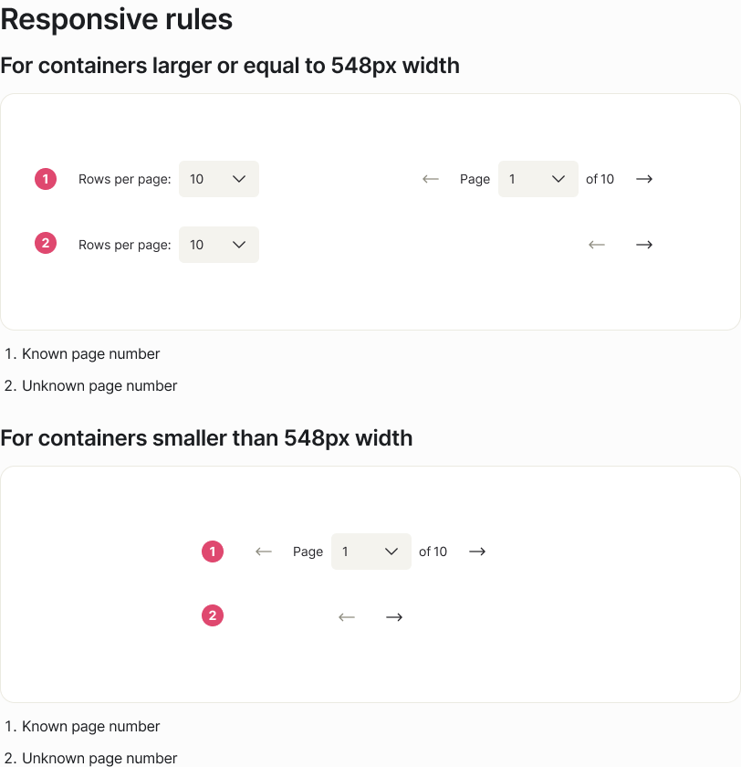

<!-- SOURCE: Figma — ↳ Pagination examples -->
<!-- PAGE: ↳ Pagination examples (node 56020:139286) -->
<!-- SECTION: Pagination behaviour (node 56020:140872) -->
<!-- EXTRACTED: 2026-05-01 -->
<!-- COMPONENT: Pagination -->
<!-- FORMAT NOTE: This page uses descriptive behavioural sections, not ✅ Do / ❌ Don't cards.
     Content is verbatim from Figma text nodes. Screenshots per section. -->

# Pagination — Usage Guidelines

> **See also:** [props.md](./props.md) · [tokens.md](./tokens.md) ·
> [examples.md](./examples.md) · [Pagination-figma.md](./Pagination-figma.md)

Usage guidelines extracted from the Figma `↳ Pagination examples` page.
This page documents behavioural variants and responsive rules rather than Do/Don't pairs.

---

## Type

### Known page number

> "To be used when the page numbers are known."

Shows the full pagination bar with rows-per-page dropdown, previous/next buttons, page selector, and "of N pages" count.

### Unknown page number

> "To be used when the page numbers are unknown."

Shows pagination without the "of N pages" count label — the `numberOfPages` display is hidden.

### Without rows per page

> "Pagination can be used without the control of the number of rows per page."

Two sub-variants shown:
- **Known page number** — rows-per-page section hidden; page selector + count visible
- **Unknown page number** — rows-per-page section hidden; page selector only, no count

Omit `rowsPerPageOptions` to suppress the rows-per-page section.

---

## Responsive rules

### For containers ≥ 548px width

Full layout: rows-per-page section on the left, page controls (prev + page selector + count + next) on the right.

Sub-variants:
- **Known page number** — includes "of N pages" count
- **Unknown page number** — page selector only, no count

### For containers < 548px width

Compact layout: rows-per-page section is hidden; only page controls render (prev + page selector + next). Width constrained to 547px max, 288px min.

Sub-variants:
- **Known page number** — includes "of N pages" count
- **Unknown page number** — page selector only

> **Note:** The breakpoint (548px) is a Figma design decision. Responsive behaviour is the consuming application's responsibility — no `breakpoint` prop exists in the React component.

---

## Size

### Default

Standard 40px height. Used in most contexts.

Shown in both breakpoints:
- Full layout (≥ 548px) — `size` prop omitted or `"default"`
- Compact layout (< 548px) — same `size`, consumer controls width

### Small

Compact 32px height. For denser layouts.

Shown in both breakpoints:
- Full layout (≥ 548px) — `size="small"`
- Compact layout (< 548px) — same `size`, consumer controls width

---

## Tooltips for Next and Previous buttons

### Hover

Prev and Next icon buttons display a tooltip on hover. Two positions shown:
- Tooltip above the **Next** button (right side)
- Tooltip above the **Previous** button (left side)

The tooltip text corresponds to `translations.nextPage` and `translations.prevPage` values.

### Keyboard focus

Same tooltip positions are shown for keyboard focus state. When the Prev or Next button receives keyboard focus, the tooltip is shown — reinforcing that these icon-only buttons have accessible labels surfaced on focus.

---

## Gaps

No Do/Don't cards found — this page uses descriptive section format only.

| Section | Missing |
|---------|---------|
| All | No `✅ Do` / `❌ Don't` frames — no negative examples documented |

---

_Source: Figma examples page · Extracted 2026-05-01_
