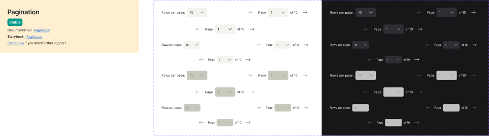

<!-- source: figma-only -->

## Visual Reference

Figma file: `5YihJ5WuDvnvrlrRMC4sBp` · Node: `55766:411`

---

## Anatomy

The component renders as a horizontal flex row (`justify-between`) with two major regions.

| # | Type | Name | Role | Notes |
|---|------|------|------|-------|
| 1 | frame | Rows per page | optional slot | Shown when `rowsPerPageOptions` is provided; always hidden at container `< 548px` |
| 1a | text | Label | content | "Rows per page:" — localisation string (`translations.rowsPerPage`) |
| 1b | instance | Select (rows) | sub-component | Dropdown for rows-per-page value; width 88px (default) / 72px (small) |
| 2 | frame | Page controls | structural | Always present |
| 2a | instance | previousButton | sub-component | Icon button (`arrow-left-long`); shows tooltip from `translations.prevPage` |
| 2b | frame | Group | structural | Contains page label + page Select + pageCount |
| 2c | text | Page | content | "Page" — localisation string |
| 2d | instance | Select (page) | sub-component | Dropdown for current page number (jump-to-page) |
| 2e | frame | pageCount | optional slot | "of {pages}" text; hidden when `translations.numberOfPages` is `""` |
| 2f | instance | nextButton | sub-component | Icon button (`arrow-right-long`); shows tooltip from `translations.nextPage` |

### Sub-component: Select

Used for both dropdowns (rows-per-page and page selector):

| # | Type | Name | Role |
|---|------|------|------|
| 1 | frame | Input Text | structural — background fill varies by state and mode |
| 2 | frame | Text | content — current selected value |
| 3 | instance | arrow-down | icon — `iconSizeS` (default) / `iconSizeXS` (small) |

### Sub-component: previousButton / nextButton

Icon-only buttons. Button padding varies by size and breakpoint:

| Context | Padding |
|---------|---------|
| Default size, > 548px | `10px` |
| Small size, > 548px | `6px` |
| Small / default size, < 548px | `4px` |

Border radius: `6px` on all interactive elements.

---

## Variant Axes

| Property | Values | Default |
|----------|--------|---------|
| `mode` | `light`, `dark` | `light` |
| `size` | `default`, `small` | `default` |
| `isDisabled?` | `no`, `yes` | `no` |
| `breakpoint` | `> 548px`, `< 548px` | `> 548px` |

The `breakpoint` axis is a Figma design decision — there is no corresponding React prop. Responsive layout is the consuming application's responsibility.

### Boolean toggles (Figma-only)

| Property | Default | Effect |
|----------|---------|--------|
| `rowsPerPage` | `true` | Shows/hides the rows-per-page slot; React equivalent: omit `rowsPerPageOptions` |
| `numberOfPages` | `true` | Shows/hides the "of {pages}" count; React equivalent: pass `translations.numberOfPages=""` |

---

## States

<!-- STUB:GAP-010 source="Designer to add hover, focus-visible, and pressed variant states to the Figma component set — only Default and Disabled are currently modelled in the variant structure" -->

| State | Trigger | Visual change |
|-------|---------|---------------|
| Default | — | `--ui/ui05` dropdown background; `--text/textcolor01` text |
| Disabled | `isDisabled?=yes` | `--interactive/disabled01` dropdown background; `--interactive/disabled04` input text; all controls non-interactive |

Focus-visible and hover states are documented in the examples page (tooltip on hover and keyboard focus) but are not modelled as discrete component variants.

---

## Structure & Spacing

### Container

| Property | Value | Variant |
|----------|-------|---------|
| Height | `40px` | default size |
| Height | `32px` | small size |
| Width | `640px` | > 548px breakpoint |
| Width | `547px` max / `288px` min | < 548px breakpoint |
| Layout | horizontal flex, `justify-between`, `items-center` | all |

### Internal Spacing

| Property | Value | Notes |
|----------|-------|-------|
| Gap — Rows per page group (label + Select) | `8px` | — |
| Gap — Page controls group (prev + page group + next) | `12px` | — |
| Gap — Page group (label + Select + count) | `8px` | — |
| Gap — pageCount ("of" + page number) | `2px` | — |
| Select input padding (default) | `12px` h / `8px` v | — |
| Select input padding (small) | `8px` h / `4px` v | — |

---

<!-- STUB:GAP-009 source="Designer to add ARIA role, focus order, and keyboard interaction annotations to the Figma Pagination component set — currently not annotated" -->

<!-- STUB:GAP-011 source="Re-run figma-extract with Figma Desktop Bridge plugin active to obtain full component key and variant key map via figma_get_component_details" -->
