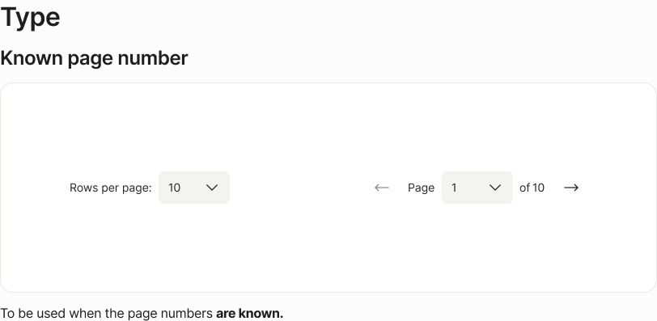
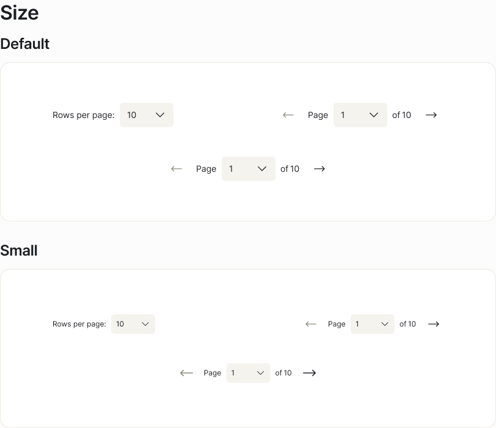
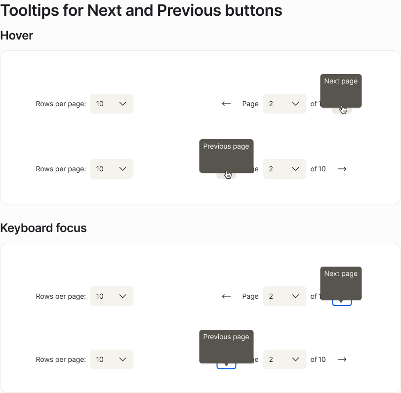

<!-- STUB:GAP-014 source="Designer to add Do/Don't card pairs to the Figma examples page — the current Pagination examples page documents behavioural variants only (Type, Responsive, Size, Tooltips); the 7 pairs below are editorially derived from the published Oxygen docs page + Figma variants + extracted artifacts (2026-05-13)" -->

## Behaviour

The Figma examples page documents four behavioural variants:

### Type — Known vs. Unknown page number



**Known page number** — full bar with rows-per-page dropdown, prev/next buttons, page selector, and "of N pages" count. Use when the backend can return a total record count.

**Unknown page number** — the "of N pages" count is hidden (`translations.numberOfPages=""`). The page selector and prev/next still function via cursor state.

**Without rows per page** — omit `rowsPerPageOptions` to suppress the rows-per-page slot entirely.

### Responsive — Full vs. Compact layout


**≥ 548px** — full layout. Rows-per-page on the left, page controls on the right. There is no `breakpoint` prop — consuming applications manage the layout swap via CSS media queries, container queries, or conditional `rowsPerPageOptions`.

**< 548px** — compact layout. The rows-per-page section is hidden; only page controls render.

### Size — Default vs. Small



**Default** — 40px height, 14px typography. Standard data-table contexts.

**Small** — 32px height, 12px typography. Denser layouts, narrow side panels, compact admin tables. Pass `size="small"`.

### Tooltips & keyboard focus on Previous / Next



The Previous and Next buttons are icon-only. Their accessible name and visible tooltip both come from `translations.prevPage` / `translations.nextPage`. The tooltip renders on **hover and on keyboard focus** — both must show the same label.

---

## Do / Don't

### Pair 1 — Paginate one logical dataset

#### ✅ Do — Paginate a single query result or filterable dataset

```tsx
const { canGoBack, canGoNext, numberOfPages, pageNumber, rowsPerPage } =
  usePagination(pagination, totalContactsMatchingFilter);

<Pagination
  canGoBack={canGoBack}
  canGoNext={canGoNext}
  numberOfPages={numberOfPages}
  onPaginationChange={setPagination}
  pageNumber={pageNumber}
  rowsPerPage={rowsPerPage}
  rowsPerPageOptions={[10, 25, 50, 100]}
  translations={{
    rowsPerPage: 'Rows per page:',
    prevPage: 'Previous page',
    numberOfPages: `of ${numberOfPages} pages`,
    nextPage: 'Next page',
  }}
/>
```

#### ❌ Don't — Wrap pagination around a mixed set of unrelated items

```tsx
{/* Wrong — three disjoint result sets paginated as one */}
const merged = [...recentActivity, ...savedFilters, ...suggestedContacts];
<Pagination /* page 2 crosses category boundaries */ />
```

---

### Pair 2 — Only paginate when results exceed one screen

#### ✅ Do — Conditionally render once `totalRecords > rowsPerPage`

```tsx
{totalRecords > rowsPerPage && (
  <Pagination canGoBack={canGoBack} canGoNext={canGoNext} numberOfPages={numberOfPages} /* ... */ />
)}
```

#### ❌ Don't — Render Pagination over a short, fully visible list

```tsx
{/* Wrong — 7 results, control renders "1 of 1 pages" with disabled buttons */}
<Pagination canGoBack={false} canGoNext={false} numberOfPages={1} pageNumber={1} rowsPerPage={10} /* ... */ />
```

---

### Pair 3 — Match the Type variant to what you know

#### ✅ Do — Use the "Unknown page number" variant when the total isn't queryable

```tsx
<Pagination
  canGoBack={hasPrevCursor}
  canGoNext={hasNextCursor}
  numberOfPages={0}
  pageNumber={pageNumber}
  rowsPerPage={rowsPerPage}
  onPaginationChange={setPagination}
  translations={{
    rowsPerPage: 'Rows per page:',
    prevPage: 'Previous page',
    numberOfPages: '',   /* hides the "of N pages" label */
    nextPage: 'Next page',
  }}
/>
```

#### ❌ Don't — Invent a total to render the "of N pages" count

```tsx
{/* Wrong — fabricated total from cursor API */}
<Pagination numberOfPages={999} translations={{ numberOfPages: `of ${999} pages`, ...rest }} />
```

---

### Pair 4 — Drive responsive layout from the container, not a prop

#### ✅ Do — Suppress `rowsPerPageOptions` below 548px

```tsx
const isNarrow = containerWidth < 548;

<Pagination
  rowsPerPageOptions={isNarrow ? undefined : [10, 25, 50, 100]}
  /* ...rest... */
/>
```

#### ❌ Don't — Pass a `breakpoint` prop (it doesn't exist)

```tsx
{/* Wrong — no such prop; forces overflow in narrow container */}
<div style={{ width: 320 }}>
  <Pagination /* @ts-expect-error */ breakpoint="< 548px" rowsPerPageOptions={[10, 25, 50, 100]} />
</div>
```

---

### Pair 5 — Localise every visible string; icon-only buttons need it most

#### ✅ Do — Pass a complete `translations` object from your i18n source

```tsx
import { t } from '@/i18n';

<Pagination
  translations={{
    rowsPerPage: t('pagination.rowsPerPage'),
    prevPage: t('pagination.prevPage'),
    numberOfPages: t('pagination.numberOfPages', { n: numberOfPages }),
    nextPage: t('pagination.nextPage'),
  }}
  /* ...rest... */
/>
```

#### ❌ Don't — Ship hardcoded English strings or pass empty strings

```tsx
{/* Wrong — strips accessible name from icon-only buttons; fails WCAG 4.1.2 */}
<Pagination translations={{ rowsPerPage: '', prevPage: '', numberOfPages: '', nextPage: '' }} />
```

---

### Pair 6 — Keep all controls keyboard-operable; preserve the focus ring

#### ✅ Do — Let the platform focus ring render

```tsx
{/* No custom focus override needed — platform handles it */}
<Pagination /* ...required props... */ />
```

#### ❌ Don't — Suppress the focus indicator

```css
/* Wrong — kills keyboard navigation signal for all users */
button:focus,
.oxygen-pagination * { outline: none !important; }
```

---

### Pair 7 — `rowsPerPageOptions` requires a real choice or omission

#### ✅ Do — Pass two or more meaningful options, or omit the prop

```tsx
{/* Choice offered */}
<Pagination rowsPerPageOptions={[10, 25, 50, 100]} /* ...rest... */ />

{/* No choice — fixed row count; omit to hide the section */}
<Pagination /* ...rest with rowsPerPage={25}, no rowsPerPageOptions... */ />
```

#### ❌ Don't — Pass a single-value array

```tsx
{/* Wrong — renders a dropdown with one item; no real choice */}
<Pagination rowsPerPageOptions={[25]} /* ...rest... */ />
```

---

## When to Use

- When there are too many results to display on one page.
- For tables with more than ten rows.

## When Not to Use

- Do not use pagination if the items or data are not part of the same set.
- Do not substitute pagination for **Breadcrumbs** (hierarchical navigation) or infinite scroll (feed-style content).
