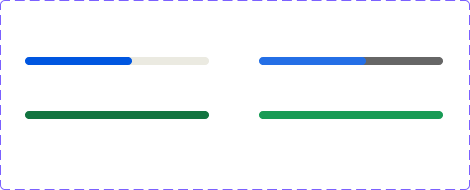

<!-- SOURCE: Figma MCP + figma-console MCP -->
<!-- FILE KEY: 5YihJ5WuDvnvrlrRMC4sBp -->
<!-- NODE ID: 30880:55942 -->
<!-- EXTRACTED: 2026-05-05 -->
<!-- COMPONENT: ProgressBar -->
<!-- COLOR STRATEGY: B (4 state/mode combos — states as columns, elements as rows) -->

# ProgressBar — Figma Design Spec

> **See also:** [props.md](./props.md) · [tokens.md](./tokens.md) ·
> [examples.md](./examples.md) · [accessibility.md](./accessibility.md) · [ProgressBar-usage.md](./ProgressBar-usage.md)

---

## Visual reference

---

## Anatomy

Element structure extracted from the Figma layer tree of the `Bar` component set (`30880:55942`). Each of the 4 variants shares this layer structure.

| # | Type | Name | Role | Notes |
|---|------|------|------|-------|
| 1 | frame | `bar` | structural | Track background; full width, 8px height, 8px border-radius |
| 2 | frame | `linear-bar-indicator` | optional slot | Loading fill inside the track; present when `status=loading` (hidden) |
| 3 | frame | `linear-bar-bg-complete` | optional slot | Complete fill covering full track; present when `status=complete` (hidden) |
| 4 | text | text label | optional slot | Supporting text below the bar; toggled by boolean `text?` property |

---

## API — Component properties

### Variant axes

| Property | Values | Default |
|----------|--------|---------|
| `mode` | `light`, `dark` | `light` |
| `status` | `loading`, `complete` | `loading` |

### Boolean toggles

| Property | Default | Notes |
|----------|---------|-------|
| `text?` | `false` | Shows/hides the text label below the bar |

### Instance swap slots

<!-- NO INSTANCE SWAP SLOTS FOUND -->

### Persistent states

<!-- NO PERSISTENT STATES FOUND — `status` is a variant axis, not a persistent state prop -->

### Text content properties

| Property | Default | Notes |
|----------|---------|-------|
| `↳ loading text` | `"Please wait..."` | Text shown when `status=loading` and `text?=true` |
| `↳ complete text` | `"Complete"` | Text shown when `status=complete` and `text?=true` |

### Token coverage

- **Coverage:** ~100% — all color and typography values reference CSS custom properties (design tokens)
- **Hardcoded values flagged:**
  - `bar.width`: `184px` — Figma demo placeholder; actual component width controlled by `size` / `fullWidth` props
  - `linear-bar-indicator.inset-right`: `41.85%` — demo fill percentage in Figma; actual fill width is driven by the `value` prop at runtime

---

## Color & token bindings

<!-- COLOR STRATEGY B: 4 state combos — elements as rows, states as columns -->

| Element | Token | Light / Loading | Light / Complete | Dark / Loading | Dark / Complete |
|---------|-------|----------------|-----------------|----------------|-----------------|
| Bar track background | `--ui/ui01` | `#ebeae1` | `#ebeae1` | `#666666` | `#666666` |
| Loading fill indicator | `--actions/action04` | `#0056e0` | — | `#246fe5` | — |
| Complete fill | `--success/success01` | — | `#127440` | — | `#189b55` |
| Text label color | `--text/textcolor01` | `#26252a` | `#26252a` | `#ffffff` | `#ffffff` |

### Text styles

| Element | Token | Family | Size | Weight | Line height | Letter spacing |
|---------|-------|--------|------|--------|-------------|----------------|
| Text label | `--typography/body01` | `Inter Regular` | `14px` | `400 (normal)` | `20px` | `-0.06px` |

### Effect styles

<!-- NO EFFECT STYLES — no shadows or blurs on this component -->

---

## Structure & spacing

### Container

| Property | Token | Value | Notes |
|----------|-------|-------|-------|
| Width | — | `184px` | Figma placeholder only; prop-controlled at runtime |
| Direction | — | vertical (flex-col) | Bar track stacked above text label |
| Gap (bar → text) | — | `8px` | Hardcoded in Figma — no token binding found |
| Items alignment | — | `items-start` | |

### Bar track

| Property | Token | Value |
|----------|-------|-------|
| Height | — | `8px` |
| Border-radius | — | `8px` (full pill) |
| Width | — | `100%` of container |

### Internal spacing

| Property | Token | Value | Notes |
|----------|-------|-------|-------|
| Gap (bar → label) | — | `8px` | No token binding |
| Loading fill right inset | — | `41.85%` | Demo value in Figma; runtime value from `value` prop |

### Auto-layout

- Direction: vertical (flex-col)
- Alignment: items-start (left-aligned)

### Density / size variants

No density or size variant axes are present in the Figma component set. Sizing is controlled entirely by the Oxygen `size` and `fullWidth` props.

---

## Interaction states

States visible in the Figma variant structure.

| State | Trigger | Visual change |
|-------|---------|---------------|
| `status=loading` | `value` is 0–99 | Blue/indigo fill covers partial track width |
| `status=complete` | `value` reaches 100 | Green fill covers full track width |

<!-- NO HOVER / FOCUS / PRESSED INTERACTION STATES — ProgressBar is a passive display component -->

---

## Design decisions & annotations

> **Documentation link:** https://oxygen.8x8.com/docs/components/progressbar/usage

<!-- NO ADDITIONAL ANNOTATIONS FOUND IN FIGMA RESPONSE — Desktop Bridge not available -->

---

## Accessibility (from Figma annotations only)

- **ARIA role:** <!-- NOT ANNOTATED IN FIGMA -->
- **Focus order:** <!-- NOT ANNOTATED IN FIGMA -->
- **Keyboard interactions:** <!-- NOT ANNOTATED IN FIGMA -->

See [accessibility.md](./accessibility.md) for full WCAG 2.1 AA guidance.

---

## Gaps & conflicts

| Type | Description |
|------|-------------|
| Conflict | Figma `mode` (light/dark) has no corresponding Oxygen prop — theme is handled by the design-system provider, not the component API |
| Conflict | Figma `status` (loading/complete) is a variant axis; Oxygen uses `value` (number 0–100) — consumers must derive "complete" state from `value === 100` |
| Conflict | Figma exposes separate `loadingText` and `completeText` text properties; Oxygen exposes a single `text: string` prop — consumers must swap text strings themselves |
| Missing token | `gap` between bar track and text label (`8px`) has no token binding |
| Missing token | `bar` track height (`8px`) has no token binding |
| Incomplete data | `figma_get_variables` failed — no Desktop Bridge / enterprise token API access; token names extracted from design context CSS variables only |
| Incomplete data | `figma_get_component_details` failed — Desktop Bridge not available; component key not retrieved |
| Incomplete data | No styles returned from `figma_get_styles` — styles may be defined in a linked library |
| Missing annotation | No design intent annotations captured; Desktop Bridge unavailable |

---

_Source: Figma MCP · figma-console MCP · Extracted 2026-05-05_
