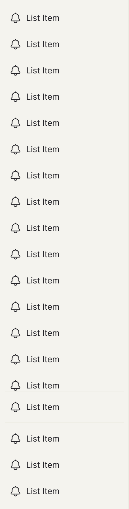

<!-- SOURCE: Figma MCP + figma-console MCP -->
<!-- FILE KEY: 5YihJ5WuDvnvrlrRMC4sBp -->
<!-- NODE ID: 62897:18973 (Sidebar menu), 62897:19352 (Sidebar menu - Sublist item) -->
<!-- EXTRACTED: 2026-05-07 -->
<!-- COMPONENT: SidebarMenu -->
<!-- COLOR STRATEGY: A for Sidebar container; B for Sublist item (5 states × 2 modes) -->

# SidebarMenu — Figma Design Spec

> **See also:** [props.md](./props.md) · [tokens.md](./tokens.md) ·
> [examples.md](./examples.md) · [accessibility.md](./accessibility.md)

---

## Visual reference

### Sidebar menu — light mode, expanded (mode=light, collapsed?=false)

### Sidebar menu — light mode, collapsed (mode=light, collapsed?=true)

<!-- Collapsed variant rendered from node 62897:19028 -->
<!-- Image URL (expires 30 days): https://figma-alpha-api.s3.us-west-2.amazonaws.com/images/5c031b10-6824-45f8-80d8-6c731b03fa12 -->

### Sidebar menu - Sublist item — light mode, Rest state

<!-- Sublist item Rest variant rendered from node 62897:19370 -->
<!-- Image URL (expires 30 days): https://figma-alpha-api.s3.us-west-2.amazonaws.com/images/582abd6d-bd58-49e2-a64e-a6f0030e0880 -->

---

## Anatomy

### Component set: Sidebar menu (`62897:18973`)

Top-level structure of the `mode=light, collapsed?=false` variant.

| # | Type | Name | Role | Notes |
|---|------|------|------|-------|
| 1 | frame | Scroll | Structural — scrollable viewport | 200 × 643 px; contains Primary navigation |
| 2 | frame | Primary navigation | Structural — main nav list | 200 × 740 px; contains 17× `_Menu List Items / Expanded`; fill → `ui25` |
| 3 | frame | Secondary Navigation | Structural — footer slot | 200 × 186 px; contains dividers + 4× footer items; fill → `ui25` |
| 4 | instance (×n) | _Menu List Items / Expanded | Content element — nav item | Repeated instance; one per navigation entry |
| 5 | instance (×2) | Dividers | Structural/decorative | Horizontal rules separating footer sections |

> **Collapsed variant:** In `collapsed?=true`, the `Scroll` frame hides labels — only icons are visible. The `Secondary Navigation` frame is also present in icon-only form.

### Component set: Sidebar menu - Sublist item (`62897:19352`)

Structure of the `mode=light, State=Rest` variant.

| # | Type | Name | Role | Notes |
|---|------|------|------|-------|
| 1 | frame | Text Info | Content element — label area | 120×20 px; VERTICAL layout; `layoutGrow: 1` fills remaining width |
| 2 | text | List Label | Content element — primary label | Inter 14px/20px Regular; color → variable `20136:254`; always visible |
| 3 | text | Sub List Label | Optional slot — secondary label | Inter 12px/16px Regular; color → variable `20136:255`; `visible: false` by default |
| 4 | frame | Frame 6 | Optional slot — badge container | 16×20 px; HORIZONTAL; `visible: false` by default; controlled by `hasBadge` |
| 5 | instance | Badge (dot) | Optional slot — dot badge | 12×12 px; `type=dot`; color → variable `20136:487`; shown by `↪ small (no number)` |
| 6 | instance | Badge (counter) | Optional slot — count badge | 16×16 px; `type=counter`; padding 4px H; color → variable `20136:487`; shown by `↪ medium (with number)` |

---

## API — Component properties

### Variant axes

#### Sidebar menu

| Property | Values | Default |
|----------|--------|---------|
| `mode` | `light`, `dark` | `light` |
| `collapsed?` | `false`, `true` | `false` |

#### Sidebar menu - Sublist item

| Property | Values | Default |
|----------|--------|---------|
| `mode` | `light`, `dark` | `light` |
| `State` | `Rest`, `Hover`, `Selected`, `Focus`, `Disabled` | `Rest` |

---

### Boolean toggles

#### Sidebar menu - Sublist item

| Property | Default | Notes |
|----------|---------|-------|
| `Secondary Label` (`Secondary Label#15115:2`) | `false` | Shows/hides the secondary label text row below the primary label |
| `↪ small (no number)` (`↪ small (no number)#81894:0`) | `false` | Badge dot variant (no count) |
| `↪ medium (with number)` (`↪ medium (with number)#82108:50`) | `false` | Badge with numeric count |
| `hasBadge` (`hasBadge#82108:59`) | `false` | Master badge visibility toggle |

> **Sidebar menu:** No boolean toggles at the component set level. Collapse state is controlled via the `collapsed?` variant axis.

---

### Text properties

#### Sidebar menu - Sublist item

| Property | Default value | Notes |
|----------|--------------|-------|
| `↪ Secondary Label` (`↪ Secondary Label#15115:0`) | `"Sub List Label"` | Text content for secondary label row |
| `Primary Label` (`Primary Label#15115:1`) | `"List Label"` | Text content for main label |

---

### Instance swap slots

#### `_Menu List Items / Expanded` (nav item atom)

| Slot | Property ID | Type | Default |
|------|------------|------|---------|
| Icon | `icon#19789:5` | `INSTANCE_SWAP` | Node `84709:245180` |

---

### Persistent states

#### Sidebar menu - Sublist item

| State | Property name | Notes |
|-------|--------------|-------|
| Disabled | `State=Disabled` | Muted text, no interaction |
| Selected | `State=Selected` | Active route; bold text, darker background |

> Hover, Focus are transient — listed under Interaction states only.

#### Sidebar menu

<!-- NO PERSISTENT STATES as named props — collapse is a variant axis (`collapsed?`), not a state prop -->

---

### Token coverage

<!-- NO COVERAGE % METRIC — not returned by enrichment for these node types -->

All fill and text color values are bound to variables. Resolved from UI Foundations library (`iVY5nI8JAxM05Apnnvozzs`):

| Variable ID | Primitive token (UI Foundations) | Hex | Used on |
|-------------|----------------------------------|-----|---------|
| `20136:372` | `color/offWhite/offWhite10` | `#F4F3EE` | Container / nav fills → OX semantic `ui25` |
| `20136:253` | `color/offWhite/offWhite09` | `#EBEAE1` | Outer container border → same primitive as OX `hover12` |
| `20136:254` | `color/offWhite/offWhite02` | `#26253A` | Primary label text color |
| `20136:255` | `color/offWhite/offWhite05` | `#6C6861` | Secondary label text color (muted) |
| `20136:487` | `color/turqouise/turqouise05` | `#04828A` | Badge fill |

---

## Color & token bindings

<!-- COLOR STRATEGY A for Sidebar container (4 variants); B for Sublist item (10 variants = 5 states × 2 modes) -->

### Sidebar container background

| Mode | Token | Value |
|------|-------|-------|
| Light | `ui25` | `#F4F3EE` |
| Dark | `ui25` | `#171719` |

### Sublist item — background by state (Strategy B)

| Element | Token | Light value | Dark value |
|---------|-------|------------|------------|
| Hover background | `hover12` | `#EBEAE1` | `#3D3D3D` |
| Selected/Active background | `active12` | `#DEDED5` | `#666666` |
| Floating sub-menu hover | `hover13` | `#EBEAE1` | `#525252` |

> Token names cross-referenced from OX MCP; individual layer variable bindings were not resolvable from the UI-components file (tokens live in the external UI-Foundations library `iVY5nI8JAxM05Apnnvozzs`).

### Text styles

<!-- NO STYLE DEFINITIONS FOUND — `figma_get_styles` returned 0 styles for file `5YihJ5WuDvnvrlrRMC4sBp`; text styles likely inherited from external library -->

### Effect styles

<!-- NO EFFECT STYLES FOUND -->

---

## Structure & spacing

### Sidebar menu — outer container

| Property | Token | Value | Variant |
|----------|-------|-------|---------|
| Width | — | 216 px | Expanded (`collapsed?=false`) |
| Height | — | 853 px | Expanded |
| Width | — | 52 px | Collapsed (`collapsed?=true`) |
| Height | — | 841 px | Collapsed |
| Padding top | — | 12 px | Both |
| Padding bottom | — | 12 px | Both |
| Padding left | — | 8 px | Expanded |
| Padding right | — | 8 px | Expanded |
| Padding left | — | 0 px | Collapsed |
| Padding right | — | 0 px | Collapsed |
| Item spacing | — | 0 px | Both |
| Layout direction | — | VERTICAL | Both |
| Background fill | `ui25` | `#F4F3EE` light / `#171719` dark | Both modes |
| Border | — | 1 px outside, variable `20136:253` | Both |

### Sidebar menu — internal frames

| Frame | Width | Height | Layout | Axis align | Item spacing | Notes |
|-------|-------|--------|--------|------------|-------------|-------|
| `Scroll` | 200 px | 643 px | HORIZONTAL | — | 0 px | Clips content (scrollable viewport) |
| `Primary navigation` | 200 px | 740 px | VERTICAL | CENTER (counter) | 8 px | Hugs content height; fill → `ui25` |
| `Secondary Navigation` | 200 px | 186 px | VERTICAL | MAX (primary, pinned to bottom) | 8 px | Footer zone; fill → `ui25` |

### `_Menu List Items / Expanded` atom

| Property | Value |
|----------|-------|
| Width | 200 px |
| Height | 36 px |
| Corner radius | 6 px |
| Layout | VERTICAL |

### Sublist item (`Sidebar menu - Sublist item`)

| Property | Token | Value | Notes |
|----------|-------|-------|-------|
| Width | — | 144 px | Fixed; fills container in use |
| Height | — | 36 px | Fixed |
| Padding top / bottom | — | 8 px | |
| Padding left / right | — | 12 px | |
| Item spacing (icon ↔ text) | — | 12 px | |
| Corner radius | — | 6 px | |
| Layout direction | — | HORIZONTAL | |

### Sublist item — child frames

| Frame | Width | Height | Layout | Notes |
|-------|-------|--------|--------|-------|
| `Text Info` | 120 px | 20 px | VERTICAL | `layoutGrow: 1` — fills remaining width |
| `Frame 6` (badge slot) | 16 px | 20 px | HORIZONTAL | `visible: false` by default; center-aligned |

### Text styles (Sublist item)

| Element | Font | Size | Weight | Line height | Letter spacing | Primitive token | Hex |
|---------|------|------|--------|-------------|----------------|-----------------|-----|
| `List Label` (Primary) | Inter | 14 px | 400 Regular | 20 px | −0.06 px | `color/offWhite/offWhite02` | `#26253A` |
| `Sub List Label` (Secondary) | Inter | 12 px | 400 Regular | 16 px | 0 px | `color/offWhite/offWhite05` | `#6C6861` |

> `Sub List Label` is `visible: false` by default — shown only when `Secondary Label` boolean toggle is enabled.

### Badge atom (inside Frame 6)

| Variant | Width | Height | Corner radius | Padding | Color variable |
|---------|-------|--------|---------------|---------|----------------|
| Dot (`↪ small`) | 12 px | 12 px | 8 px | — | `20136:487` |
| Counter (`↪ medium`) | 16 px | 16 px | 8 px | 4 px horizontal | `20136:487` |

### Auto-layout summary

| Frame | Direction | Primary align | Counter align |
|-------|-----------|---------------|---------------|
| Sidebar outer | VERTICAL | MIN (top) | MIN (left) |
| Scroll | HORIZONTAL | MIN | MIN |
| Primary navigation | VERTICAL | MIN | CENTER |
| Secondary Navigation | VERTICAL | MAX (bottom-pinned) | MIN |
| Sublist item | HORIZONTAL | MIN | MIN |
| Text Info | VERTICAL | MIN | MIN |
| Frame 6 (badge) | HORIZONTAL | CENTER | CENTER |

### Density / size variants

| Variant | Width | Padding H | Notes |
|---------|-------|-----------|-------|
| `collapsed?=false` | 216 px | 8 px left/right | Icons + labels visible |
| `collapsed?=true` | 52 px | 0 px left/right | Icon-only strip; labels hidden |

---

## Interaction states

| State | Trigger | Visual change |
|-------|---------|---------------|
| `Hover` | Pointer over item | Background → `hover12` (`#EBEAE1` light / `#3D3D3D` dark) |
| `Selected` | Active route | Background → `active12`; text bold; persists until route changes |
| `Focus` | Keyboard Tab | Blue outline border visible (observed in screenshot) |
| `Disabled` | `State=Disabled` | Text muted/greyed; no pointer interaction |
| Collapsed | `collapsed?=true` | Labels hidden; sidebar narrows to icon strip |

---

## Design decisions & annotations

<!-- NO ANNOTATIONS FOUND IN FIGMA RESPONSE -->

The component set description links to:
> **Sidebar menu description:** https://oxygen.8x8.com/docs/Contribution/intro

No inline design annotations were present on either component set. Intent behind individual decisions (e.g. why collapsed state hides labels vs. scales them, why `Secondary Navigation` is always visible in both states) is not documented in Figma.

---

## Accessibility (from Figma annotations only)

- **ARIA role:** <!-- NOT ANNOTATED IN FIGMA -->
- **Focus order:** <!-- NOT ANNOTATED IN FIGMA -->
- **Keyboard interactions:** <!-- NOT ANNOTATED IN FIGMA — Focus state is present in Sublist item variants (blue outline) but no annotation explains the expected keyboard behaviour -->

See [accessibility.md](./accessibility.md) for full accessibility documentation.

---

## Gaps & conflicts

| Type | Description |
|------|-------------|
| Missing annotation | No design intent annotations on either component set (`Sidebar menu` or `Sidebar menu - Sublist item`) |
| Missing annotation | No description on `Sidebar menu - Sublist item` component set |
| Resolved | Border `20136:253` → `color/offWhite/offWhite09` (`#EBEAE1`) — same primitive as OX token `hover12`; no dedicated border semantic token |
| Resolved | Text colors `20136:254` → `color/offWhite/offWhite02` (`#26253A`); `20136:255` → `color/offWhite/offWhite05` (`#6C6861`) |
| Resolved | Badge fill `20136:487` → `color/turqouise/turqouise05` (`#04828A`) |
| Missing data | `figma_get_styles` returned 0 styles — text styles are applied via variables, not named styles; no effect styles present |
| Missing data | `_Menu List Items / Expanded` internal anatomy not drilled — its icon slot (`icon#19789:5`), label, badge properties are documented from the secondary navigation instance, but the atom's own layer tree was not extracted |
| Conflict | Figma `collapsed?` boolean axis does not have a direct prop equivalent in `@8x8/oxygen-sidebar-menu` — the `Sidebar` component manages collapse internally via `initialCollapsedState` / `onCollapseChange`; `SidebarContainer` accepts `collapsed` as a controlled prop |
| Incomplete data | Screenshot saved for `mode=light, collapsed?=false` only; dark mode and collapsed variants linked via expiring S3 URLs |

---

_Source: Figma MCP · figma-console MCP · Extracted 2026-05-07_
