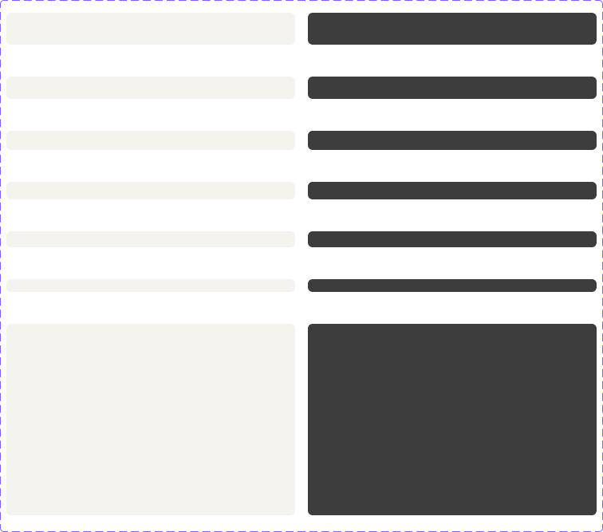

<!-- SOURCE: Figma MCP + figma-console MCP -->
<!-- FILE KEY: 5YihJ5WuDvnvrlrRMC4sBp -->
<!-- NODE ID: 31984:56109 -->
<!-- EXTRACTED: 2026-05-05 -->
<!-- COMPONENT: SkeletonBlock (Skeletons) -->
<!-- COLOR STRATEGY: A (≤3 state variants per element — one table per element, states as rows) -->

# SkeletonBlock — Figma Design Spec

> **See also:** [props.md](./props.md) · [tokens.md](./tokens.md) ·
> [examples.md](./examples.md) · [accessibility.md](./accessibility.md)

---

## Visual reference

---

## Anatomy

The Figma node `31984:56109` is a component set frame named **"Block"** (756×667px). It contains 14 variant symbols arranged in two columns (Light on left, Dark on right), covering 7 size/type variants × 2 modes.

| # | Node ID | Name / Variant key | Position | Dimensions | Notes |
|---|---------|-------------------|----------|------------|-------|
| 1 | `31984:56110` | `Mode=Light, Size=40px - heading02` | x=8, y=16 | 362×40px | Default variant |
| 2 | `31984:56111` | `Mode=Dark, Size=40px - heading02` | x=386, y=16 | 362×40px | Dark mode default |
| 3 | `31984:56112` | `Mode=Light, Size=28px - heading01` | x=8, y=96 | 362×28px | |
| 4 | `31984:56113` | `Mode=Dark, Size=28px - heading01` | x=386, y=96 | 362×28px | |
| 5 | `46034:4` | `Mode=Light, Size=24px - bulletList01` | x=8, y=164 | 362×24px | |
| 6 | `46034:5` | `Mode=Dark, Size=24px - bulletList01` | x=386, y=164 | 362×24px | |
| 7 | `31984:56114` | `Mode=Light, Size=22px - body02` | x=8, y=228 | 362×22px | |
| 8 | `31984:56118` | `Mode=Dark, Size=22px - body02` | x=386, y=228 | 362×22px | |
| 9 | `31984:56115` | `Mode=Light, Size=20px - body01` | x=8, y=290 | 362×20px | |
| 10 | `31984:56117` | `Mode=Dark, Size=20px - body01` | x=386, y=290 | 362×20px | |
| 11 | `31984:56116` | `Mode=Light, Size=16px - label01` | x=8, y=350 | 362×16px | Smallest text skeleton |
| 12 | `31984:56119` | `Mode=Dark, Size=16px - label01` | x=386, y=350 | 362×16px | |
| 13 | `50238:836` | `Mode=Light, Size=custom - image` | x=8, y=406 | 362×240px | Image/block placeholder |
| 14 | `50238:834` | `Mode=Dark, Size=custom - image` | x=386, y=406 | 362×240px | |

**Element classification:**

| Element | Type | Role |
|---------|------|------|
| Each variant symbol | Symbol (instance) | Content element — single rounded rectangle fill representing a placeholder |

Each variant is a single leaf node — a `div` with background fill and no child elements. There are no nested components, no slots, and no boolean toggles visible in the layer tree.

---

## API — Component properties

### Variant axes

| Property | Values | Default | Notes |
|----------|--------|---------|-------|
| `mode` | `Light`, `Dark` | `Light` | Theme mode; in application context driven by theme provider |
| `size` | `40px - heading02`, `28px - heading01`, `24px - bulletList01`, `22px - body02`, `20px - body01`, `16px - label01`, `custom - image` | `40px - heading02` | Determines height; value names reference the text style being replaced |

### Boolean toggles

<!-- NO BOOLEAN TOGGLES FOUND — Desktop Bridge offline; inner layer properties unavailable -->

### Instance swap slots

<!-- NO INSTANCE SWAP SLOTS FOUND — Desktop Bridge offline; inner layer properties unavailable -->

### Persistent states

The SkeletonBlock has no interactive states. It is a passive, animated display element. The only axis is `mode` (Light/Dark) and `size`.

### Token coverage

<!-- NO COVERAGE DATA RETURNED — Variables API unavailable; Desktop Bridge not connected -->

---

## Color & token bindings

**Strategy A:** Single table — states as rows, elements as columns.

| Element | Token | Light value | Dark value |
|---------|-------|-------------|------------|
| Background fill | `--ui/ui02` | `#f4f3ee` | `#3d3d3d` |

Token `--ui/ui02` is referenced via CSS custom property with hardcoded fallbacks visible in the design context output. This is the only color token used — the component is a single filled rectangle.

The usage documentation also references `ui01` as the animation start color (the fill fades between `ui01` and `ui02`), but `ui01` does not appear in the Figma node properties for this component set.

### Text styles

<!-- NO TEXT STYLES — SkeletonBlock contains no text layers; styles API returned 0 styles for this file -->

### Effect styles

<!-- NO EFFECT STYLES FOUND IN FIGMA RESPONSE -->

---

## Structure & spacing

### Container

| Property | Value | Token | Notes |
|----------|-------|-------|-------|
| Width | 362px | — | Hardcoded in component set frame; fills container in actual usage |
| Border radius | 6px | — | **Hardcoded** — no token binding found |
| Layout | Single `div`, no children | — | `overflow-clip`, `relative` |

### Height by size variant

| Size | Height | Intended text style |
|------|--------|-------------------|
| `40px - heading02` | 40px | `heading02` |
| `28px - heading01` | 28px | `heading01` |
| `24px - bulletList01` | 24px | `bulletList01` |
| `22px - body02` | 22px | `body02` |
| `20px - body01` | 20px | `body01` |
| `16px - label01` | 16px | `label01` |
| `custom - image` | 240px | Image / block element |

### Spacing guidance (from usage documentation)

- Between stacked text skeleton lines: `spacing03` = **8px**
- The spacing tokens from the "loaded" state are used to separate different skeleton variants.

### Auto-layout

The component set frame arranges variants in a two-column grid (Light left, Dark right) with manual positions — this is a Figma documentation layout, not a component layout constraint. Each individual variant is a single leaf node with no auto-layout.

---

## Interaction states

The SkeletonBlock is non-interactive. No hover, focus, or pressed states exist.

| State | Trigger | Visual change |
|-------|---------|---------------|
| Animating (default) | Mount | Background fades between `ui01` and `ui02` |
| (No other states) | — | — |

---

## Design decisions & annotations

> **Size values mirror text style names:** Each `size` value is named after the Oxygen text style it replaces (e.g. `20px - body01`). This makes it explicit which text style the skeleton should match, removing ambiguity for engineers.

> **`custom - image` at 240px:** The image/block variant uses a fixed 240px height in the component set. In practice, the height should match the image or block being replaced — this is the "default" image size shown in documentation.

> **Two-column layout in Figma:** The component set arranges Light and Dark variants side-by-side for visual comparison. They are not nested — each is an independent symbol.

> **Documentation link:** `https://oxygen.8x8.com/docs/components/skeletonloader`

<!-- NO FURTHER ANNOTATIONS FOUND IN FIGMA RESPONSE -->

---

## Accessibility (from Figma annotations only)

- **ARIA role:** <!-- NOT ANNOTATED IN FIGMA -->
- **Focus order:** <!-- NOT ANNOTATED IN FIGMA -->
- **Keyboard interactions:** <!-- NOT ANNOTATED IN FIGMA -->

For full accessibility documentation see [accessibility.md](./accessibility.md).

---

## Gaps & conflicts

| Type | Description |
|------|-------------|
| Missing token | `ui01` (animation start color) not resolved — referenced in usage docs but not present in Figma node properties |
| Missing token | Border radius (`6px`) is hardcoded — no token binding found |
| Hardcoded value | Width (`362px`) is hardcoded in component set frame; real-world usage fills the container |
| Missing data | Desktop Bridge offline — no enriched component metadata, no component key, no boolean toggle list |
| Missing data | Variables API unavailable — token bindings not confirmed from source library |
| Missing data | Styles API returned 0 styles |
| Missing annotation | No ARIA role annotated in Figma |
| Missing annotation | No keyboard interaction notes in Figma |
| Missing annotation | `prefers-reduced-motion` handling not documented in Figma |
| Source gap | MCP `get-component-props` returned no props for `SkeletonBlock` or `SkeletonCircle` — prop names unconfirmed |

---

_Source: Figma MCP · figma-console MCP · Extracted 2026-05-05_
