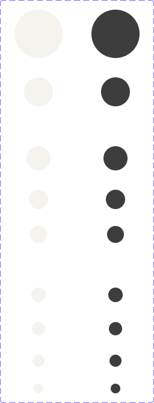

<!-- SOURCE: Figma MCP + figma-console MCP -->
<!-- FILE KEY: 5YihJ5WuDvnvrlrRMC4sBp -->
<!-- NODE ID: 31984:56124 -->
<!-- EXTRACTED: 2026-05-05 -->
<!-- COMPONENT: SkeletonCircle (Skeletons) -->
<!-- COLOR STRATEGY: A (≤3 state variants per element — one table per element, states as rows) -->

# SkeletonCircle — Figma Design Spec

> **See also:** [props.md](./props.md) · [tokens.md](./tokens.md) ·
> [examples.md](./examples.md) · [accessibility.md](./accessibility.md)

---

## Visual reference

---

## Anatomy

The Figma node `31984:56124` is a component set frame named **"Circle"** (256×667px) on the "Skeleton loader" page. It contains 18 variant symbols arranged in two columns (Light on left, Dark on right), covering 9 size variants × 2 modes.

| # | Node ID | Name / Variant key | Position | Dimensions | Notes |
|---|---------|-------------------|----------|------------|-------|
| 1 | `31984:56125` | `Mode=Light, Size=80px - xlarge` | x=24, y=16 | 80×80px | Default variant |
| 2 | `31984:56126` | `Mode=Dark, Size=80px - xlarge` | x=152, y=16 | 80×80px | |
| 3 | `31984:56127` | `Mode=Light, Size=48px - large` | x=40, y=128 | 48×48px | |
| 4 | `31984:56128` | `Mode=Dark, Size=48px - large` | x=168, y=128 | 48×48px | |
| 5 | `31984:56129` | `Mode=Light, Size=40px - medium` | x=44, y=242 | 40×40px | |
| 6 | `31984:56130` | `Mode=Dark, Size=40px - medium` | x=172, y=242 | 40×40px | |
| 7 | `31984:56131` | `Mode=Light, Size=32px - small` | x=48, y=314 | 32×32px | |
| 8 | `31984:56132` | `Mode=Dark, Size=32px - small` | x=176, y=314 | 32×32px | |
| 9 | `50238:4493` | `Mode=Light, Size=28px - small` | x=50, y=374 | 28×28px | Added later (different prefix) |
| 10 | `50238:4499` | `Mode=Dark, Size=28px - small` | x=178, y=374 | 28×28px | |
| 11 | `31984:56133` | `Mode=Light, Size=24px - xsmall` | x=52, y=476 | 24×24px | |
| 12 | `31984:56134` | `Mode=Dark, Size=24px - xsmall` | x=180, y=476 | 24×24px | |
| 13 | `50238:4491` | `Mode=Light, Size=22px - xsmall` | x=53, y=533 | 22×22px | Added later |
| 14 | `50238:4501` | `Mode=Dark, Size=22px - xsmall` | x=181, y=533 | 22×22px | |
| 15 | `50238:4496` | `Mode=Light, Size=20px - xsmall` | x=54, y=587 | 20×20px | Added later |
| 16 | `50238:4503` | `Mode=Dark, Size=20px - xsmall` | x=182, y=587 | 20×20px | |
| 17 | `50238:4520` | `Mode=Light, Size=16px - xsmall` | x=56, y=635 | 16×16px | Smallest; added later |
| 18 | `50238:4521` | `Mode=Dark, Size=16px - xsmall` | x=184, y=635 | 16×16px | |

**Element classification:**

| Element | Type | Role |
|---------|------|------|
| Each variant symbol | Symbol (instance) | Content element — single fully-rounded div representing a circular placeholder |

Each variant is a single leaf node with no child elements. There are no nested components, slots, or boolean toggles.

> **Node prefix note:** Variants with prefix `50238` (28px, 22px, 20px, 16px) were added later than the original set (`31984`), consistent with the pattern seen in the Block component set.

---

## API — Component properties

### Variant axes

| Property | Values | Default | Notes |
|----------|--------|---------|-------|
| `mode` | `Light`, `Dark` | `Light` | Theme mode; driven by theme provider in application context |
| `size` | `80px - xlarge`, `48px - large`, `40px - medium`, `32px - small`, `28px - small`, `24px - xsmall`, `22px - xsmall`, `20px - xsmall`, `16px - xsmall` | `80px - xlarge` | Determines diameter; value names reference the avatar/icon size context |

### Boolean toggles

<!-- NO BOOLEAN TOGGLES FOUND — Desktop Bridge offline; inner layer properties unavailable -->

### Instance swap slots

<!-- NO INSTANCE SWAP SLOTS FOUND — Desktop Bridge offline; inner layer properties unavailable -->

### Persistent states

No interactive states. The only axes are `mode` and `size`.

### Token coverage

<!-- NO COVERAGE DATA RETURNED — Variables API unavailable; Desktop Bridge not connected -->

---

## Color & token bindings

**Strategy A:** Single table.

| Element | Token | Light value | Dark value |
|---------|-------|-------------|------------|
| Circle fill background | `--ui/ui02` | `#f4f3ee` | `#3d3d3d` |

Same token as `SkeletonBlock` — both components share a single fill color per mode. The animation fades this fill between `ui01` (start) and `ui02` (end), per usage documentation.

### Text styles

<!-- NO TEXT STYLES — SkeletonCircle contains no text layers -->

### Effect styles

<!-- NO EFFECT STYLES FOUND IN FIGMA RESPONSE -->

---

## Structure & spacing

### Container

| Property | Value | Token | Notes |
|----------|-------|-------|-------|
| Shape | Fully rounded circle | — | `border-radius: 100px` — **hardcoded**, no token binding found |
| Width = Height | Varies by size | — | Square aspect ratio; border-radius makes it circular |
| Layout | Single `div`, no children | — | `overflow-clip`, `relative` |

### Size variants

| Size value | Diameter | Size label |
|---|---|---|
| `80px - xlarge` | 80px | xlarge |
| `48px - large` | 48px | large |
| `40px - medium` | 40px | medium |
| `32px - small` | 32px | small |
| `28px - small` | 28px | small |
| `24px - xsmall` | 24px | xsmall |
| `22px - xsmall` | 22px | xsmall |
| `20px - xsmall` | 20px | xsmall |
| `16px - xsmall` | 16px | xsmall |

> **Two "small" sizes:** Both 32px and 28px map to the `small` size label. Similarly, four diameters (24px, 22px, 20px, 16px) all map to `xsmall`. The pixel values are the disambiguating factor.

### Auto-layout

The component set arranges variants in a two-column documentation grid (Light left, Dark right). Each individual variant is a single leaf node with no auto-layout.

---

## Interaction states

`SkeletonCircle` is non-interactive. No hover, focus, or pressed states.

| State | Trigger | Visual change |
|-------|---------|---------------|
| Animating (default) | Mount | Fill fades between `ui01` and `ui02` |
| (No other states) | — | — |

---

## Design decisions & annotations

> **Size names reference avatar/icon context:** Each size value encodes both the pixel dimension and the semantic size label (e.g. `40px - medium`), making it clear which avatar or icon slot the skeleton replaces.

> **Two `small` and four `xsmall` values:** The size labels don't map 1:1 to pixel values — both 32px and 28px are "small", and 24/22/20/16px are all "xsmall". This matches real-world avatar/icon sizing where multiple pixel sizes share a label tier.

> **Shared token with Block:** Both `SkeletonBlock` and `SkeletonCircle` use `--ui/ui02` as the fill token, ensuring visual consistency across skeleton types.

> **Documentation link:** `https://oxygen.8x8.com/docs/components/skeletonloader`

<!-- NO FURTHER ANNOTATIONS FOUND IN FIGMA RESPONSE -->

---

## Accessibility (from Figma annotations only)

- **ARIA role:** <!-- NOT ANNOTATED IN FIGMA -->
- **Focus order:** <!-- NOT ANNOTATED IN FIGMA -->
- **Keyboard interactions:** <!-- NOT ANNOTATED IN FIGMA -->

For full accessibility documentation see [accessibility.md](./accessibility.md).

---

## Gaps & conflicts

| Type | Description |
|------|-------------|
| Missing token | Border radius (`100px`) is hardcoded — no token binding found |
| Missing token | `ui01` animation start color not present in Figma node properties |
| Missing data | Desktop Bridge offline — no enriched component metadata, no component key |
| Missing data | Variables API unavailable — token bindings not confirmed from source library |
| Missing data | Styles API returned 0 styles |
| Missing annotation | No ARIA role annotated in Figma |
| Missing annotation | `prefers-reduced-motion` handling not documented in Figma |
| Source gap | MCP `get-component-props` returned no props for `SkeletonCircle` — prop names unconfirmed |
| Ambiguous naming | Two sizes labeled `small` (32px, 28px); four labeled `xsmall` (24px, 22px, 20px, 16px) — React API may collapse these differently |

---

_Source: Figma MCP · figma-console MCP · Extracted 2026-05-05_
