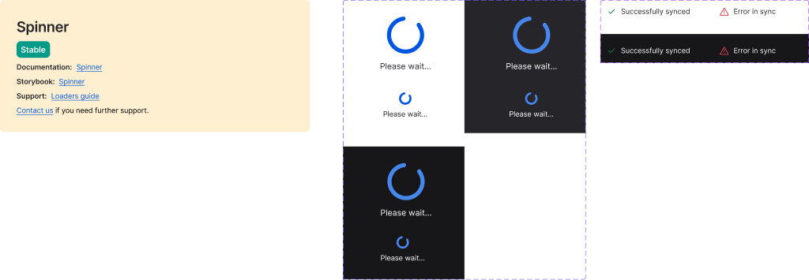

<!-- source: figma-only -->

## Visual reference

## Anatomy

The Figma page for Spinner contains two component sets: **Spinner** (animated loading state) and **Spinner complete** (terminal states: complete and error).

### Component set: Spinner (node `2063:0`)

Six variant combinations in a 470×542px frame:

| # | Type | Variant key | Dimensions | Notes |
|---|------|-------------|------------|-------|
| 1 | symbol | `mode=light, size=default, isInverted=no` | 100×108px | Primary default variant |
| 2 | symbol | `mode=light, size=default, isInverted=yes` | 100×108px | Inverted — light mode, dark background |
| 3 | symbol | `mode=dark, size=default, isInverted=no` | 100×108px | Dark mode default |
| 4 | symbol | `mode=light, size=small, isInverted=no` | 87×52px | Compact inline variant |
| 5 | symbol | `mode=light, size=small, isInverted=yes` | 87×52px | Inverted small |
| 6 | symbol | `mode=dark, size=small, isInverted=no` | 87×52px | Dark mode small |

> **Note:** The `dark + isInverted=yes` combination is absent — only 6 of 8 possible permutations are defined. Per design annotations this is intentional (redundant — dark mode already handles that context).

### Component set: Spinner complete (node `28591:41808`)

Terminal state variants. Frame: 404×122px. Each variant ~186×44px.

| # | Type | Variant key | Dimensions | Notes |
|---|------|-------------|------------|-------|
| 1 | symbol | `mode=light, state=complete` | 186×44px | Loading completed successfully |
| 2 | symbol | `mode=dark, state=complete` | 186×44px | Dark mode complete |
| 3 | symbol | `mode=light, state=error` | 186×44px | Loading failed |
| 4 | symbol | `mode=dark, state=error` | 186×44px | Dark mode error |

## Variant axes

### Spinner (animated)

| Property | Values | Default | Notes |
|----------|--------|---------|-------|
| `mode` | `light`, `dark` | `light` | Theme mode |
| `size` | `default`, `small` | `default` | Maps to `size` prop in Oxygen |
| `isInverted` | `no`, `yes` | `no` | Inverted colour variant for use on dark/coloured backgrounds |

<!-- CONFLICT:GAP-010 finding="isInverted: Figma exposes isInverted as a first-class variant axis (no/yes); the React component has no isInverted prop — unclear whether (a) theme/surface context auto-handles inversion, (b) prop is missing from the package, or (c) design-only intent" HUMAN DECISION REQUIRED -->

### Spinner complete (terminal states)

| Property | Values | Default | Notes |
|----------|--------|---------|-------|
| `mode` | `light`, `dark` | `light` | Theme mode |
| `state` | `complete`, `error` | — | Terminal outcome state |

## Sizes

| Variant | Width | Height | Notes |
|---------|-------|--------|-------|
| `size=default` | 100px | 108px | Height includes supporting text area below arc |
| `size=small` | 87px | 52px | Compact; includes supporting text area |

<!-- CONFLICT:GAP-011 finding="large2x: React spinnerSize enum includes large2x (evidenced in Storybook examples); Figma component set only defines default and small — one source is stale" HUMAN DECISION REQUIRED -->

## States

| State | Trigger | Visual change |
|-------|---------|---------------|
| Animating | Mount / `hasAnimation=true` | Continuous rotation of the spinner arc |
| Static | `hasAnimation=false` | Spinner arc frozen; no rotation |
| Complete | Loading finishes | Transition to "Spinner complete" with `state=complete` |
| Error | Loading fails | Transition to "Spinner complete" with `state=error` |

## Internal spacing

<!-- STUB:GAP-008 source="Open Spinner node in Figma Desktop, select it, and call get_design_context to populate inner padding, gap between arc and supporting text, arc icon dimensions, and auto-layout direction" -->

Inner padding, gap between spinner arc and supporting text, arc icon dimensions, and auto-layout direction could not be extracted — `get_design_context` requires selection in Figma Desktop, which was unavailable during extraction.

## Design decisions

> **isInverted variant:** A dedicated inverted colour variant is provided for placement on dark or brand-coloured backgrounds, rather than relying on CSS inversion filters. The `dark + isInverted=yes` combination is intentionally absent.

> **Spinner complete as separate component set:** Terminal states (complete, error) live in a separate Figma component set. This signals that consuming code should swap the component rather than changing a variant prop when loading ends.

> **Supporting text height:** The 108px height of the default variant (vs ~56px for the spinner arc alone) accommodates the supporting text label below the arc.

_Source: Figma MCP · figma-console MCP · Extracted 2026-05-05_
