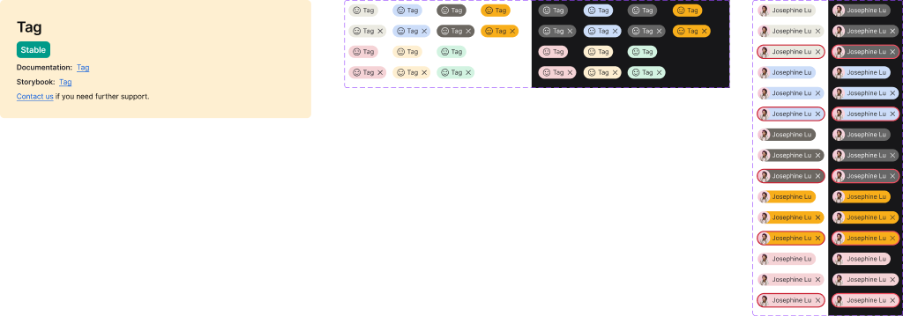

<!-- SOURCE: Figma MCP + figma-console MCP -->
<!-- FILE KEY: 5YihJ5WuDvnvrlrRMC4sBp -->
<!-- NODE ID: 8083:8359 (Tag canvas) · 16334:16412 (Standard Tag set) · 16390:16896 (Avatar Tag set) · 52829:11107 (↳ Tag examples page) -->
<!-- EXTRACTED: 2026-05-01 -->
<!-- COMPONENT: Tag -->
<!-- COLOR STRATEGY: B (colors as rows, mode Light/Dark as columns — 7 colors × 2 modes > 3 threshold) -->

# Tag — Figma Design Spec

> **See also:** [props.md](./props.md) · [tokens.md](./tokens.md) ·
> [examples.md](./examples.md) · [accessibility.md](./accessibility.md)

---

## Visual reference

*Tag canvas node `8083:8359`. Left: Standard Tag component set (light + dark mode, all color variants). Right: Avatar Tag component set (all mode/color/type combinations).*

---

## Component sets overview

The Tag Figma node contains **two independent component sets**:

| Component set | Node ID | Description |
|---|---|---|
| Standard Tag | `16334:16412` | Pill tag with optional leading icon and optional remove action |
| Avatar Tag | `16390:16896` | Pill tag with a fixed avatar photo and optional remove action |

Both share the same 24px height and pill (fully-rounded) shape. They differ in anatomy, color support, and available `type` values.

---

## Anatomy

### Standard Tag

Element structure from the Standard Tag component set (`16334:16412`).

| # | Type | Name | Role | Notes |
|---|------|------|------|-------|
| 1 | frame | Container | Structural | Auto-layout horizontal; `h-24px`; `gap-4px`; `py-2px`; `border-radius: 15px`; background token applied here |
| 2 | instance | Leading icon | Optional slot | Controlled by `icon?` boolean (default: true). Instance-swap; default icon `face-smile` (84161:245102). Rendered at `iconSizeXS` (16×16px). |
| 3 | text | Label | Content element | Default "Tag"; uses `$label01` text style (12px, weight 400, Inter). Color varies by `color` + `mode`. |
| 4 | instance | Close button (×) | Optional slot | Present only when `type=withAction`. Maps to `CloseButton` component (`packages/tag/src/components/CloseButton.tsx`). |
| 5 | frame | Focus ring | Transient state | `size-24px`, `rounded-1000px`, `border-2`; visible only when `type=withAction` and `focus?=true`. |

**Annotations from examples page (83101:4975):** `Leading icon (optional) · Label · Remove button (optional)`

### Avatar Tag

Element structure from the Avatar Tag component set (`16390:16896`).

| # | Type | Name | Role | Notes |
|---|------|------|------|-------|
| 1 | frame | Container | Structural | Same shape as Standard Tag; padding asymmetric — no left pad (avatar sits flush), `pr-8px` (default) or `pr-4px` (withAction/withActionError). Error border added when `type=withActionError`. |
| 2 | instance | Avatar | Fixed sub-component | `size-24px`, `rounded-1000px`; contains a circular photo (`img`). Uses the Avatar component (`packages/avatar`). Always present. |
| 3 | text | Label | Content element | Default "Josephine Lu"; same `$label01` style as Standard Tag. Color varies by `color` + `mode`. |
| 4 | instance | Close button (×) | Optional slot | Present when `type=withAction` or `type=withActionError`. Same `CloseButton` component. |
| 5 | frame | Error border | State indicator | `border-2 border-[var(--error/error01)]`; only when `type=withActionError`. |
| 6 | frame | Focus ring | Transient state | Same structure as Standard Tag focus ring; only when `type=withAction`/`withActionError` and `focus?=true`. |

**Annotations from examples page (82947:1561):** `Avatar · Label · Remove button (optional)`

---

## API — Component properties

### Standard Tag — Variant axes

| Property | Values | Default |
|----------|--------|---------|
| `mode` | `light`, `dark` | `light` |
| `color` | `default`, `blue`, `grey`, `red`, `yellow`, `green`, `yellow-emphasis` | `default` |
| `type` | `default`, `withAction` | `default` |

### Standard Tag — Boolean toggles

| Property | Default | Notes |
|----------|---------|-------|
| `icon?` | `true` | Shows/hides the leading icon slot |
| `focus?` | `false` | Shows/hides the focus ring (transient; only applies when `type=withAction`) |

### Standard Tag — Instance swap slots

| Slot | Default component key | Notes |
|------|-----------------------|-------|
| `↪ icon` | `84161:245102` (face-smile) | Accepts any icon component; rendered at `iconSizeXS` |

### Standard Tag — Text properties

| Property | Default |
|----------|---------|
| `label` | `"Tag"` |

### Standard Tag — Variant matrix

28 variants total (2 modes × 7 colors × 2 types = 28 components).

---

### Avatar Tag — Variant axes

| Property | Values | Default |
|----------|--------|---------|
| `mode` | `light`, `dark` | `light` |
| `color` | `default`, `blue`, `grey`, `red`, `yellow-emphasis` | `default` |
| `type` | `default`, `withAction`, `withActionError` | `default` |

> **Note:** Avatar Tag omits `yellow` and `green` color variants present in Standard Tag.
> Avatar Tag adds `withActionError` type not present in Standard Tag.

### Avatar Tag — Boolean toggles

| Property | Default | Notes |
|----------|---------|-------|
| `focus?` | `false` | Shows/hides focus ring (transient; only when `type=withAction` or `type=withActionError`) |

### Avatar Tag — Text properties

| Property | Default |
|----------|---------|
| `label` | `"Josephine Lu"` |

### Avatar Tag — Variant matrix

30 variants total (2 modes × 5 colors × 3 types = 30 components).

---

### Persistent vs transient states

| State | Classification | Notes |
|-------|----------------|-------|
| `type=withAction` | Persistent API property | Determines structural layout (adds close button) |
| `type=withActionError` | Persistent API property (Avatar Tag only) | Adds error border + close button |
| `focus?=true` | Transient state | Focus ring visibility; not an API prop on the code component |
| `icon?=true/false` | Boolean slot toggle | Toggles leading icon slot |

### Token coverage

- Token coverage % **not returned** — Figma Variables API unavailable (Enterprise plan required; Desktop Bridge not connected).
- Tokens inferred from CSS variable references in design context code (e.g. `var(--ui/ui01, #ebeae1)`).

---

## Color & token bindings

<!-- COLOR STRATEGY B: colors as rows, mode as columns -->

Token names extracted from CSS variable paths in design context code.
Format: `var(--collection/token-name, #resolved-fallback)`.

### Standard Tag — Background token

| Color | Light mode token | Light fallback | Dark mode token | Dark fallback |
|-------|-----------------|----------------|-----------------|---------------|
| `default` | `ui/ui01` | `#ebeae1` | `ui/ui01` | `#666666` |
| `blue` | `ui/ui09` | `#ccddf9` | `ui/ui09` | `#ccddf9` |
| `grey` | `ui/ui10` | `#6c6862` | `ui/ui10` | `#666666` |
| `red` | `ui/ui16` | `#f5d3d6` | `ui/ui16` | `#f5d3d6` |
| `yellow` | `ui/ui17` | `#feefd1` | `ui/ui17` | `#feefd1` |
| `green` | `ui/ui18` | `#d2f3e1` | `ui/ui18` | `#d2f3e1` |
| `yellow-emphasis` | `warning/warning01` | `#f8ae1a` | `warning/warning01` | `#f8ae1a` |

> **Note:** `default` color uses the same token (`ui/ui01`) in both modes but with different resolved values (warm off-white vs dark grey). All other colors resolve to identical values across modes — only `default` and `grey` show visible mode variation.

### Standard Tag — Text color token

| Color | Light mode token | Light fallback | Dark mode token | Dark fallback |
|-------|-----------------|----------------|-----------------|---------------|
| `default` | `text/textcolor01` | `#26252a` | `text/textcolor01` | `white` |
| `blue` | `text/textcolor07` | `#26252a` | `text/textcolor07` | `#292929` |
| `grey` | `text/textcolor06` | `white` | `text/textcolor06` | `white` |
| `red` | `text/textcolor07` | `#26252a` | `text/textcolor07` | `#292929` |
| `yellow` | `text/textcolor07` | `#26252a` | `text/textcolor07` | `#292929` |
| `green` | `text/textcolor07` | `#26252a` | `text/textcolor07` | `#292929` |
| `yellow-emphasis` | `text/textcolor07` | `#26252a` | `text/textcolor07` | `#292929` |

> **Note:** `grey` tags always use white text (inverted) regardless of mode. `default` light uses near-black; `default` dark uses white.

### Avatar Tag — Background token

Same token structure as Standard Tag for shared colors (`default`, `blue`, `grey`, `red`, `yellow-emphasis`). `yellow` and `green` are absent from Avatar Tag.

### Avatar Tag — Error border token (`type=withActionError`)

| Mode | Token | Fallback |
|------|-------|---------|
| Light | `error/error01` | `#cb2233` |
| Dark | `error/error01` | `#f24d5f` |

### Focus ring tokens (both component sets)

| Element | Light mode token | Light fallback | Dark mode token | Dark fallback |
|---------|-----------------|----------------|-----------------|---------------|
| Focus ring border | `interactive/focus01` | `#0056e0` | `interactive/focus01` | `#d7e3f9` |
| Focus ring inset shadow | `ui/ui06` | `white` | `ui/ui06` | `#171719` |

### Text styles

| Element | Style name | Size | Weight | Line height | Letter spacing |
|---------|-----------|------|--------|-------------|----------------|
| Label | `$label01` | `typography/label01/font-size` (12px) | `typography/label01/font-weight` (400/normal) | `typography/label01/line-height` (16px) | `typography/label01/letter-spacing` (0px) |
| Font family | `typography/font-family/sans` | — | — | — | Inter |

### Effect styles

<!-- NO EFFECT STYLES FOUND IN FIGMA RESPONSE — styles API returned 0 styles total -->

---

## Structure & spacing

### Standard Tag container

| Property | Token | Value | Notes |
|----------|-------|-------|-------|
| Height | — | `24px` | Fixed; same across all variants |
| Border radius | — | `15px` | Pill shape |
| Padding vertical | — | `2px` top + bottom | |
| Padding horizontal (`type=default`) | — | `8px` left + right | `px-8px` |
| Padding horizontal (`type=withAction`) | — | `8px` left, `4px` right | `pl-8px pr-4px` — right reduced to allow close button |
| Gap | — | `4px` | Between icon, label, close button |
| Auto-layout direction | — | Horizontal | `items-center` |

> All padding and gap values are hardcoded px — no design tokens found binding these spacing values.

### Avatar Tag container

| Property | Token | Value | Notes |
|----------|-------|-------|-------|
| Height | — | `24px` | Fixed |
| Border radius | — | `15px` | Pill shape |
| Padding vertical | — | `2px` | |
| Left padding | — | `0px` | Avatar sits flush left inside pill |
| Right padding (`type=default`) | — | `8px` | |
| Right padding (`type=withAction`/`withActionError`) | — | `4px` | Reduced for close button |
| Gap | — | `4px` | Between avatar, label, close button |
| Error border (`type=withActionError`) | `error/error01` | `2px solid` | Applied to container |

### Sub-component sizing

| Sub-component | Size | Notes |
|---|---|---|
| Leading icon (Standard Tag) | `iconSizeXS` — inferred 16×16px | Via Code Connect snippet `<BasicUsage size="iconSizeXS" />` |
| Avatar (Avatar Tag) | `24×24px` | `rounded-1000px`; fills the full height of the tag |
| Focus ring | `24×24px` | Absolutely positioned over the close button area |
| Close button | ~`16×16px` | `CloseButton` component; exact size from sub-component |

### Hardcoded values flagged

| Property | Value | Expected token |
|----------|-------|----------------|
| Height | `24px` | Should bind to a size/height token |
| Border radius | `15px` | Should bind to a border-radius token |
| Padding vertical | `2px` | Should bind to a spacing token |
| Padding horizontal | `8px` / `4px` | Should bind to spacing tokens |
| Gap | `4px` | Should bind to a spacing token |

---

## Interaction states

| State | Trigger | Visual change | Applies to |
|-------|---------|---------------|------------|
| `focus?=true` | Keyboard focus on close button | Focus ring appears: 2px border + 4px inset shadow | `type=withAction` (both sets); `type=withActionError` (Avatar Tag only) |
| `type=withActionError` | Error condition on remove action | Red border (`error/error01`) added to container | Avatar Tag only |

> **No hover or active/pressed states** are documented in Figma for Tag. Neither component set includes hover/pressed variant axes. These interaction states may exist in implementation only.

---

## Examples page summary (node 52829:11107)

The "↳ Tag examples" page contains three sections:

### Avatar tags section
- **Anatomy:** Avatar · Label · Remove button (optional)
- **Types shown:** Default | With remove action

### Standard tags section
- **Anatomy:** Leading icon (optional) · Label · Remove button (optional)
- **Types shown:** Default | With remove action
- **RAG tags:** Red · Amber (yellow) · Green — a named usage pattern for status indicators

### Tags inside Select section
> "The tags used inside the select component when multiple selection is on."
- Standard tags shown inside a Select component
- Avatar tags shown inside a Select component
- Both types support multi-select usage

---

## Design decisions & annotations

> **Standard Tag description (Figma):** Link to `https://oxygen.8x8.com/docs/Contribution/intro` — appears to be a placeholder/incorrect documentation link.

> **Avatar Tag Storybook:** `https://oxygen.8x8.dev/packages/release/latest/?path=/story/components-tag--guidelines`

> **Component status (from `_Information & support` panel in canvas):** `Stable`

> **Code Connect source for close button:** `packages/tag/src/components/CloseButton.tsx`
> Props observed: `action`, `isFocused`, `variant`, `tabIndex`, `actionProps`, `testId`.

> **face-smile icon** (default leading icon) described in Figma as: "happy · face · smile · good · sentiment" — indicates semantic/mood usage context.

<!-- NO FURTHER DESIGNER ANNOTATIONS FOUND IN FIGMA RESPONSE -->

---

## Accessibility (from Figma annotations only)

- **ARIA role:** <!-- NOT ANNOTATED IN FIGMA -->
- **Focus order:** Focus ring is explicitly modelled in Figma as a `focus?` boolean on the component — present only when `type=withAction` or `type=withActionError`, indicating the close button is the focusable element.
- **Keyboard interactions:** <!-- NOT ANNOTATED IN FIGMA — close button appears interactive, but no keyboard annotation found -->
- **`aria-hidden` on focus ring overlay:** Design context shows `
` on the inner fill layer of the focus ring — the focus ring is decorative; the button itself carries focus.

> For full accessibility documentation see [accessibility.md](./accessibility.md).

---

## Gaps & conflicts

| Type | ID | Description |
|------|----|-------------|
| **Incomplete data** | I-001 | Standard Tag documentation link points to `https://oxygen.8x8.com/docs/Contribution/intro` (contribution guide), not the Tag usage page. Likely a placeholder. Correct URL may be `https://oxygen.8x8.com/components/tag/usage`. |
| **Incomplete data** | I-002 | Avatar Tag `yellow` and `green` colors are absent. Standard Tag supports 7 colors; Avatar Tag only 5. No Figma annotation explains why these were excluded. May be intentional (semantic: status tags with avatar face less common) or a gap. |
| **Incomplete data** | I-003 | No hover or pressed/active states defined in either component set. Tag likely has hover styling in code (especially for `type=withAction` close button) but it is not modelled in Figma. |
| **Incomplete data** | I-004 | Figma Variables API unavailable — no variable binding data returned. Token names inferred from CSS fallback variable paths. Actual variable collection structure unconfirmed. |
| **Incomplete data** | I-005 | Close button exact sizing not confirmed from this extraction. `CloseButton` is a sub-component in `packages/tag/src/components/CloseButton.tsx`; its dimensions should be verified against the component source. |
| **New data** | N-001 | `withActionError` type discovered in Avatar Tag — not present in Standard Tag. Adds a red `error/error01` border to the container. Verify this is exposed in the Oxygen API as a prop (e.g. `isError` or `hasActionError`). |
| **New data** | N-002 | Focus ring uses a double-layer technique: outer `border-2 interactive/focus01` + inner `shadow-[inset_0px_0px_0px_4px_ui/ui06]`. The inset shadow creates a white/dark gap between border and element — this is the 8x8 standard focus ring pattern. |
| **New data** | N-003 | RAG tags (Red/Amber/Green) named explicitly in examples page as a usage pattern. `yellow` maps to "Amber" in this context. This naming may need to be documented in usage guidance. |
| **Missing annotation** | M-001 | No ARIA role annotation in Figma. Standard Tag (`type=default`) is likely display-only (`role="status"` or none); `type=withAction` close button should have `aria-label="Remove [label]"`. |
| **Missing annotation** | M-002 | No keyboard interaction annotations. Close button behaviour on Enter/Space/Delete not documented at design layer. |
| **Hardcoded values** | H-001 | All spacing values (height 24px, border-radius 15px, padding 8px/4px/2px, gap 4px) are hardcoded — not bound to Figma variables. These should map to Oxygen spacing tokens. |

---

_Source: Figma MCP · figma-console MCP · Extracted 2026-05-01_
