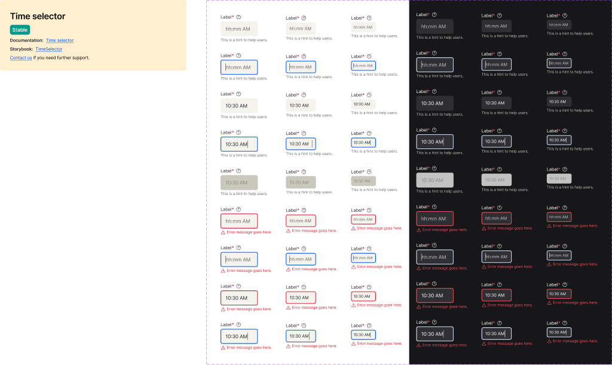

<!-- SOURCE: Figma MCP + figma-console MCP -->
<!-- FILE KEY: 5YihJ5WuDvnvrlrRMC4sBp -->
<!-- NODE ID: 32598:56953 -->
<!-- EXTRACTED: 2026-05-07 -->
<!-- COMPONENT: TimeSelector -->
<!-- COLOR STRATEGY: B (states as columns, elements as rows — >3 state×variant combos) -->

# TimeSelector — Figma Design Spec

> **See also:** [props.md](./props.md) · [tokens.md](./tokens.md) ·
> [examples.md](./examples.md) · [accessibility.md](./accessibility.md)

---

## Visual reference

---

## Anatomy

Element structure extracted from the Figma layer tree (node `28996:49849`, frame "Time select").

| # | Type | Name | Role | Notes |
|---|------|------|------|-------|
| 1 | frame | `_base_form_label` | optional slot | Controlled by `showLabel` boolean. Contains label text, required asterisk, and info icon button. |
| 1a | text | Label text | content | Typography: `$body01`, `--text/textcolor01` |
| 1b | text | Required asterisk (*) | content | Typography: `$bodyBold01`, `--error/error01`. Always red. |
| 1c | instance | Icon Button | fixed sub-component | Info/FAQ icon (iconSizeM). Wraps to tooltip/help pattern. |
| 2 | frame | `_Text input` | fixed | The time input field itself. Always present. |
| 2a | frame | `Input Text` | structural | Background container. Carries state-dependent background and border. |
| 2b | frame | `Text` → `Text Wrap` | content | Holds displayed time value or placeholder. |
| 2c | frame | `Type indicator` (hidden) | optional slot | 1px × 24px cursor bar. Visible only in Focus state. |
| 2d | frame | `Focus ring` (hidden) | optional slot | Absolute overlay, 2px border. Visible only in Focus state. |
| 3 | frame | `_base_form_hint` | optional slot | Controlled by `showHint` boolean. Hint text below input. |
| 4 | frame | `Error Area` | conditional | Shown only when `Error=True`. Contains error icon (16×16) + error message text. |

### Sub-component: Icon Button (label area)

| # | Type | Name | Role | Notes |
|---|------|------|------|-------|
| 1 | container | Icon Button | interactive | `p-[2px]`, `rounded-[6px]`. Reveals tooltip/help info. |
| 1a | instance | TypeIcon | content | Swap slot — faq/help icon at `iconSizeM`. |

---

## API — Component properties

### Variant axes

Source: `figma_get_component` via Desktop Bridge (authoritative).

| Property | Values | Figma default | Notes |
|----------|--------|---------------|-------|
| Mode | Light, Dark | Light | Theme mode |
| Size | Small, Medium, Large | Large | Three sizes; code API only exposes `small` and `default` (≡ Medium) |
| State | Rest, Focus, Disabled | Rest | Persistent interaction states |
| Error | False, True | False | Adds red border + Error Area |
| Filled | No, Yes | No | Whether a time value is filled in |

### Boolean toggles

Source: `figma_get_component` via Desktop Bridge (authoritative).

| Property | Figma ID | Default | Notes |
|----------|----------|---------|-------|
| `Show Label` | `Show Label#19887:0` | true | Shows/hides `_base_form_label` (label + asterisk + icon) |
| `Show Hint` | `Show Hint#19869:10` | true | Shows/hides `_base_form_hint` hint text below input |

### Text properties

| Property | Figma ID | Default |
|----------|----------|---------|
| `Error text` | `Error text#19714:27` | `"Error message goes here."` |

### Instance swap slots

| Slot | Accepted types | Notes |
|------|----------------|-------|
| Icon Button → TypeIcon | Icon components at `iconSizeM` | Info/FAQ icon in the label area |

### Persistent states

| State | Figma property | Code prop | Notes |
|-------|---------------|-----------|-------|
| Disabled | `State=Disabled` | `isDisabled` | Full component muted; no interaction |
| Error | `Error=True` | `hasError` | Red border + Error Area shown |

### Token coverage

Token coverage % was not returned by `figma_get_component enrich` — the UI-components file has **0 local variables**; all tokens are consumed from the external UI-Foundations library (`iVY5nI8JAxM05Apnnvozzs`). The Desktop Bridge can only read variables from the currently open file, so the library variable collection is not queryable via this tool.

Tokens were extracted from Figma design context (CSS custom properties in Tailwind output). See [tokens.md](./tokens.md) for the full list.

**Hardcoded values flagged:**
- `Input Text.border-radius`: `6px` — no token binding found; should map to a border-radius token
- `Icon Button.border-radius`: `6px` — no token binding found
- `Focus ring.border-width`: `2px` — hardcoded; likely intentional

---

## Color & token bindings

<!-- COLOR STRATEGY B: states as columns, elements as rows -->

### Input container background

| Element | Mode | Rest | Focus | Disabled | Error |
|---------|------|------|-------|----------|-------|
| `Input Text` bg | Light | `--ui/ui05` (#f4f3ee) | `--ui/ui05` (#f4f3ee) | `--interactive/disabled01` (#c8c8bd) | `--ui/ui05` (#f4f3ee) |
| `Input Text` bg | Dark | `--ui/ui05` (#2F2E32) | `--ui/ui05` (#2F2E32) | `--interactive/disabled01` (#C2C2C2) | `--ui/ui05` (#2F2E32) |

### Input border

| Element | Mode | Rest | Focus | Disabled | Error |
|---------|------|------|-------|----------|-------|
| Container border | Light | none | `--interactive/focus01` (#0056e0), 2px | none | `--error/error01` (#cb2233), 2px |
| Container border | Dark | none | `--interactive/focus01` (#D7E3F9), 2px | none | `--error/error01` (#F24D5F), 2px |

### Text colors

| Element | Mode | Rest | Disabled |
|---------|------|------|----------|
| Placeholder / time value | Light | `--text/textcolor02` (#6c6862) | `--interactive/disabled04` (#8d8b7e) |
| Placeholder / time value | Dark | `--text/textColor02` (#C2C2C2) | `--interactive/disabled04` (#858585) |
| Label | Light | `--text/textColor01` (#26252A) | `--text/textColor01` (#26252A) |
| Label | Dark | `--text/textColor01` (#FFFFFF) | `--text/textColor01` (#FFFFFF) |
| Required asterisk | Light | `--error/error01` (#CB2233) | `--error/error01` (#CB2233) |
| Required asterisk | Dark | `--error/error01` (#F24D5F) | `--error/error01` (#F24D5F) |
| Hint text | Light | `--text/textColor02` (#6C6862) | `--text/textColor02` (#6C6862) |
| Hint text | Dark | `--text/textColor02` (#C2C2C2) | `--text/textColor02` (#C2C2C2) |
| Error message | Light | — | — | `--error/error01` (#CB2233) |
| Error message | Dark | — | — | `--error/error01` (#F24D5F) |
| Focus type cursor | Light | — | `--text/textColor01` (#26252A) | — |
| Focus type cursor | Dark | — | `--text/textColor01` (#FFFFFF) | — |

### Text styles

| Element | Style | Size | Weight | Line height | Letter spacing |
|---------|-------|------|--------|------------|----------------|
| Label | `$body01` | 14px | 400 | 20px | −0.06px |
| Required asterisk | `$bodyBold01` | 14px | 600 | 20px | — |
| Input value (Small) | `$label01` | 12px | 400 | 16px | — |
| Input value (Medium) | `$body01` | 14px | 400 | 20px | −0.084px |
| Input value (Large) | `$body02` | 16px | 400 | 24px | −0.176px |
| Hint / Error text | `$label01` | 12px | 400 | 16px | 0px |

---

## Structure & spacing

### Container (full component)

| Size | Total height | Notes |
|------|-------------|-------|
| Small | 76px | Label + 32px input + hint |
| Medium | 84px | Label + 40px input + hint |
| Large | 92px | Label + ~48px input + hint |

### Input field

| Property | Small | Medium | Large | Token |
|----------|-------|--------|-------|-------|
| Height | 32px | 40px | 48px | Hardcoded |
| Width | 80px | 97px | 120px | Hardcoded |
| Padding | 8px all | 12px H / 8px V | 16px H / 12px V | Hardcoded |
| Border radius | 6px | 6px | 6px | Hardcoded |

### Internal spacing

| Property | Value | Token |
|----------|-------|-------|
| Gap (label → input → hint) | 4px | Hardcoded |
| Gap (elements within input row) | 8px | Hardcoded |
| Error area gap (icon → text) | 4px | Hardcoded |
| Icon Button padding | 2px | Hardcoded |
| Error icon size | 16×16px | Hardcoded |

### Auto-layout

- Direction: vertical (column) — label → input → hint/error stacked
- Input internal direction: horizontal — icon, text, focus ring

---

## Interaction states

| State | Trigger | Visual change |
|-------|---------|---------------|
| Rest | Default | `--ui/ui05` background, no border |
| Focus | Keyboard tab / click | `--interactive/focus01` 2px ring overlay + type cursor bar |
| Disabled | `isDisabled=true` | `--interactive/disabled01` background, `--interactive/disabled04` text, no interaction |
| Error (Rest) | `hasError=true` | `--error/error01` 2px border + Error Area shown below |
| Error (Focus) | Focus while `hasError=true` | Both focus ring and error border visible |
| Filled | Value selected | Time value shown (`10:30 AM`) in `--text/textcolor02` |

---

## Design decisions & annotations

> **Time select — Node 28996:49849:**
> Documentation reference: [https://oxygen.8x8.com/docs/components/timeselector/usage](https://oxygen.8x8.com/docs/components/timeselector/usage)

> **Focus ring — Node 81242:2239:**
> "A focus ring is used to indicate the currently focused item."

> **Icon Button (label area) — Node 28172:41855:**
> Icon Button. Documentation: [https://zeroheight.com/714056d2f/p/75909b-icons/b/1725fe](https://zeroheight.com/714056d2f/p/75909b-icons/b/1725fe)

---

## Accessibility (from Figma annotations only)

- **ARIA role:** <!-- NOT ANNOTATED IN FIGMA -->
- **Focus order:** <!-- NOT ANNOTATED IN FIGMA -->
- **Keyboard interactions:** <!-- NOT ANNOTATED IN FIGMA -->

See [accessibility.md](./accessibility.md) for the full accessibility specification.

---

## Gaps & conflicts

| Type | Description |
|------|-------------|
| Missing annotation | No ARIA role, keyboard map, or focus order documented in Figma annotations |
| Conflict | Figma `Size=Large` has no matching code API value; `size="default"` corresponds to Figma `Medium` — naming misalignment |
| Conflict | Figma default size is `Large`; code default is `"default"` (Medium) — different defaults |
| Missing token | `Input Text.border-radius` is hardcoded `6px` — no design token binding |
| Missing token | `Icon Button.border-radius` is hardcoded `6px` — no design token binding |
| Missing token | All spacing values (padding, gap) are hardcoded — no token bindings observed |
| Resolved | All semantic color tokens now fully resolved (Light + Dark) from UI-Foundations library via Desktop Bridge |

---

_Source: Figma MCP · figma-console MCP · Extracted 2026-05-07_
