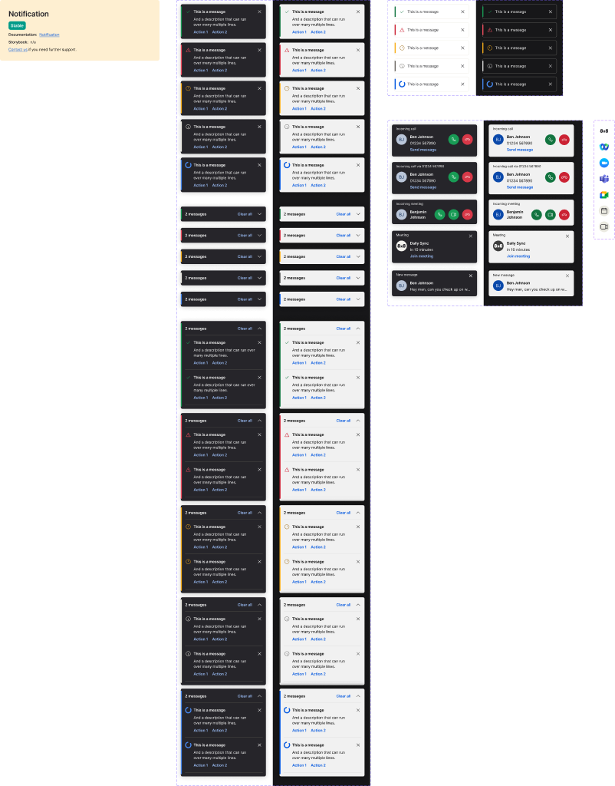

<!-- SOURCE: Figma MCP + figma-console MCP -->
<!-- FILE KEY: 5YihJ5WuDvnvrlrRMC4sBp -->
<!-- NODE ID: 1823:0 (Notification canvas) · 26764:41883 (Notification component set) · 5549:4130 (Inline Notification component set) · 9141:14534 (Interaction component set) -->
<!-- EXTRACTED: 2026-05-05 -->
<!-- COMPONENT: Toast / Notification -->
<!-- COLOR STRATEGY: B (states as columns, variants as rows — 5 types × 3 styles × 2 modes > 3 threshold) -->

# Toast — Figma Design Spec

> **See also:** [props.md](./props.md) · [tokens.md](./tokens.md) ·
> [examples.md](./examples.md) · [accessibility.md](./accessibility.md)

---

## Visual reference

*Page "Notification" — node 1823:0. Contains three component sets: Notification (full/grouped), Inline Notification, and Interaction (incoming calls, messages, meeting reminders).*

---

## Anatomy

### Notification component set (`26764:41883`)

Anatomy derived from "Mode=Light, Style=Full notification, Type=Success" (`26764:42276`).

| # | Type | Name | Role | Notes |
|---|------|------|------|-------|
| 1 | frame | Container | Structural | Auto-layout horizontal; gap `12px`; padding `16px` L / `12px` R / `8px` T-B; border-radius `6px`; bg `var(--ui/ui07)` (dark, even in Light mode); drop-shadow `var(--ui/shadow01)`; fixed width `320px` |
| 2 | frame | indicator | Decorative | Absolute-positioned left accent bar; width `4px`; inset `8px` T-B; border-radius `4px`; color is type-specific (e.g. `var(--success/success02)` for Success) |
| 3 | frame | content | Structural | Auto-layout horizontal; gap `16px`; padding `8px` T-B; flex-1 |
| 4 | frame | content (inner) | Structural | Auto-layout horizontal; gap `8px`; flex-1 |
| 5 | frame | icon | Content element | 24×24 container; holds status icon (check, warning, info, etc.) |
| 6 | frame | text | Structural | Auto-layout vertical; gap `8px`; flex-1 |
| 7 | text | title | Content element | Semi-bold; `var(--typography/bodybold01/*)` — 14px, 20px line-height, -0.06px tracking; color `var(--text/textcolor09)` (white) |
| 8 | text | description | Optional slot | Regular; `var(--typography/body01/*)` — 14px, 20px line-height; color `var(--text/textcolor09)`; controlled by `Description` boolean toggle (default: `true`) |
| 9 | frame | cta | Optional slot | Flex-wrap row; gap `8px 16px`; controlled by `Actions` boolean toggle (default: `true`); action links use `var(--actions/action10)` (#99bbf3) |
| 10 | frame | Icon Button | Optional slot | Close button; top-right; `2px` padding; border-radius `6px`; hidden when `hideCloseControl` is set |

### Inline Notification component set (`5549:4130`)

| # | Type | Name | Role | Notes |
|---|------|------|------|-------|
| 1 | frame | Container | Structural | Fixed width `280px`; height `56px`; same border-radius and token pattern as Notification |
| 2 | text | title | Content element | Text prop; default "This is a message" |
| — | — | description | — | No description or action slots exposed in Inline Notification properties |
| — | — | close button | — | Not present in Inline Notification |

### Interaction component set (`9141:14534`)

Covers incoming calls, meetings, messages, and meeting reminders. Not directly mapped to the `Toast` / `Toaster` Oxygen package — separate domain component for telephony/meeting events.

---

## API — Component properties

### Notification variant axes

| Property | Values | Default |
|----------|--------|---------|
| `Mode` | `Light`, `Dark` | `Light` |
| `Style` | `Full notification`, `Group collapsed`, `Group expanded` | `Full notification` |
| `Type` | `Success`, `Warning`, `Error`, `Info`, `Loading` | `Success` |

### Notification boolean toggles

| Property | Default | Notes |
|----------|---------|-------|
| `Description` | `true` | Shows/hides the description text element |
| `Actions` | `true` | Shows/hides the CTA action links row |

### Notification text properties

| Property | Default value | Notes |
|----------|---------------|-------|
| `Title` | "This is a message" | Maps to `title` prop |
| `Description text` | "And a description that can run over many multiple lines." | Maps to `description` prop |
| `Action 1` | "Action 1" | First action label in `actions` array |
| `Action 2` | "Action 2" | Second action label in `actions` array |
| `Grouped text` | "2 messages" | Stack count label shown in Group collapsed/expanded style |

### Inline Notification variant axes

| Property | Values | Default |
|----------|--------|---------|
| `Mode` | `Light`, `Dark` | `Light` |
| `Type` | `Success`, `Info`, `Error`, `Warning`, `Loading` | `Success` |

### Inline Notification text properties

| Property | Default value |
|----------|---------------|
| `Title` | "This is a message" |

### Persistent vs. transient states

Persistent states captured in Figma as variant properties:
- `Mode` (Light / Dark) — theming
- `Type` — semantic state (success, error, warning, info, loading)
- `Style` — layout variant (Full / Group collapsed / Group expanded)

Transient states (hover, focus, pressed) are not explicitly modelled as separate components in this component set.

---

## Color and token bindings

Tokens resolved via `figma_execute` + `getVariableByIdAsync` alias chain traversal against the linked UI-Foundations library (`iVY5nI8JAxM05Apnnvozzs`). All values confirmed from Figma — no inference.

**Color strategy B applied** — types as rows, modes as columns.

### Container tokens

| Element | Semantic token | Primitive (Light) | Hex (Light) | Primitive (Dark) | Hex (Dark) |
|---------|---------------|-------------------|-------------|------------------|------------|
| Background | `ui/ui07` | `color/offWhite/offWhite02` | `#26252a` | `color/gray/gray10` | `#f1f1f1` |
| Drop shadow | `ui/shadow01` | *(direct value)* | `rgba(41,41,41,0.25)` | *(direct value)* | `rgba(20,20,20,1.0)` |
| Text — title, description | `text/textColor09` | `color/pure/white` | `#ffffff` | `color/pure/black` | `#000000` |
| Icon fill | `icon/icon05` | `color/pure/white` | `#ffffff` | `color/gray/gray02` | `#292929` |
| Action links | `actions/action10` | `color/blue/blue08` | `#99bbf3` | `color/blue/blue05` | `#0056e0` |

> Note: The notification uses an **inverted background by design** — in Light mode the background is dark (`#26252a`), in Dark mode it is light (`#f1f1f1`), ensuring the toast always pops against the main app canvas.

### Left indicator bar — type-specific tokens

| Type | Semantic token | Primitive (Light) | Hex (Light) | Primitive (Dark) | Hex (Dark) |
|------|---------------|-------------------|-------------|------------------|------------|
| Success | `success/success02` | `color/green/green04` | `#189b55` | `color/green/green03` | `#12743f` |
| Error | `error/error02` | `color/red/red07` | `#f24d5f` | `color/red/red05` | `#cb2233` |
| Warning | `warning/warning01` | `color/yellow/yellow06` | `#f8ae1a` | `color/yellow/yellow03` | `#9f701c` |
| Info | `info/info01` | `color/offWhite/offWhite09` | `#ebeae1` | `color/gray/gray05` | `#666666` |
| Loading | `actions/action06` | `color/blue/blue07` | `#4687ed` | `color/blue/blue05` | `#0056e0` |

> Warning indicator uses `warning/warning01`; the warning icon vector fill uses `warning/warning03` — both resolve to the same `color/yellow/yellow06` primitive in Light mode.

### Typography tokens

| Style | Token prefix | Size | Weight | Line-height | Letter-spacing |
|-------|-------------|------|--------|-------------|----------------|
| Title | `typography/bodyBold01/` | `14px` | `600` (semi-bold) | `20px` | `-0.06px` |
| Description | `typography/body01/` | `14px` | `400` (regular) | `20px` | `-0.06px` |
| CTA links | `typography/bodyBold01/` | `14px` | `600` (semi-bold) | `20px` | `-0.06px` |
| Loading text ("Please wait…") | `typography/body01/` | `14px` | `400` (regular) | `20px` | `-0.06px` |

### Hardcoded values

| Element | Property | Hardcoded value | Flag |
|---------|----------|-----------------|------|
| Container | width | `320px` | Should be a size token or responsive constraint |
| Indicator bar | width | `4px` | Should be a spacing token |
| Icon container | size | `24px` | May map to icon-size token |
| Container | border-radius | `6px` | Should reference radius token |

---

## Structure and spacing

### Notification — Full notification

| Property | Value | Token? |
|----------|-------|--------|
| Width | `320px` (fixed) | Hardcoded |
| Height | Variable (content-driven) | — |
| Padding left | `16px` | Hardcoded |
| Padding right | `12px` | Hardcoded |
| Padding top/bottom | `8px` | Hardcoded |
| Gap (outer row) | `12px` | Hardcoded |
| Gap (inner content) | `16px` | Hardcoded |
| Gap (icon → text) | `8px` | Hardcoded |
| Gap (text items) | `8px` | Hardcoded |
| Gap (CTA row) | `8px / 16px` (wrap) | Hardcoded |
| Border radius | `6px` | Hardcoded |
| Indicator bar width | `4px` | Hardcoded |
| Indicator inset T-B | `8px` | Hardcoded |

### Notification — Group collapsed

| Property | Value |
|----------|-------|
| Width | `320px` (fixed) |
| Height | `56px` |

### Inline Notification

| Property | Value |
|----------|-------|
| Width | `280px` (fixed) |
| Height | `56px` |

---

## Visual record and accessibility

### Design intent (from Figma annotations and descriptions)

- The Notification component set description links to `https://oxygen.8x8.com/docs/Contribution/intro` — Oxygen contribution guide. No inline design intent annotations present.
- The Inline Notification description states: "Documentation not available" — component exists in Figma but is not yet officially documented on the Oxygen docs site.
- The Notification uses an **inverted (dark) background by default** even in Light mode — this is intentional for high contrast and visual prominence of the toast.
- Notifications appear at the **top corner of the UI below the top bar** per the Toaster usage notes. Incoming interactions go to the top of the stack.

### Keyboard and focus notes

<!-- NOT FOUND IN FIGMA RESPONSE — no accessibility annotations present on this component set -->

### ARIA notes

<!-- NOT FOUND IN FIGMA RESPONSE — no ARIA annotations in Figma -->

---

## Gaps & conflicts

| # | Type | Severity | Description |
|---|------|----------|-------------|
| 1 | SOURCE_GAP | Medium | No Figma variables returned (Variables API requires Enterprise plan). Token names extracted from design context code only — resolved values are incomplete (Light mode Success only). |
| 2 | SOURCE_GAP | Medium | Left indicator token resolved only for `Success` type. Error / Warning / Info / Loading indicator tokens require separate design context calls per variant. |
| 3 | DOC_GAP | Low | Inline Notification has no Oxygen docs page ("Documentation not available" in Figma). Props are not surfaced via oxygen-mcp. |
| 4 | DOC_GAP | Low | `InlineNotification` component in `@8x8/oxygen-toast` package returns no props from MCP — may be undocumented or not yet fully integrated into the MCP. |
| 5 | DOC_GAP | Low | Dark mode token values not captured — only Light mode resolved values available from this extraction. |
| 6 | DOC_GAP | Low | Container width (`320px`), indicator width (`4px`), and border-radius (`6px`) appear hardcoded — no spacing/radius tokens confirmed. |
| 7 | SOURCE_GAP | Low | No accessibility annotations found on the Notification component set in Figma. |
| 8 | CONFLICT | Low | Figma `Style` axis has "Full notification" / "Group collapsed" / "Group expanded" — no corresponding `style` prop is exposed in the `Toast` Oxygen API. The Figma `Style` variants appear to be handled by `ToastStack` + `Toaster` (grouped/stacked behaviour), not a prop on `Toast` directly. Needs confirmation. |

_Source: Figma MCP (claude.ai) + figma-console MCP · Extracted 2026-05-05_
