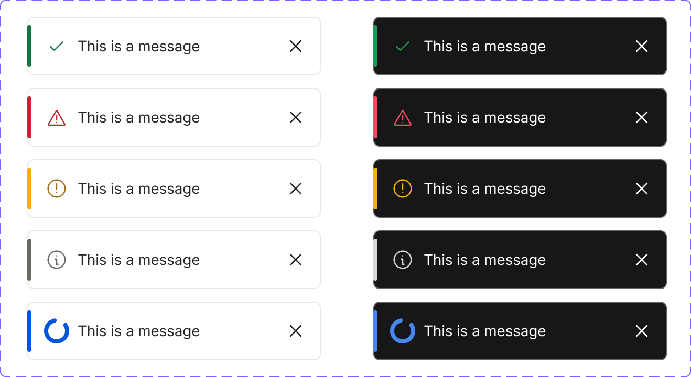

<!-- source: figma-only -->

## Visual reference

*Page "Notification" — node 1823:0. Three component sets: Notification (full/grouped), InlineNotification, and Interaction (incoming calls, messages, meeting reminders — separate domain).*

*InlineNotification — node 5549:4130. 10 variants: Success, Error, Warning, Info, Loading × Light/Dark.*

---

## Anatomy — Notification component set

Derived from "Mode=Light, Style=Full notification, Type=Success" (node `26764:42276`). Component set node: `26764:41883`.

| # | Type | Name | Role | Notes |
|---|------|------|------|-------|
| 1 | frame | Container | Structural | Auto-layout horizontal; gap 12px; padding 16px L / 12px R / 8px T-B; border-radius 6px; bg `var(--ui/ui07)` (dark even in Light mode); drop-shadow `var(--ui/shadow01)`; fixed width 320px |
| 2 | frame | indicator | Decorative | Absolute-positioned left accent bar; width 4px; inset 8px T-B; border-radius 4px; color is type-specific (e.g. `var(--success/success02)` for Success) |
| 3 | frame | content | Structural | Auto-layout horizontal; gap 16px; padding 8px T-B; flex-1 |
| 4 | frame | content (inner) | Structural | Auto-layout horizontal; gap 8px; flex-1 |
| 5 | frame | icon | Content element | 24×24 container; holds status icon (check, warning, info, etc.) |
| 6 | frame | text | Structural | Auto-layout vertical; gap 8px; flex-1 |
| 7 | text | title | Content element | Semi-bold; `typography/bodybold01/*` — 14px, 20px line-height, -0.06px tracking; color `text/textcolor09` (white) |
| 8 | text | description | Optional slot | Regular; `typography/body01/*` — 14px, 20px line-height; color `text/textcolor09`; controlled by `Description` boolean toggle (default: true) |
| 9 | frame | cta | Optional slot | Flex-wrap row; gap 8px / 16px; controlled by `Actions` boolean toggle (default: true); action links use `actions/action10` |
| 10 | frame | Icon Button | Optional slot | Close button; top-right; 2px padding; border-radius 6px; hidden when `hideCloseControl` is set |

---

## Anatomy — InlineNotification component set

Component set node: `5549:4130`.

| # | Type | Name | Role | Notes |
|---|------|------|------|-------|
| 1 | frame | Container | Structural | Fixed width 280px; height 56px; same border-radius and token pattern as Notification |
| 2 | text | title | Content element | Text prop; default "This is a message" |
| — | — | description | — | No description or action slots in InlineNotification |
| — | — | close button | — | Not present in InlineNotification |

**Key design distinction:** InlineNotification uses a **standard (non-inverted) theme** — white background in Light mode, dark in Dark mode. The full Notification always renders dark in Light mode (inverted by design for contrast). Light/Dark indicator hex values are therefore swapped between the two components for the same token.

---

## Variant axes

### Notification

| Property | Values | Default |
|----------|--------|---------|
| `Mode` | Light, Dark | Light |
| `Style` | Full notification, Group collapsed, Group expanded | Full notification |
| `Type` | Success, Warning, Error, Info, Loading | Success |

| Boolean toggle | Default | Notes |
|----------------|---------|-------|
| `Description` | true | Shows/hides description text element |
| `Actions` | true | Shows/hides CTA action links row |

| Text property | Default value |
|---------------|---------------|
| `Title` | "This is a message" |
| `Description text` | "And a description that can run over many multiple lines." |
| `Action 1` | "Action 1" |
| `Action 2` | "Action 2" |
| `Grouped text` | "2 messages" — shown in Group collapsed/expanded style |

> **Style axis and stacking:** "Group collapsed" and "Group expanded" Figma Style variants are handled by the `Toaster` system component (automatic stacking and collapse/expand managed by the `notify()` queue). There is no `style` prop on `Toast` directly.

### InlineNotification

| Property | Values | Default |
|----------|--------|---------|
| `Mode` | Light, Dark | Light |
| `Type` | Success, Info, Error, Warning, Loading | Success |

| Text property | Default value |
|---------------|---------------|
| `Title` | "This is a message" |

---

## States

### Persistent states (Figma variant properties)

| State | Mechanism |
|-------|-----------|
| Mode (Light / Dark) | `Mode` variant axis — theming |
| Type (success / error / warning / info / loading) | `Type` variant axis — semantic state |
| Style (Full / Group collapsed / Group expanded) | `Style` axis — layout; managed by Toaster |

### Transient states

Hover, focus, and pressed states are not explicitly modelled as separate components in the Notification or InlineNotification component sets.

<!-- STUB:GAP-009 source="Request design owner add keyboard interaction and ARIA annotations to the Notification and InlineNotification component sets in Figma. No accessibility annotations found on node 26764:41883 or 5549:4130." -->

---

## Structure and spacing

### Notification — Full notification

| Property | Value | Token? |
|----------|-------|--------|
| Width | 320px (fixed) | Hardcoded |
| Height | Variable (content-driven) | — |
| Padding left | 16px | Hardcoded |
| Padding right | 12px | Hardcoded |
| Padding top/bottom | 8px | Hardcoded |
| Gap (outer row) | 12px | Hardcoded |
| Gap (inner content) | 16px | Hardcoded |
| Gap (icon → text) | 8px | Hardcoded |
| Gap (text items) | 8px | Hardcoded |
| Gap (CTA row) | 8px / 16px (wrap) | Hardcoded |
| Border radius | 6px | Hardcoded |
| Indicator bar width | 4px | Hardcoded |
| Indicator inset T-B | 8px | Hardcoded |

### Notification — Group collapsed

| Property | Value |
|----------|-------|
| Width | 320px (fixed) |
| Height | 56px |

### InlineNotification

| Property | Value |
|----------|-------|
| Width | 280px (fixed) |
| Height | 56px |
| Indicator bar | 4×40px (absolute-positioned, 8px inset top and bottom) |
| Indicator border-radius | 4px |
