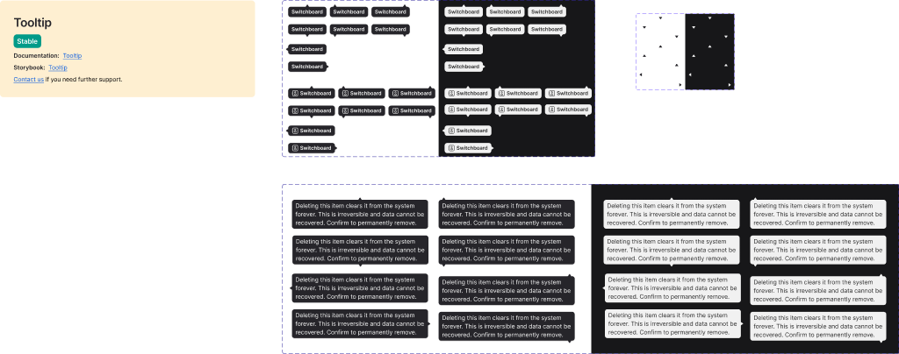

<!-- SOURCE: Figma MCP + figma-console MCP -->
<!-- FILE KEY: 5YihJ5WuDvnvrlrRMC4sBp -->
<!-- NODE ID: 1797:0 -->
<!-- EXTRACTED: 2026-05-05 -->
<!-- COMPONENT: Tooltip -->
<!-- COLOR STRATEGY: A -->

# Tooltip — Figma Design Spec

> **See also:** [props.md](./props.md) · [tokens.md](./tokens.md) ·
> [examples.md](./examples.md) · [accessibility.md](./accessibility.md)

---

## Visual reference

---

## Anatomy

The Tooltip canvas (`1797:0`) contains two primary frames and one atom section:

### Frame: `Tooltip` (3174:0)

The main tooltip body — text content + optional directional arrow tip. Shown as a grid of all orientation × mode combinations.

| # | Type | Name | Role | Notes |
|---|------|------|------|-------|
| 1 | frame | Content | Structural container | `px-8px py-4px`, `rounded-6px`, `max-w-320px` |
| 2 | text | Text (140 chars max) | Content element | Body01 typography; fills container width |
| 3 | instance | _Tip (arrow) | Optional slot | Directional arrow; controlled by `enableArrow` prop |

### Frame: `Icon tooltip` (1956:11221)

A variant of the tooltip that includes an icon alongside the text.

| # | Type | Name | Role | Notes |
|---|------|------|------|-------|
| 1 | frame | Content | Structural container | Same padding as main tooltip |
| 2 | text | Text | Content element | Body01 typography |
| 3 | instance | Icon | Optional slot | Toggled by `Icon` variant axis |

### Sub-component: `_Tip` (7987:8235) — Arrow/pointer atom

Located in the `Atoms` section (29870:42882).

| # | Type | Name | Role | Notes |
|---|------|------|------|-------|
| 1 | symbol | _Tip | Structural/decorative | Small arrow rendered below, above, left, or right of container |

---

## API — Component properties

### Variant axes

| Property | Values | Default |
|----------|--------|---------|
| Mode | `Light`, `Dark` | `Light` |
| Horizontal direction | `Bottom`, `Top`, `Left`, `Right` | `Bottom` |
| Vertical direction | `Center`, `Left`, `Right` | `Center` |
| Icon _(Icon tooltip variant only)_ | `True`, `False` | `False` |

**Note on naming:** Figma uses "Horizontal direction" (Bottom/Top) and "Vertical direction" (Center/Left/Right) to describe placement. In the Oxygen React API these map to the `orientation` prop (e.g. `bottom`, `top-start`, `top-end`, `right`, `left`). See mapping table:

| Figma: Horizontal / Vertical | Oxygen `orientation` prop |
|------------------------------|--------------------------|
| Bottom / Center | `bottom` |
| Bottom / Left | `bottom-start` |
| Bottom / Right | `bottom-end` |
| Top / Center | `top` |
| Top / Left | `top-start` |
| Top / Right | `top-end` |
| Right / Center | `right` |
| Left / Center | `left` |

### Boolean toggles

<!-- NO BOOLEAN TOGGLES FOUND — Icon is a variant axis, not a boolean toggle -->

### Instance swap slots

<!-- NO INSTANCE SWAP SLOTS FOUND IN FIGMA RESPONSE -->

### Persistent states

<!-- NO PERSISTENT STATES FOUND — Tooltip has no disabled, selected, or error states in Figma -->

### Token coverage

- **Coverage:** ~80% estimated — most visual properties use semantic tokens; `border-radius` (6px) and `padding` (8px/4px) appear hardcoded
- **Hardcoded values flagged:**
  - `Content.border-radius`: `6px` — no token binding found; should map to a `--radius/*` token
  - `Content.padding-x`: `8px` — no token binding found
  - `Content.padding-y`: `4px` — no token binding found
  - `Content.max-width`: `320px` (horizontal) / `326px` (Left/Right) — hardcoded px value

---

## Color & token bindings

<!-- COLOR STRATEGY A: one table per element, states as rows -->
<!-- Variables API unavailable — token names extracted from design context Tailwind output -->

### Content container (background)

| Mode | Token | Collection | Resolved value |
|------|-------|------------|----------------|
| Light | `--ui/ui07` | UI | `#26252a` (dark gray) |
| Dark | `--ui/ui07` | UI | `#f1f1f1` (light gray) |

**Note:** The token `--ui/ui07` resolves to opposite values in Light vs Dark mode — Light mode uses a dark background (inverted for contrast), Dark mode uses a light background.

### Text

| Mode | Token | Collection | Resolved value |
|------|-------|------------|----------------|
| Light | `--text/textcolor04` | Text | `white` |
| Dark | `--text/textcolor04` | Text | `#292929` |

### Shadow / elevation

| Mode | Token | Collection | Resolved value |
|------|-------|------------|----------------|
| Light | `--ui/shadow01` | UI | `rgba(41, 41, 41, 0.25)` — `drop-shadow` |
| Dark | `--ui/shadow01` | UI | `#141414` — `box-shadow 0px 1px 2px 0px` |

**Note:** Light mode uses CSS `drop-shadow` filter; Dark mode uses `box-shadow`. The token is the same but the implementation differs.

### Text styles

| Element | Style name | Size | Weight | Line height | Letter spacing |
|---------|-----------|------|--------|-------------|----------------|
| Tooltip text | `typography/body01` | `14px` (`--typography/body01/font-size`) | `400` (`--typography/body01/font-weight`) | `20px` (`--typography/body01/line-height`) | `-0.06px` (`--typography/body01/letter-spacing`) |

Font family token: `--typography/body01/font-family` → `'Inter:Regular', sans-serif`

### Effect styles

<!-- NO ADDITIONAL EFFECT STYLES — shadow documented under Color & token bindings above -->

---

## Structure & spacing

### Container

| Property | Token | Value | Notes |
|----------|-------|-------|-------|
| Max width | — (hardcoded) | `320px` | `326px` for Left/Right orientation |
| Min width | — (hardcoded) | `24px` | |
| Padding horizontal | — (hardcoded) | `8px` | Flagged: no token binding |
| Padding vertical | — (hardcoded) | `4px` | Flagged: no token binding |
| Border radius | — (hardcoded) | `6px` | Flagged: no token binding |

### Internal spacing

| Property | Token | Value | Notes |
|----------|-------|-------|-------|
| Gap (elements) | — | N/A | Single text element; no gap needed |
| Icon size _(Icon tooltip)_ | — | Not extracted | Icon variant present in Figma but dimensions not returned |

### Auto-layout

- Direction: vertical (`flex-col`) for Top/Bottom orientations; horizontal (`flex-row`) for Left/Right
- Alignment: `items-center` (Center), `items-start` (Left), `items-end` (Right)

### Density / size variants

Only one size (`Small`) observed on the `_Tip` arrow atom. No size axis on the main Tooltip body.

---

## Interaction states

States visible in the Figma variant structure.

| State | Trigger | Visual change |
|-------|---------|---------------|
| Default | — | Tooltip body visible with semi-transparent background |

**Hover / focus / pressed states:** Not represented in Figma — Tooltip is a display component; its trigger element carries interaction states. The Oxygen component handles show/hide via the `showOn` prop and `delay`.

---

## Design decisions & annotations

> **Documentation link:** https://oxygen.8x8.com/docs/components/tooltip/usage

> **Storybook:** https://oxygen.8x8.dev/packages/release/latest/?path=/story/components-tooltip--tooltip-documentation

> **Color inversion:** The Light mode tooltip uses a dark background (`--ui/ui07 = #26252a`) and the Dark mode tooltip uses a light background (`--ui/ui07 = #f1f1f1`). This is intentional — tooltip backgrounds are always inverted relative to the page mode to create contrast.

> **Shadow implementation:** Light mode uses `drop-shadow` (CSS filter) while Dark mode uses `box-shadow`. Both resolve to `--ui/shadow01` but the rendering differs. This may be a Figma artifact or an intentional layering difference.

> **Max character limit:** The placeholder text "Deleting this item clears it from the system forever. This is irreversible and data cannot be recovered. Confirm to permanently remove." is used to demonstrate max-width (320px) behavior at 140 characters.

---

## Accessibility (from Figma annotations only)

- **ARIA role:** <!-- NOT ANNOTATED IN FIGMA -->
- **Focus order:** <!-- NOT ANNOTATED IN FIGMA -->
- **Keyboard interactions:** <!-- NOT ANNOTATED IN FIGMA -->

See [accessibility.md](./accessibility.md) for full WAI-ARIA Tooltip pattern documentation.

---

## Gaps & conflicts

| Type | Description |
|------|-------------|
| Missing token | `Content.border-radius` is hardcoded at `6px` — no CSS variable binding found |
| Missing token | `Content.padding-x` is hardcoded at `8px` — no CSS variable binding found |
| Missing token | `Content.padding-y` is hardcoded at `4px` — no CSS variable binding found |
| Missing token | `Content.max-width` is hardcoded at `320px` / `326px` — no token binding |
| Naming conflict | Figma "Horizontal direction" (Bottom/Top) + "Vertical direction" (Center/Left/Right) axes don't directly map to Oxygen `orientation` prop values — mapping table provided above |
| Incomplete data | Variables API unavailable (requires Figma Enterprise) — tokens extracted from `get_design_context` Tailwind output; need verification |
| Incomplete data | `figma_get_component` / `figma_get_component_details` unavailable without Desktop Bridge plugin — enriched metadata and token coverage % not retrieved |
| Missing annotation | No ARIA role, focus order, or keyboard interaction annotations in Figma |
| Source gap | Icon tooltip dimensions and icon token bindings not extracted |

---

_Source: Figma MCP · figma-console MCP · Extracted 2026-05-05_
